# Resolving numerical errors when applying Muskingum routing on continental to global hydrology models

*Draft manuscript. Figures are in `../figures`, tables in `../tables`, and every number below is produced by the scripts in `../scripts` (see `../README.md`). Items marked [pending: …] are analyses not yet run.*

---

## Abstract

Muskingum routing is the channel routing method of most national and global river models, which apply one time step to millions of reaches whose lengths are set by delineation rather than by numerics. We examine the numerical errors that follow and the options for avoiding them, to determine the minimum feature set a Muskingum router needs at continental scale. The study is numerical, not a calibration: every simulation is compared with a time-converged solution of the same network, never with gauges. The coefficients are non-negative only inside a Courant-like window 2kx ≤ Δt ≤ 2k (1 − x), which keeps the routed discharge non-negative but is not needed for numerical stability, and the discharge the method solves for at each step, averaged with the discharge of the previous step, is the mean flow over the step. Given travel times by one velocity law, 30% to 66% of the reaches of four global hydrofabrics are too long and 3.2% to 21% too short for hourly routing, and two of them carry reaches of zero length, artifacts of their delineation tooling that no step can route and that must be resolved in the topology. Routed through the Columbia basin of the GEOGLOWS River Forecast System from 30 s to 1 h under ERA5 and designed forcing, the step changed annual peaks by 2.1% or less on average, and its apparent effect on timing was the half-step lead of reporting the plain mean of the computed discharges. Reaches too short for the step oscillated and carried up to 11.6% of their volume as negative discharge, and splitting long reaches without adjusting x raised annual peaks by 7% to 15%. None of RAPID, WRF-Hydro, and t-route checks its coefficients, and the National Water Model's routine bounds k and x, alters negative discharge, and lags upstream inflow. Negative discharge should be written as routed; hydrography should not be edited for numerical convenience, except to resolve zero-length reaches; and fewer, longer reaches that can be validly subdivided are preferable to many short ones. river-route implements the resulting feature set.

---

## 1 Introduction

Continental and global river models now resolve networks of millions of reaches. The GEOGLOWS hydrological model routes ERA5 and ECMWF ensemble runoff through a subset of the TDX-Hydro hydrography [@hales2025], whose River Forecast System v3 (RFS v3) network holds 4.9 million reaches. The U.S. National Water Model (NWM) routes more than 2.7 million NHDPlus V2 reaches with the Muskingum–Cunge scheme of WRF-Hydro at a 5 min step [@gochis2020; @read2023; @cosgrove2024], which NOAA's t-route re-implements for the Next Generation Water Resources Modeling Framework, and GRADES applies the RAPID router to 2.94 million MERIT Hydro reaches [@lin2019]. Muskingum methods dominate because the update of a reach is linear, local, and cheap, and because the equations of every reach form one matrix equation of the form Ax = b [@david2011].

A Muskingum computation is valid only if the travel time k, the weight x, and the time step Δt keep every coefficient non-negative, 2kx ≤ Δt ≤ 2k (1 − x) [@chow1988; @ponce1989; @usace_hms]. That guidance assumes a modeler who chooses the space and time steps together. A continental hydrofabric reverses the relationship: its reach lengths are fixed by the spacing of confluences in an elevation model and by the processing that cleans the delineation, and one step is applied to every reach. Reaches outside the window dip below zero ahead of a rise, alternate from step to step, or carry negative discharge, and codes and hydrofabric builders respond by limiting negative discharge, bounding k and x, or deleting short reaches [@wrfhydro_code; @troute_code; @johnson_hyaggregate].

Five hydrofabrics carry most continental and global routing. NHDPlus V2 [@mckay2012] holds about three million flowlines of the conterminous United States, of which the NWM routes 2.7 million [@salas2018; @read2023]; @david2011 found a median length of 2.4 km in two Texas basins. The NextGen hydrofabric [@johnson2022] refactors NHDPlus, collapsing inter-confluence flowpaths shorter than 1 km and splitting those longer than 10 km [@blodgett_hyrefactor; @johnson_hyaggregate]. HydroRIVERS [@lehner2013], the river network of HydroSHEDS [@lehner2008], holds 8,477,883 reaches from 15 arc-second SRTM data, beginning streams at 10 km² or 0.1 m³ s⁻¹ [@lehner2019]. MERIT-Basins [@lin2019], the vectorization of MERIT Hydro [@yamazaki2019] and the network of GRADES, holds 2.94 million reaches with a median length of 6.8 km. TDX-Hydro [@carlson2024], derived from the 12 m TanDEM-X elevation model, holds about 16 million segments, which GEOGLOWS processes into the RFS v3 network [@hales2025]. In all of them a reach ends where two streams meet, so closely spaced confluences make short reaches regardless of any numerical criterion, and consolidation cannot remove those bounded by confluences at both ends. Delineation tooling also leaves artifacts that are not rivers at all, the most consequential being reaches of zero length. The stream network of TDX-Hydro has the fields of the link table of TauDEM's StreamNet [@tarboton_taudem], in which a link records at most two upstream links, so a junction of three streams in one cell can only be written as two junctions joined by a link of zero length; HydroRIVERS and MERIT-Basins let any number of reaches share a downstream reach and represent such junctions directly.

The routing codes differ in how they meet the window. RAPID [@david2011] solves the equations of all reaches in a domain as one sparse matrix equation per step with the parallel solvers of PETSc, with k proportional to length and x constant, both scaled by calibrated multipliers. The NWM routes with the Muskingum–Cunge routine of WRF-Hydro [@gochis2020], which t-route [@troute_code] re-implements, with k and x computed at every step from channel geometry and discharge, and mizuRoute [@mizukami2016] offers impulse-response and kinematic wave routing alongside Muskingum methods. The WRF-Hydro documentation warns that "reach-based routing is highly sensitive to time step" [@gochis2020] without giving a criterion, and the step is usually chosen as the resolution wanted in the output, on the assumption that finer is more accurate, although continental forcing is hourly at best. What the literature does not give is a quantitative account, on real continental hydrofabrics, of how common negative coefficients are, what they do to routed discharge, and how the remedies compare, nor a consensus on the minimum a Muskingum router must do to produce valid results.

This paper explores the errors of Muskingum routing and the options for mitigating them, to determine the minimum feature set required to apply it to national and global models. The study is purely numerical: every simulation is compared with a time-converged solution of the same network under the same forcing, so every difference is attributable to how the routing is carried out. We (1) treat the sources of error in k, x, and Δt mathematically; (2) estimate how often reaches fall outside the window in TDX-Hydro, HydroSHEDS, MERIT Hydro, NHDPlus, and the NextGen hydrofabric, and identify artifacts of delineation, such as zero-length reaches, that no step can accommodate; (3) derive the options for avoiding the errors; (4) examine how RAPID, WRF-Hydro, and t-route handle them, from their source code; (5) quantify on a test basin how the errors manifest under real and designed forcing and how well the options work; and (6) derive the minimum feature set and best practices for large Muskingum models. The paper also introduces river-route, an open-source router whose stabilization procedure implements that feature set, and benchmarks it numerically. Section 2 develops the theory, Sections 3 and 4 give the methods and results, Section 5 discusses them, and Section 6 concludes.

## 2 Theory

### 2.1 The continuity, inventory, and storage equations

Conservation of mass along a channel is the continuity equation,

$$
\frac{\partial A}{\partial t} + \frac{\partial Q}{\partial s} = q_l, \tag{1}
$$

with A the flow area, Q the discharge, s the distance along the channel, and q_l the lateral inflow per unit length. Integrated over a reach it is the inventory equation,

$$
\frac{dS}{dt} = I (t) - Q (t) + Q_l (t), \tag{2}
$$

with S the storage, I the inflow from upstream, Q the outflow, and Q_l the lateral inflow from the reach's catchment. Integrated over a step Δt, Eq. 2 states exactly that the change in storage is the mean inflow minus the mean outflow. The Muskingum method approximates each mean by the trapezoidal rule,

$$
\frac{I_t + I_{t+1}}{2} - \frac{Q_t + Q_{t+1}}{2} = \frac{S_{t+1} - S_t}{\Delta t}, \tag{3}
$$

and closes Eq. 3 with the storage relation of @mccarthy1938, prism storage plus the wedge storage of a rising or falling wave,

$$
S_t = k\, Q_t + k\, x\, (I_t - Q_t) = k \left[ x\, I_t + (1 - x)\, Q_t \right], \tag{4}
$$

with k the travel time of the wave through the reach and x ∈ [0, 1/2] the weight of the inflow: x = 0 is a linear reservoir, which attenuates the most, and x = 1/2 a pure delay by k. Substituting Eq. 4 into Eq. 3 gives the Muskingum equation

$$
Q_{t+1} = c_1\, I_{t+1} + c_2\, I_t + c_3\, Q_t, \tag{5}
$$

$$
c_1 = \frac{\Delta t / k - 2x}{\Delta t / k + 2 (1-x)}, \qquad
c_2 = \frac{\Delta t / k + 2x}{\Delta t / k + 2 (1-x)}, \qquad
c_3 = \frac{2 (1-x) - \Delta t / k}{\Delta t / k + 2 (1-x)}. \tag{6}
$$

The coefficients sum to one, so the scheme conserves mass; with parameters that vary with discharge it conserves volume only if reformulated [@tang1999; @todini2007]. The treatment of lateral inflow, which carries most of the water in a continental model, changes the accuracy of the scheme [@wang2018]. Following RAPID [@david2011], and as river-route does, the catchment runoff enters as a lateral inflow Q_l held constant over the runoff interval and routed as if it entered upstream at both ends of the step:

$$
Q_{t+1} = c_1\, I_{t+1} + c_2\, I_t + c_3\, Q_t + c_4\, Q_{l,t}, \qquad c_4 = c_1 + c_2. \tag{7}
$$

The Muskingum method is thus a numerical approximation of the continuity equation in its integrated, inventory form, closed by a storage relation. Its errors are those of the storage relation as a model of the reach, which calibration addresses and this paper does not, and those of discretizing the inventory equation with k, x, and Δt, which are its subject.

### 2.2 Interpretation of Q_{t+1}

Because Eq. 3 replaces each mean over the step by the average of its end values, the discharge the method solves for is defined by

$$
\frac{Q_t + Q_{t+\Delta t}}{2} = \overline{Q}_{t,\,t + \Delta t} = \frac{1}{\Delta t} \int_t^{t + \Delta t} Q\, dt: \tag{8}
$$

$Q_{t+1}$ is the discharge that, when averaged with the previous step, gives the mean discharge over the interval. It is not necessarily the instantaneous discharge or the mean over the step on its own. Read with Eq. 8, Eq. 3 is the inventory equation itself, and the approximation lies in the storage relation evaluated at the computed discharges. Three consequences follow. Runoff accumulations are interval means, so entering them as a value held at both ends of the step (Eq. 7) is consistent with Eq. 8. The mean over a reporting interval of m steps is the trapezoidal mean of the computed discharges,

$$
\overline{Q} = \frac{1}{m} \left (\frac{Q_0}{2} + Q_1 + \dots + Q_{m-1} + \frac{Q_m}{2} \right), \tag{9}
$$

and the plain mean of the m computed discharges Q_1 … Q_m exceeds it by $(Q_m - Q_0)/ (2m) \approx (\Delta t/2)\, dQ/dt$: reported that way, a hydrograph leads the interval means by half a routing step, half an hour at Δt = 1 h. And simulations at different steps are comparable only through their interval means (Section 4.7).

### 2.3 Topological ordering of computations

The `RAPID` method

### 2.4 Muskingum Coefficients and Numerical Stability

With the Courant number C = Δt / k,

$$
c_1 = \frac{C - 2x}{C + 2 (1-x)}, \qquad c_2 = \frac{C + 2x}{C + 2 (1-x)}, \qquad c_3 = \frac{2 (1-x) - C}{C + 2 (1-x)}. \tag{11}
$$

@cunge1969 showed that the Muskingum recurrence approximates the kinematic wave equation with a numerical diffusion that can be matched to the physical diffusion of a flood wave. In that Muskingum–Cunge reading k = Δx / c, so C is the Courant number of the reach, and x = (1 − D)/2 with D = q / (S₀ c Δx) the cell Reynolds number [@ponce1989], which WRF-Hydro and the NWM compute from channel geometry [@gochis2020].

In the sense of numerical analysis, stability means that errors do not grow as the computation proceeds [@lax1956]. An alteration to a given river's discharge decays over the following steps and as it propagates downstream. Adding additional flow to a river does not amplify and grow and fail conservation of mass tests. The stability of the Muskingum equation is established for positive Δt, k, and x ∈ [0, 1/2].

Without inflow, Eq. 5 reduces to $Q_{t+1} = c_3 Q_t$, so a perturbation decays as $c_3^n$, and $|c_3| < 1$ for every C > 0. For x ≤ 1/2 no reach amplifies its upstream inflow [@ponce1979].

More commonly in the hydrology literature, **stability** is used to mean that the algorithm will not produce physically impossible values. @garbrecht1991 describe the scheme as "stable with properly selected coefficients", and limits on Δt and the routing parameters are prescribed so that the routed outflow cannot go negative [@hjelmfelt1985; @gill1992; @ponce1982]. The two most common forms of instability in this sense are negative discharges, possibly oscillating from negative to positive, and decreases in discharge despite increasing inflow. Errors come from the coefficients c₁, c₂, and c₃ being less than zero.

From Eq. 6, c₂ is always positive, and

$$
\begin{aligned}
c_1 \ge 0 &\implies \Delta t \ge 2kx, \\
c_3 \ge 0 &\implies \Delta t \le 2k (1-x).
\end{aligned} \tag{12}
$$

Every coefficient is non-negative in the window 2kx ≤ Δt ≤ 2k (1 − x) (Fig. 1). As x approaches 1/2 the window closes on Δt = k, where Q_{t+1} = I_t, an exact translation by one reach per step. A reach is too long for Δt when c₁ < 0 and too short when c₃ < 0. The lower side of the window has a long literature (Section 2.6); the upper side receives less attention, because a modeler who chooses Δx and Δt together can avoid it. The window spans a factor (1 − x)/x in k, so a network whose travel times span more than that has no step at which every reach is inside it. Each parameter can be set improperly relative to the others: the delineation leaves k too small or too large for the step, a single x ignores that the Muskingum–Cunge x depends on reach length, and a Δt chosen for the output moves the whole network across the window.

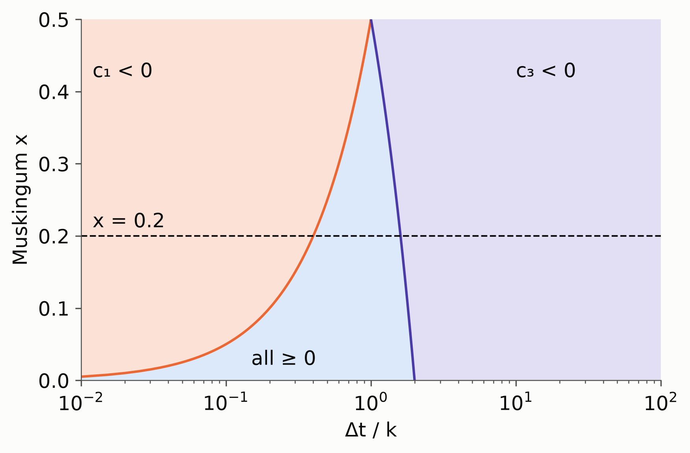

*Figure 1. The plane of Δt/k and x divided by the signs of c₁ and c₃; the dashed line is x = 0.2, the value used throughout this study.*

Only inside the window does non-negative inflow always yield non-negative outflow. When c₁, c₂, and c₃ are non-negative, Eq. 5 makes Q_{t+1} a weighted average of I_{t+1}, I_t, and Q_t, because the coefficients sum to one, and the outflow cannot leave the range of those three values. A negative coefficient turns the average into an extrapolation, and the outflow can fall below that range, including below zero. The upstream impulse response, $h_0 = c_1$ and $h_n = (c_2 + c_1 c_3)\, c_3^{n-1}$ for $n \ge 1$ with $c_2 + c_1 c_3 = 4C/ (C + 2 (1 - x))^2 > 0$, shows the two ways this happens: it is negative at the first step exactly when c₁ < 0, and it alternates in sign exactly when c₃ < 0 (Fig. 2).

Outside the window the scheme therefore remains numerically stable: its errors stay bounded and decay, and the computation never diverges. Its outflow, however, can dip below zero before a rise (Section 2.6) or alternate (Section 2.7). Even the amplification of lateral inflow by reaches too short (Eq. 15) is not instability: the gain is finite, applies once to the reach's own runoff, and is attenuated rather than compounded by the reaches below. The window is a stability condition only in the sense that it keeps the outflow non-negative, and violating it is a problem of accuracy and physical meaning, not of divergence.

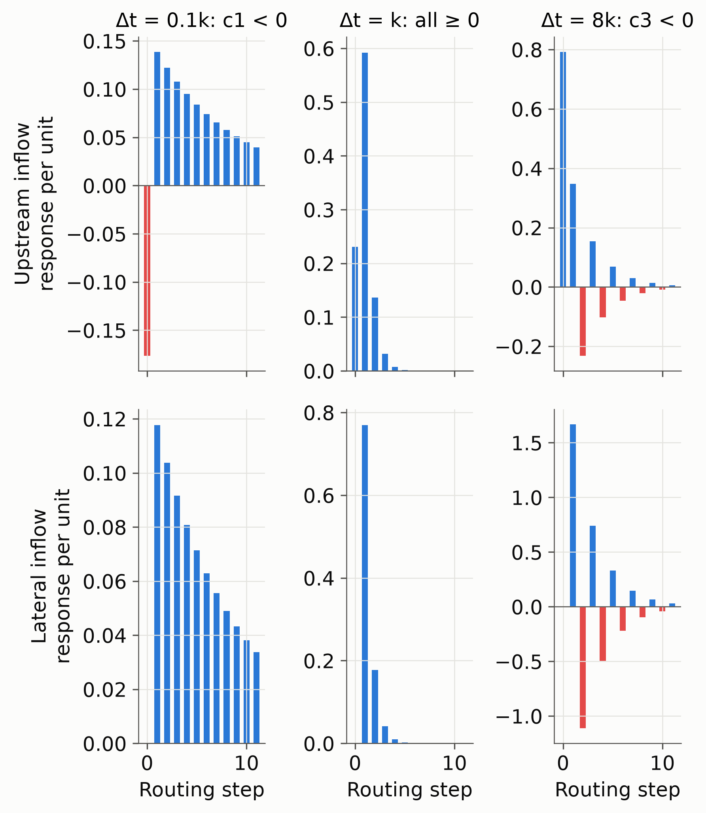

*Figure 2. Response of a reach (x = 0.2) to a unit pulse of upstream inflow (top) and of lateral inflow held over one step (bottom), below, inside, and above the window. Negative ordinates are red.*

### 2.5 What the time step does not change

For every C > 0 the upstream impulse response has

$$
\sum_n n\,\Delta t\; h_n = k, \qquad \sum_n (n\,\Delta t - k)^2\, h_n = k^2 (1 - 2x), \tag{13}
$$

the mean and variance of the continuous model $(1 - kxs)/ (1 + k (1 - x)s)$, because the trapezoidal rule is the bilinear transform, which preserves the first two cumulants (confirmed numerically for C from 0.01 to 20). The step therefore does not change how much a reach delays or diffuses a flood wave; only the shape beyond the variance, including the negative lobes of Fig. 2, depends on Δt. This is the time-domain counterpart of the result of @cunge1969 that the numerical diffusion c Δx (1/2 − x) contains no Δt, and it complements the analyses of the model's translation and dispersion by @strupczewski1980 and of accuracy criteria for the space step by @ponce1982: attenuation is set by segmentation and x, and a finer step is not a more accurate one.

### 2.6 Reaches too long for the time step: the dip

As C → 0, c₁ → −x/ (1 − x), c₂ → x/ (1 − x), and c₃ → 1, and the scheme converges to the continuous model, whose impulse response is

$$
h (t) = -\frac{x}{1-x}\,\delta (t) + \frac{1}{k (1-x)^2}\, e^{-t / (k (1-x))}. \tag{14}
$$

The negative impulse is the dip of @nash1959, who showed that the continuous model predicts negative outflow at the start of a rise; @perumal1992 traced it to the storage relation's assumption that discharge varies linearly along the reach, @szilagyi1992 explained why fitted x can be negative, and @szel2000 showed that negative weights do not invalidate the Muskingum–Cunge scheme. A negative c₁ is therefore the time-converged model's own behavior, exposed when the step resolves times shorter than 2kx, and it can be removed only by changing the model: lowering x or splitting the reach.

### 2.7 Reaches too short for the time step: alternation and amplified lateral inflow

When c₃ < 0 every disturbance decays as an alternation of period 2Δt, and as C → ∞, with c₃ → −1 and c₁, c₂ → 1, Eq. 5 becomes $Q_{t+1} + Q_t = I_{t+1} + I_t$: the reach stores nothing at the resolution of the step. Short reaches are often headwaters or sit between confluences, where their own lateral inflow dominates. For inflow of angular frequency ω (radians per step), its gain is $H_l (\omega) = c_4 e^{-i\omega}/ (1 - c_3 e^{-i\omega})$, which at the Nyquist frequency is

$$
|H_l (\pi)| = \frac{c_4}{1 + c_3} = \frac{C}{2 (1-x)}, \tag{15}
$$

greater than one exactly when c₃ < 0: a reach with k = 19 s at Δt = 3600 s amplifies an hourly alternation of its runoff 118-fold. Equivalently, the variance of its lateral response, (k (1 − x))² − Δt²/4, is negative exactly when Δt > 2k (1 − x). The gain of upstream inflow, $H_u (\omega) = (c_1 + c_2 e^{-i\omega}) / (1 - c_3 e^{-i\omega})$, is $H_u (\pi) = -x/ (1 - x)$ at the Nyquist frequency at every Courant number (Fig. 3), so every reach below a defect multiplies an alternating error by 0.25 at x = 0.2, and alternation is reduced 16-fold within two reaches. The interval means of a reach respond to lateral inflow with the gain $c_4 \cos (\omega/2) / |1 - c_3 e^{-i\omega}|$, which vanishes at the Nyquist frequency, so the amplification lives in the computed discharges and not in their interval means; but the interval means' response to a pulse still alternates when c₃ < 0, with a first negative lobe (1 + c₃)|c₃| of its peak, 25% at c₃ = −0.53. Reporting interval means does not remove the need to treat reaches too short.

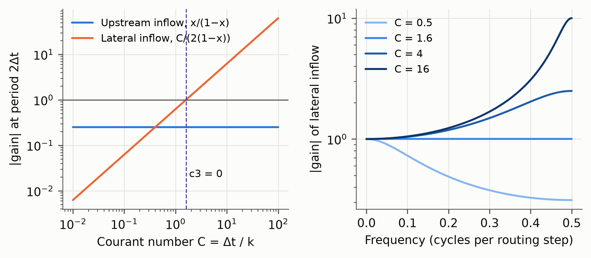

*Figure 3. Left: magnitude of the gain at the period of two steps for upstream inflow, x/ (1 − x), and for lateral inflow, Δt/ (2k (1 − x)). Right: magnitude of the lateral inflow gain across frequencies for four values of Δt/k.*

**Reaches of zero length.** A reach of zero length has k = 0 and lies outside the window at every step. Eq. 6 is undefined there; written as c₁ = (Δt − 2kx)/ (Δt + 2k (1 − x)) and its counterparts, the coefficients are c₁ = c₂ = 1 and c₃ = −1, and Eq. 5 is $Q_{t+1} + Q_t = I_{t+1} + I_t$ exactly. The reach is neutrally stable, |H_u (ω)| = 1 at every frequency, so a mismatch between outflow and inflow alternates without decay, and the lateral gain of Eq. 15 is unbounded. No run-time treatment applies: subcycles would need infinitely many steps, and inflating k adds a travel time of Δt/ (2 (1 − x)), 37.5 min at 1 h, that the reach does not have. But a reach of zero length stores nothing, takes no time, and passes the sum of its inflows. Removing it and joining its upstream reaches to its downstream reach, the merge treatment of Section 2.9, is exact: the network loses a travel time and a variance of zero (Table 1). At an outlet its upstream reaches become outlets, and an isolated one is a catchment draining directly to the sea or a sink.

### 2.8 Mass, negative discharge, and clamping

Because c₁ + c₂ + c₃ = 1 and c₄ = c₁ + c₂, Eq. 7 conserves mass for any coefficients, negative ones included. A code that clamps negative discharge to zero either gains the clamped volume, if the clamped series passes downstream, or reports discharge that no longer integrates to the routed volume, if only the written discharge is clamped. Either way the clamp hides the signal of a reach outside the window, keeps the positive half of its alternation, and replaces an error with a known cause and remedy by one without either. Every value reported here is routed and unclamped.

### 2.9 Options to avoid the errors

Choosing the step can minimize but not eliminate the reaches outside the window; the remaining options treat them.

**Substeps.** A reach is divided into N = ⌈2kx/Δt⌉ equal sub-reaches of travel time k/N and the original x, each with c₁ ≥ 0 and 1/N of the lateral inflow. The cascade keeps the mean k but its variance falls to k² (1 − 2x)/N (Eq. 13), so it changes the model and tends to pure translation as Δt → 0, at N times the cost.

**Diffusion-preserving substeps** (introduced here; river-route's treatment of reaches too long). If each sub-reach takes

$$
x_N = \tfrac{1}{2} - N\left (\tfrac{1}{2} - x\right), \tag{16}
$$

the cascade keeps both the mean k and the variance k² (1 − 2x). Eq. 16 is the Muskingum–Cunge x of a reach N times shorter, since D is inversely proportional to Δx, so a scheme that computes x from reach length makes this adjustment itself unless it bounds x from below, as the NWM does at 0.25 (Section 4.2). For N ≥ 2 and x = 0.2, x_N is negative, which in the Muskingum–Cunge reading is a reach shorter than the characteristic length $q/ (S_0 c)$; the lower bound of the window is then negative, c₁ > 0 at any step, and Eq. 14 gives a non-negative response. A negative x makes c₂ negative when C < −2x, but the response stays non-negative, because it depends on c₂ only through c₂ + c₁c₃ > 0 (Section 2.4). Pieces of unequal travel time k_i keep both moments with x_i = 1/2 − (1/2 − x)k/k_i, of which Eq. 16 is the case k_i = k/N, and every coefficient of a piece is non-negative when k_i lies within (1 − 2x)k of Δt. The fewest equal pieces are therefore N = ⌈k/ (Δt + (1 − 2x)k)⌉, at most ⌈1/ (1 − 2x)⌉: two for every reach too long at x = 0.2, whatever the step. The cascade also keeps the mean delay of the reach's own lateral inflow, k (1 − x), which pieces of the original x shorten. More pieces converge to a fixed model as Δt → 0 (Fig. 4), so a long reach can be subdivided validly into as many pieces as its geometry warrants, but two make its coefficients non-negative.

**Subcycles** (river-route's treatment of reaches too short). A reach is routed in m = ⌈Δt/ (2k (1 − x))⌉ steps of its own, with its upstream inflow interpolated linearly within each step. This local time stepping does not change the reach and converges to the reference, at m times the cost on the short reaches only.

**Inflated k.** The travel time of a reach too short is raised to k' = Δt/ (2 (1 − x)), adding travel time k' − k and variance (k'² − k²)(1 − 2x), at no cost.

**Merge.** A reach too short is deleted, its upstream reaches draining into the reach below, which also receives its runoff. Where it joins two confluences, as short reaches often do (Section 4.1), the confluences become one. The network loses the travel time k, the variance k² (1 − 2x), and the discharge at the reach, at no cost. This is the edit of hydrofabric consolidation and refactoring.

**Stabilized** combines substeps with x held for reaches too long and subcycles for reaches too short.

**x from a diffusivity.** Setting x per reach from a diffusivity D_h, x = 1/2 − D_h/ (vL) for length L and celerity v, of which Eq. 16 is a special case, keeps c₃ ≥ 0 whenever Δt ≤ L/v + 2D_h/v², a window that no longer shrinks to zero with the reach, and makes the diffusion of a reach, vL (1/2 − x) = D_h, independent of how the network is cut.

*Table 1. The treatments, what they change about the model, and what they cost.*

| Treatment            | Applies to | Mean travel time | Variance             | Converges to the reference as Δt → 0      | Coefficients ≥ 0       | Cost                                            |
|----------------------|------------|------------------|----------------------|-------------------------------------------|------------------------|-------------------------------------------------|
| Standard             | —          | kept             | kept                 | yes                                       | only inside the window | 1                                               |
| Substeps             | c₁ < 0     | kept             | divided by N         | no: tends to pure translation             | yes                    | × N on split reaches                            |
| Substeps, x adjusted | c₁ < 0     | kept             | kept                 | to a fixed model with the reach's moments | yes                    | × N on split reaches; N = 2 suffices at x = 0.2 |
| Subcycles            | c₃ < 0     | kept             | kept                 | yes                                       | yes                    | × m on short reaches                            |
| Inflated k           | c₃ < 0     | + (k' − k)       | + (k'² − k²)(1 − 2x) | no (no reach is short as Δt → 0)          | yes                    | none                                            |
| Merge                | c₃ < 0     | − k              | − k²(1 − 2x)         | no (no reach is short as Δt → 0)          | yes                    | fewer reaches                                   |

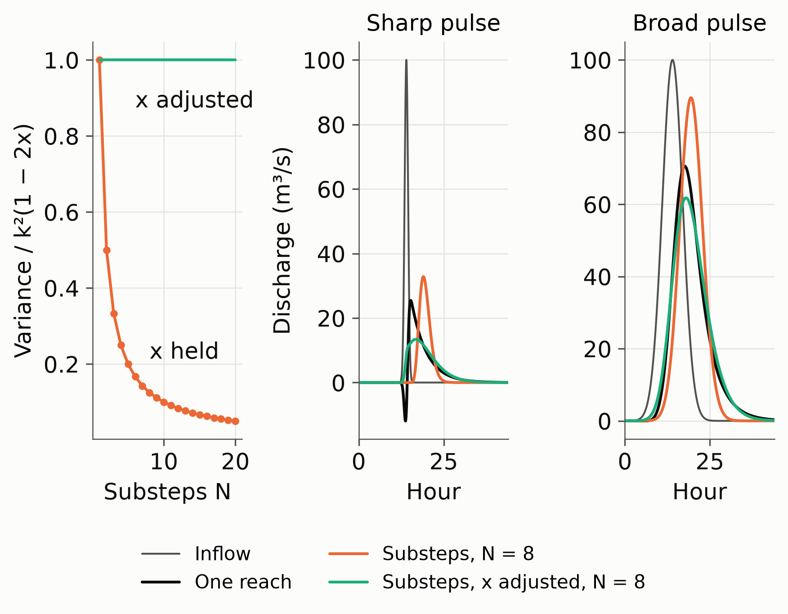

*Figure 4. Left: the travel time variance of a reach split into N substeps with x held at 0.2 and with x lowered by Eq. 16. Center and right: a sharp and a broad pulse routed through one reach of k = 5.6 h, through eight substeps with x held, and through eight substeps with x lowered, at Δt = 60 s.*

## 3 Methods

### 3.1 Hydrofabrics and the census of reaches outside the window

TDX-Hydro is a global hydrography derived by the U.S. National Geospatial-Intelligence Agency from the 12 m TanDEM-X elevation model [@carlson2024]. RFS v3 processes it into a routing network by documented edits: removal of coastal watersheds draining less than 250 km² to the sea, lake edits that route the inlets of large lakes to their outlets, removal of zero-length streams that bridge three-way confluences, dissolution of first-order headwaters into their receivers, pruning of small branches, and consolidation of reaches shorter than 2 km into a neighbor not across a confluence, so that a short reach with a confluence at both ends is kept. The global network holds 4,899,534 reaches, each with x = 0.2 and a travel time from its length L and Strahler order ω,

$$
v = 0.5 + 0.0375\, (\omega - 2)\ \text{m s}^{-1}, \qquad k = \operatorname{round} (L / v), \tag{17}
$$

from 0.5 m s⁻¹ at order 2 to 0.8 m s⁻¹ at order 10, which reproduces the k of every reach to within 1 s. Within an order k is proportional to length, so the spread of k is the spread of reach lengths, which the delineation sets.

The census covers TDX-Hydro as delineated (every link of its 62 regions, 15,940,505 links) and as processed for RFS v3, HydroRIVERS version 1.0 (8,477,883 reaches), MERIT-Basins (MERIT Hydro version 0.7, Basins version 1 with its first bug fix, 2,939,408 reaches), NHDPlus V2, and the NextGen hydrofabric. To compare segmentations independently of each model's parameters, every reach is given a travel time by Eq. 17 from the length and Strahler order its hydrofabric publishes, and x = 0.2. Eq. 17 is extended to first-order reaches, which RFS v3 does not route and which are half of the reaches of TDX-Hydro as delineated, HydroRIVERS, and MERIT-Basins, as v = 0.4625 m s⁻¹. A reach is too long or too short at each step from 30 s to 3 h by Eq. 12; equivalently, it lies inside the window when its length lies between vΔt/ (2 (1 − x)) and vΔt/ (2x), so the census is a statement about reach lengths. Reaches of zero length are too short at every step and are also reported on their own; MERIT-Basins reaches whose downstream reach is themselves are counted as isolated. Reaches too short are classified by position: a confluence at both ends, at one end, an unbranched chain, or a headwater. [pending: census of NHDPlus V2 and the NextGen hydrofabric.]

### 3.2 Review of the source code of RAPID, WRF-Hydro, and t-route

We reviewed RAPID [@rapid_code] at commit 8314510 (24 June 2024), the router of GRADES [@lin2019]; the Muskingum–Cunge routine of WRF-Hydro [@wrfhydro_code] at commit 47a64b6 (30 September 2026), which the NWM runs [@gochis2020], together with the NWM v3.0 release (tag `nwm-v3.0-final`) and tags `v5.0.0`, `v5.0.3`, and `v5.1.1` to confirm what the NWM runs and date changes; and t-route [@troute_code] at commit 12a8eae (30 January 2025), which re-implements that routine for the NWM and NextGen. For each we recorded how k, x, and Δt are set and bounded, whether the coefficients are checked, what happens to negative discharge, whether reaches are adapted, how inflows enter the update, and what discharge is written, with every departure from the scheme of Section 2 and every unchecked condition, each cited by file and lines. WRF-Hydro and t-route label the coefficients differently: their C1 multiplies the upstream inflow at the start of the step, their C2 that at its end (our c₁), and their C3 the outflow at the start of the step.

### 3.3 The river-route routing code

river-route (<https://github.com/rileyhales/river-route>) is an open-source Python package for routing runoff through large river networks. Version 3 solves Eq. 10 without forming the matrix: with the network in a depth-first topological order, it routes each reach's whole series once its upstream reaches are done and adds the result into the inflow of the reach below, the same forward substitution at O (nT) cost for n reaches and T steps, in numba-compiled single precision kernels. The routing step must divide the runoff step, so runoff is never resampled, and the reporting step must be a multiple of the runoff step. Its stabilization procedure implements the feature set of Section 5.7: a check of the coefficient signs before routing that warns (the default), raises, or is silenced; in the stabilized network type, subcycles for reaches too short and diffusion-preserving substeps (Eq. 16) for reaches too long, the fewest that make every coefficient non-negative, reported at each reach's outlet; discharge written unclamped; a default step equal to the largest divisor of the runoff step at which the coefficients of every reach can be made non-negative, which for x ≤ 1/3 is the runoff step itself; runoff entered as interval means and discharge reported as the trapezoidal mean of the computed discharges (Eq. 9); and a topology that is never changed, with a network refused if it holds a reach of zero length, a reach that drains into itself, or an x above 1/2.

The experiments call river-route's coefficient preparation and kernels through a harness that replaces only the file handling, taking forcing as arrays and recording discharge at full single precision instead of river-route's default writer, which rounds to 12 mantissa bits; it reproduces the Router bit for bit with and without substeps and subcycles at 300 s and 3600 s. It records for each hour the plain mean of the discharges computed within it, whose effect on timing Section 4.7 measures. Treatments that change only how a reach is routed are river-route stabilized networks with the treatment's substeps, subcycles, and x; inflated k and merge are ordinary networks of the edited table, and merge sums the runoff of each deleted reach into its receiver. The matrix was routed with an earlier version of river-route, whose kernels reported that plain mean and whose stabilized network divided a reach too long into ⌈2kx/Δt⌉ substeps of its own x, the stabilized treatment of Section 2.9; Section 3.11 compares it with the present version.

### 3.4 Study basin: the Columbia River

The Columbia basin is the part of TDX-Hydro region 7020014250 upstream of the reach at the Pacific (riverId 720207783): 29,405 reaches of Strahler orders 2 to 9 draining 600,843 km² (Table 2), with travel times of 39.1 days along the longest path to the Pacific and 19.1 days along the median one. We analyze it as a whole and along the main stems of fourteen major tributaries (Fig. 5), which carry 526 observation reaches, one every 20 km of channel.

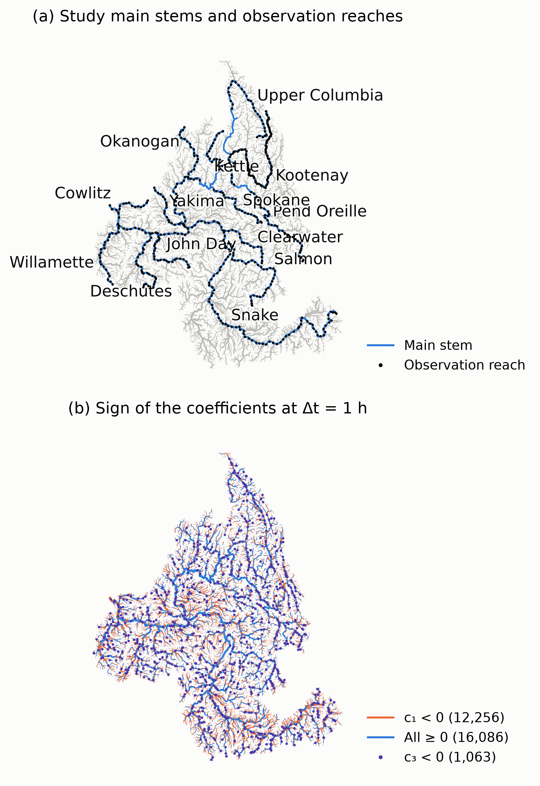

*Figure 5. The Columbia basin in the RFS v3 network. (a) The main stems of the fourteen major tributaries and of the Columbia, and the observation reaches along them. (b) Every reach by the sign of its coefficients at Δt = 1 h; reaches too short are drawn as points because most are shorter than a kilometer.*

*Table 2. Reaches of the Columbia basin by Strahler order.*

| Order | Reaches | v (m s⁻¹) | Median L (m) | 1st pct. L (m) | Median k (s) | Min k (s) | Max k (s) |
|-------|---------|-----------|--------------|----------------|--------------|-----------|-----------|
| 2     | 14,932  | 0.500     | 4,779        | 1,443          | 9,558        | 263       | 87,045    |
| 3     | 6,952   | 0.538     | 3,896        | 376            | 7,249        | 56        | 61,017    |
| 4     | 3,730   | 0.575     | 3,707        | 241            | 6,447        | 19        | 53,973    |
| 5     | 1,874   | 0.613     | 3,599        | 201            | 5,876        | 27        | 39,241    |
| 6     | 1,274   | 0.650     | 3,503        | 209            | 5,389        | 35        | 43,214    |
| 7     | 314     | 0.688     | 3,449        | 394            | 5,017        | 349       | 18,134    |
| 8     | 202     | 0.725     | 3,385        | 596            | 4,669        | 712       | 19,136    |
| 9     | 127     | 0.763     | 3,129        | 499            | 4,103        | 171       | 30,202    |

### 3.5 Forcing

**ERA5 2002–2011.** Hourly ERA5 total runoff [@hersbach2020] at 0.25° is aggregated once to the Columbia catchments with the area-weighted grid table of RFS v3. It is never negative over the basin and exactly zero in 6% to 21% of catchment-hours. Ten years are routed from a dry network on 1 October 2001, discarding three months of spin-up. Each simulation keeps, for every reach and year, the annual peak and its hour, the volume, the hours and volume of negative discharge, the oscillation hours (Section 3.8), and the total variation; the hourly series of the observation reaches; and the hourly series of every reach in four 45-day event windows chosen from the reference: the largest peaks of 2000–2019 at the Columbia outlet (June 2002), the Snake mouth (June 2011), and the Willamette mouth (December 2005 to January 2006), and the flashiest peak relative to median flow at a smaller tributary mouth (the Spokane, April 2002).

**Synthetic burst and square wave.** Every catchment produces a steady 0.02 mm h⁻¹, and every simulation starts from its exact steady state. From hour 24 the burst adds one hour of 2 mm h⁻¹ over the whole basin; the square wave instead alternates 2 mm h⁻¹ and none every hour for a day, the highest frequency an hourly forcing can carry. Both run 45 days.

### 3.6 Reference solution

The reference is the standard network routed at Δt = 30 s, with the 26 reaches whose k is shorter than 150 s subcycled to a Courant number of at most 0.2. By Eq. 13 and the second-order accuracy of the trapezoidal rule, it approximates the continuous-time solution of the delineated network: routing the synthetic scenarios at 10 s changed the median peak by 0.015% of the rise and any peak or hydrograph by at most 0.47%. The reference is a solution of the same model, not a physical truth, and inherits the dip of Eq. 14; comparing with it isolates the numerical handling of the routing.

### 3.7 Simulation matrix

The matrix crosses seven steps (30 s, 1, 5, 10, 15, 30, and 60 min) with seven treatments (standard, substeps, x-adjusted substeps, subcycles, stabilized, inflated k, merge). Cells identical to others are not run: at 30 s no reach is too short, so the short-reach treatments equal the standard network and stabilized equals substeps, and at 1 min stabilized differs from substeps in only four reaches. That leaves 44 cells and the reference per forcing scenario.

### 3.8 Measures

Each cell is compared with the reference reach by reach: the error of the peak relative to the reference rise (synthetic) or peak (ERA5), the shift of the peak hour, the largest absolute difference, and the alternating part of the difference, $\max_t |e_{t+1} - 2e_t + e_{t-1}|/4$, which equals $A$ for a difference alternating $\pm A$ and nearly vanishes for a smooth one. Oscillation hours close four hourly changes alternating in direction, which neither a natural peak nor a dip produces. Negative hours and volume count the negative discharge directly.

### 3.9 Single-defect experiment

Routing is linear, so the influence of one reach downstream can be isolated exactly. Each reach too short for Δt (1,063 at 1 h, 439 at 30 min) is a seed. The network is routed with every short reach subcycled and again with a batch of seeds left untreated, batched so that no seed lies in the watershed of another's point 200 km downstream; below each seed the difference is its contribution alone. It is measured at the seed and 2, 5, 10, 20, 50, 100, and 200 km below it, under both synthetic forcings and the Willamette and Columbia ERA5 events. For reaches too long, a random sample of 400 seeds is split into substeps, with x held or adjusted, and compared with the standard network the same way.

### 3.10 Computational benchmark

The work of a treatment, reach-steps per simulated hour, follows from its substeps and subcycles. Wall time is timed by routing two copies of one month of ERA5 catchment runoff (June 2011), held in memory, over each cell's network alone on the machine, at one and at eight threads, keeping the fastest of three runs after a warm-up, scaled to seconds per simulated year, on an Apple M3 Max with 12 performance and 4 efficiency cores and 64 GB of memory.

### 3.11 Comparison of river-route versions

The earlier version of river-route that routed the matrix and the present version each route the burst, the square wave, and ERA5 2002–2011 at every step of the matrix, each against a reference routed by the same version, so that each difference has one cause. The standard network differs between the versions only in how discharge is reported, the plain or the trapezoidal mean of the computed discharges, which isolates the reporting convention. River-route's stabilized network differs also in its treatment of reaches too long: ⌈2kx/Δt⌉ substeps of the reach's own x before, the fewest substeps with x from Eq. 16 after. With the present version, x-adjusted substeps in ⌈2kx/Δt⌉ pieces and in the fewest pieces, both without subcycles, isolate the number of pieces. The harness reproduces the Router of each version bit for bit.

## 4 Results

### 4.1 Incidence of reaches outside the window

With x = 0.2 a reach lies inside the window when k lies between 0.625 Δt and 2.5 Δt, or its length between vΔt/1.6 and vΔt/0.4: 94 to 375 m at 0.5 m s⁻¹ and Δt = 5 min, and 1.1 to 4.5 km at 1 h (Table 3, Figs. 6 and 7). [pending: census of NHDPlus V2 and the NextGen hydrofabric.] The median reach is 2.8 km long in TDX-Hydro, 3.0 km in HydroRIVERS, and 6.8 km in MERIT-Basins, so at the 5 min channel step of the NWM [@read2023] 94% to 99% of the reaches of each are too long, and at 15 min 79% to 93%. At 1 h they part. TDX-Hydro and HydroRIVERS, which keep every first-order stream, have half of their reaches inside the window, 30% and 32% too long, and 21% and 16% too short, and their share inside the window peaks between 1 and 2 h. MERIT-Basins has the longest reaches: 66% are too long at 1 h, and no step up to 3 h puts more than 53% inside the window. At the 15 min step and x = 0.3 of the global RAPID configuration, the longest reach inside the window is 1.5 km at 1 m s⁻¹, a fifth of the median MERIT-Basins reach. Processing changes the short side most: RFS v3, which dissolves the first-order streams of TDX-Hydro and consolidates reaches shorter than 2 km, has 46% of its reaches too long but only 3.2% too short at 1 h.

*Table 3. Share of reaches outside the window, with travel times from Eq. 17 and x = 0.2. Counts and lengths are from the census, except the published reach count of NHDPlus V2 (Section 1). …: not yet computed.*

| Hydrofabric                       | Used by          | Reaches     | Zero length | Median L (km) | 5 min: c₁ < 0 | 5 min: c₃ < 0 | 1 h: c₁ < 0 | 1 h: c₃ < 0 | 1 h: all ≥ 0 |
|-----------------------------------|------------------|-------------|-------------|---------------|---------------|---------------|-------------|-------------|--------------|
| NHDPlus V2                        | NWM              | 2.7 million | …           | …             | …             | …             | …           | …           | …            |
| NextGen hydrofabric               | NextGen, t-route | …           | …           | …             | …             | …             | …           | …           | …            |
| HydroRIVERS (HydroSHEDS)          | —                | 8,477,883   | 0           | 2.96          | 99.41%        | 0.003%        | 32.17%      | 16.25%      | 51.58%       |
| MERIT-Basins                      | GRADES, RAPID    | 2,939,408   | 302         | 6.83          | 98.39%        | 0.16%         | 66.07%      | 6.86%       | 27.07%       |
| TDX-Hydro                         | —                | 15,940,505  | 5,477       | 2.76          | 93.85%        | 1.27%         | 29.54%      | 20.85%      | 49.61%       |
| TDX-Hydro as processed for RFS v3 | GEOGLOWS         | 4,899,534   | 0           | 4.53          | 99.22%        | 0.16%         | 46.32%      | 3.17%       | 50.51%       |

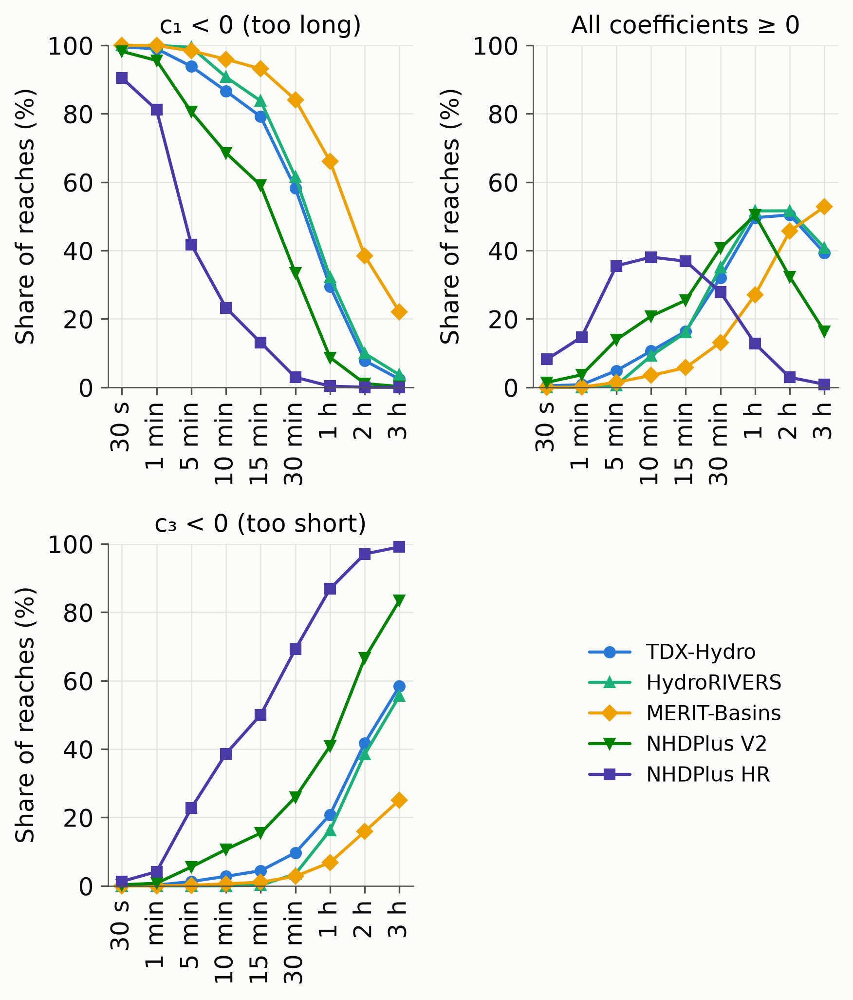

*Figure 6. Share of reaches too long for the time step (c₁ < 0), with every coefficient non-negative, and too short for it (c₃ < 0), with travel times from Eq. 17 and x = 0.2.*

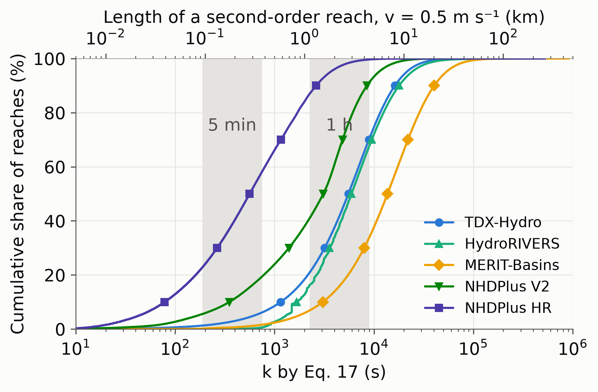

*Figure 7. Distribution of the travel time k of Eq. 17, with the windows of k that keep every coefficient non-negative at Δt = 5 min and 1 h (x = 0.2). The upper axis gives the length of a second-order reach (v = 0.5 m s⁻¹) with that k; a reach of another order with the same k is up to 7.5% shorter (first order) or 60% longer (tenth order). Reaches of zero length lie off the axis.*

TDX-Hydro, HydroRIVERS, and MERIT-Basins end a reach at every confluence and nowhere else, so their reaches too short for 1 h are headwaters or lie between two confluences, in about equal numbers: 51% and 49%, 46% and 53%, and 52% and 46%. Dissolving first-order streams removes the first group; no consolidation along a chain removes the second.

Two hydrofabrics carry reaches of zero length. TDX-Hydro has 5,477, 0.034% of its links, in 61 of its 62 regions (up to 0.19% in one) and at every Strahler order from 1 to 9. Each is a point, with zero straight-line length and the same contributing area at both ends. Of these, 4,064 have two upstream links and flow into a link that has two, so three streams meet at one point (four where two such links follow each other, in 40 cases); 1,176 join two streams at an outlet; and 237 are isolated points at an outlet draining 3.7 to 8.9 km². MERIT-Basins has 302 reaches of zero length and 52 more shorter than 0.14 m, all first-order reaches that name themselves as their downstream reach, receive no inflow, and drain 25.0 to 54.7 km², just above the 25 km² at which its headwaters begin; each is a loop in a network that should be acyclic (Section 2.3). HydroRIVERS, whose shortest reach is 60 m, has none, nor does RFS v3, which removes those of TDX-Hydro. Few as they are, zero-length reaches are the only reaches that no step and no run-time treatment can route (Section 2.7), and every one must be resolved in the topology before routing.

### 4.2 How RAPID, WRF-Hydro, and t-route treat the errors

None of the three codes checks the sign of its coefficients (Table 4, R2, W2, T1). RAPID assembles Eq. 10 as A = 𝐈 − diag (c₁)N and solves it at every step with a Krylov solver (R1), leaving reaches outside the window as they are. WRF-Hydro and t-route avoid parts of the window by changing the scheme, in ways their documentation does not describe.

**Parameters.** RAPID scales k and x by multipliers from an unconstrained Nelder–Mead search (R3), so calibration can move any reach across the window, or x outside [0, 1/2], without notice; @david2011 state that the method "is stable for any x ∈ [0, 0.5], regardless of the value of k and Δt", which is true (Section 2.4) but says nothing about the signs of the coefficients. WRF-Hydro sets k = max (Δt, Δx/c_k) (W1), so C ≤ 1 and c₃ is never negative, at the price of inflating k beyond the Δt/ (2 (1 − x)) that keeps c₃ non-negative. It clips x to [0.25, 0.5] (W2), which narrows the window to a factor of at most three, caps the diffusion of a reach at a quarter of c_kΔx, and replaces the negative x of short reaches (Section 2.9) with 0.25. From version 5.1.1, and in the NWM v3.0 release, x = (1/2)(1 − Q/ (2T_wS₀c_kΔx)) instead of the Cunge formula x = 1/2 − Q/ (2T_wS₀c_kΔx) used through 5.0.3 (W3), so the numerical diffusion of a reach is half the hydraulic diffusivity the Cunge formula matches. In the secant iteration on depth, the x of the first trial depth comes from the previous iteration's residual (W4), and in t-route from an `intent(out)` argument read before it is assigned (T2); neither enters the final coefficients, but both steer the iteration.

**Upstream inflow.** The parallel driver of WRF-Hydro, which the NWM runs, copies each reach's discharge into both its current and previous slots at the end of a step and sums the next step's upstream inflow from them (W8; NWM v3.0 `trunk/NDHMS/Routing/module_channel_routing.F`, lines 1936–1937 and 2018), as a comment acknowledges: "I think gQLINK (,2) is actually previous. Global array never sees current." The update becomes $Q_{t+1} = (c_1 + c_2) I_t + c_3 Q_t + c_4 Q_{l,t}$, whose coefficients are non-negative once k ≥ Δt but whose impulse response is geometric, with mean k (1 − x) + Δt/2 and variance k² (1 − x)² − Δt²/4 instead of k and k² (1 − 2x): each reach becomes a linear reservoir faster than the Muskingum–Cunge reach, 47.5 min instead of 60 min for k = 1 h, x = 0.25, and Δt = 300 s. The t-route kernel states that it "exactly follows SUBMUSKINGCUNGE in NWM" with this lag (T4), but by default t-route uses the true current inflow and keeps the lag as an option that is off (T5), so the two route the same hydrofabric with different models, and t-route's reaches with k > 2Δt can dip.

**Negative discharge.** RAPID writes the update as routed (R4). WRF-Hydro and t-route limit the lateral term, which in WRF-Hydro also carries channel loss, replace a still-negative update by the larger of two partial sums or by zero, and set zero discharge where no inflow or state is positive (W5, W6, T3); with k ≥ Δt only c₁I_{t+1} can be negative, so the fallback deletes exactly the dip of Section 2.6 and with it the mass balance of the step. The NWM driver also skips non-positive upstream discharge in the inflow sum (W7).

**Time step and forcing.** One step serves every reach in all three codes, and each holds the lateral inflow as the mean rate of the forcing interval, entering as (c₁ + c₂)Q_l (R6, W9, T6). WRF-Hydro requires the routing step to divide the land-surface step (W10), and the NWM routes at 300 s with hourly forcing. RAPID truncates the number of steps per runoff interval without checking that the step divides it (R5), stretching every travel time when it does not. t-route does not check the division either and reads the forcing interval with `timedelta.seconds`, which drops whole days (T7). WRF-Hydro warns and continues when the secant iteration fails (W11); in t-route that warning and the stops for invalid parameters are commented out (T8).

**Reaches, hydrofabric, and output.** None of the codes subdivides or subcycles a reach. t-route offers a refactored network only for diffusive routing, "due to short segments" (T9), and its Muskingum–Cunge routing relies on the NextGen hydrofabric [@johnson_hyaggregate]. RAPID writes the mean of the discharges at the start of each step, labeled a time mean (R7), which lags the interval mean by half a routing step (Eq. 9); WRF-Hydro and t-route write the discharge computed at the last step of the interval (W12, T10), which read as an interval mean leads it by half the output interval, and the NWM writes integers of 0.01 m³ s⁻¹, so discharge below 0.005 m³ s⁻¹ is written as zero.

*Table 4. Findings in the source code of RAPID (commit 8314510), WRF-Hydro (commit 47a64b6), and t-route (commit 12a8eae), with the file and lines at those commits. W1–W3, W5, W7, and W8 hold also in the NWM v3.0 release (tag nwm-v3.0-final).*

| ID  | Finding                                                                                                           | File and lines                                                                                                                       |
|-----|-------------------------------------------------------------------------------------------------------------------|--------------------------------------------------------------------------------------------------------------------------------------|
| R1  | Muskingum equations of all reaches assembled as A = 𝐈 − diag(c₁)N and solved as AQ = b at every step              | `src/rapid_routing_param.F90`, 66–69; `src/rapid_routing.F90`, 103                                                                   |
| R2  | Coefficients computed without a sign check                                                                        | `src/rapid_routing_param.F90`, 43–62                                                                                                 |
| R3  | k and x scaled by multipliers from an unconstrained Nelder–Mead search                                            | `src/rapid_create_obj.F90`, 213; `src/rapid_phiroutine.F90`, 59–62                                                                   |
| R4  | Update written as routed, with no clamp or limiter                                                                | `src/rapid_routing.F90`, 89–92                                                                                                       |
| R5  | Routing steps per runoff interval truncated to an integer, with no check that Δt divides the interval             | `src/rapid_init.F90`, 114                                                                                                            |
| R6  | Lateral inflow is the interval volume over its length, held over every routing step, times c₁ + c₂                | `src/rapid_main.F90`, 121–122; `src/rapid_routing.F90`, 89–92                                                                        |
| R7  | Written discharge is the mean of the discharges at the start of each step, labeled a time mean                    | `src/rapid_routing.F90`, 58–77, 196; `src/rapid_create_Qout_file.F90`, 91, 100                                                       |
| W1  | k = max(Δt, Δx/c_k)                                                                                               | `src/Routing/module_channel_routing.F90`, 283–287                                                                                    |
| W2  | x clipped to [0, 0.5] at the first trial depth and to [0.25, 0.5] at the second; coefficients not checked         | same file, 289–308, 372–391                                                                                                          |
| W3  | x = (1/2)(1 − Q/(2T_wS₀c_kΔx)) from v5.1.1; x = 1/2 − Q/(2T_wS₀c_kΔx), non-positive reset to 0.25, through v5.0.3 | same file, 374–377; v5.0.0 `trunk/NDHMS/Routing/module_channel_routing.F`, 459–469; v5.0.3 same file, 445                            |
| W4  | x of the first trial depth computed from the previous iteration's residual                                        | same file, 237, 291–294, 322–323                                                                                                     |
| W5  | Lateral term limited; a negative update replaced by the larger of two partial sums, or by zero                    | same file, 319–321, 400–407, 483–492                                                                                                 |
| W6  | Zero discharge when no inflow or state is positive                                                                | same file, 233, 501–503                                                                                                              |
| W7  | Non-positive upstream discharge skipped in the sum of upstream inflow                                             | same file, 1963–1964                                                                                                                 |
| W8  | Upstream inflow of the current step is the previous step's discharge                                              | same file, 1959–1964, 2078–2080                                                                                                      |
| W9  | Lateral inflow is a rate over the land-surface step, not divided among routing steps                              | same file, 1832–1835, 1919                                                                                                           |
| W10 | Routing step required to divide the land-surface step                                                             | `src/Data_Rec/module_namelist.F90`, 404–407                                                                                          |
| W11 | Failure of the secant iteration to converge reported; routing continues                                           | `src/Routing/module_channel_routing.F90`, 459–467                                                                                    |
| W12 | Written streamflow is the discharge of the last step of the interval, as integers of 0.01 m³ s⁻¹                  | `src/Routing/module_NWM_io.F90`, 318, 949; `src/Routing/module_NWM_io_dict.F90`, 767                                                 |
| T1  | Same bound on k, clip of x, and coefficients as WRF-Hydro, in single precision; coefficients not checked          | `src/kernel/muskingum/MCsingleSegStime_f2py_NOLOOP.f90`, 271–275, 288–312; `src/kernel/muskingum/varPrecision.f90`, 5                |
| T2  | x of the first trial depth read from an `intent(out)` argument before it is assigned                              | `MCsingleSegStime_f2py_NOLOOP.f90`, 92–93, 207, 291                                                                                  |
| T3  | Same limiter, fallback, and zero branch as WRF-Hydro                                                              | `MCsingleSegStime_f2py_NOLOOP.f90`, 73–74, 149–158, 171–172, 315–318                                                                 |
| T4  | Kernel stated to follow the NWM routine exactly, with the current upstream inflow equal to the previous           | `MCsingleSegStime_f2py_NOLOOP.f90`, 11–15                                                                                            |
| T5  | Current upstream inflow used by default; the lag of the NWM is the option `assume_short_ts`, off by default       | `src/troute-config/troute/config/compute_parameters.py`, 47–50; `src/troute-routing/troute/routing/fast_reach/mc_reach.pyx`, 499–505 |
| T6  | One step for every segment, 300 s and 12 per forcing interval by default; lateral inflow held over each interval  | `compute_parameters.py`, 414–422; `src/troute-routing/troute/routing/compute.py`, 548; `mc_reach.pyx`, 723                           |
| T7  | Forcing interval read with `timedelta.seconds`; Δt not required to divide it                                      | `src/troute-network/troute/AbstractNetwork.py`, 839–847                                                                              |
| T8  | Stops for invalid channel parameters and a zero denominator, and the warning of non-convergence, commented out    | `MCsingleSegStime_f2py_NOLOOP.f90`, 64–67, 135, 304–307                                                                              |
| T9  | Refactored network offered only for diffusive routing, "due to short segments"                                    | `compute_parameters.py`, 189–198                                                                                                     |
| T10 | Written discharge is the discharge of the last routing step of each interval                                      | `src/troute-network/troute/nhd_io.py`, 758, 2380–2384                                                                                |

### 4.3 Reaches outside the window in the Columbia network

The Columbia network of the experiments is part of RFS v3, with k from its own routing parameters. Its median reach has k = 7,956 s and 90% lie between 2,803 s and 20,808 s, so the window holds most of them only near Δt = 1 h (Fig. 5b). At 1 h, 54.7% of its reaches have every coefficient non-negative, 41.7% are too long, and 3.6% too short; at 15 min, 96.4% are too long; at 5 min, 99.1%; and at 30 s, all but twelve. The global RFS v3 network behaves the same way, with 46.3% too long and 3.2% too short at 1 h. The share inside the window peaks near Δt = 2 h, at 76% in the Columbia and 75% globally, and is 60% in the Columbia at 3 h.

Of the 1,063 Columbia reaches too short for 1 h (median length 748 m), 839 (79%) join a confluence at each end, as do 79% of the 155,097 such reaches of the global network; 60 lie just below a confluence, 55 just above one, 75 in an unbranched chain, and 34 are headwaters. The 2 km consolidation of RFS v3 cannot merge the first group, nor lake outlets, which it also keeps (Section 4.4); this is the topology the merge treatment edits.

Setting x per reach from a diffusivity (Section 2.9) would change the short side. With one diffusivity equal to the median of the Columbia reaches, 681 m² s⁻¹, the median reach keeps x = 0.2 and the shortest 17% take a negative x. The reaches too short for 1 h fall from 1,063 to 43, and at 30 min and shorter none is too short, because 2D_h/v² is at least 2,343 s for every reach; slightly more long reaches are too long at 1 h (46% against 42%).

### 4.4 How the errors manifest under designed forcing

Negative coefficients alone did not bias peaks. Under the burst the median peak error of the standard network stayed within 0.03% of the reference rise up to 30 min and was +1.2% at 1 h (Fig. 8), while the mean absolute error grew with the step, 0.07% at 1 min, 1.8% at 15 min, 3.0% at 30 min, and 10.2% at 1 h, and the peak hour moved at 0.4%, 13%, 35%, and 62% of reaches: the truncation error of resolving a one-hour burst with a comparable step, common to every treatment. The square wave gave 0.07%, 1.9%, 3.8%, and 7.6%.

**Reaches too long.** At 1 min, 99.9% of reaches have c₁ < 0 and the standard network is indistinguishable from the reference, as Section 2.6 anticipates. The reference itself dips below baseflow ahead of the burst at 135 reaches by more than 1% of their rise, by up to 30%, and 21 carry negative discharge for an hour (Fig. 9), deepest on long second-order reaches receiving a fast rise; reach 720112374 (k = 20,631 s, L = 10.3 km) falls to −0.3 m³ s⁻¹ before rising to 1.7 m³ s⁻¹ (Fig. 10, center).

**Reaches too short.** On the 1,063 reaches too short for 1 h, the standard network under the burst had a mean absolute peak error of 9.0% and a 95th percentile of 75%, and 46 carried negative discharge. Under the square wave 50 did so for 492 hours, the worst summing to 81% of its positive volume and reaching 176% of the reference rise below zero. Reach 720195548 (Fig. 10, left), a 582 m lake outlet with 17 inlets, 37,142 km², and k = 896 s, swung between −1,097 and 5,165 m³ s⁻¹ while the reference alternated between 203 and 3,268 m³ s⁻¹.

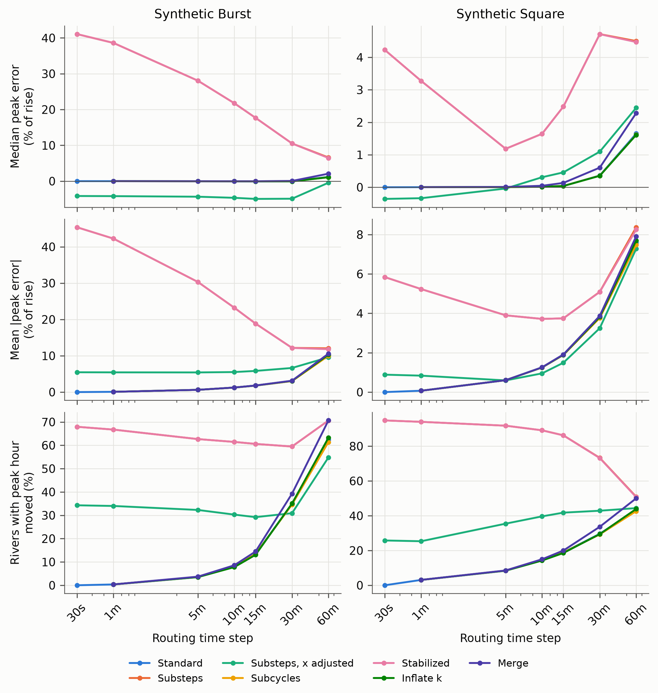

*Figure 8. Error of the peak of every reach against the reference, as a share of the reference rise, for the burst and the square wave: median (top), mean absolute (middle), and the share of reaches whose peak hour moved (bottom). Substeps and the stabilized network nearly coincide, because almost no reach is too short at these steps.*

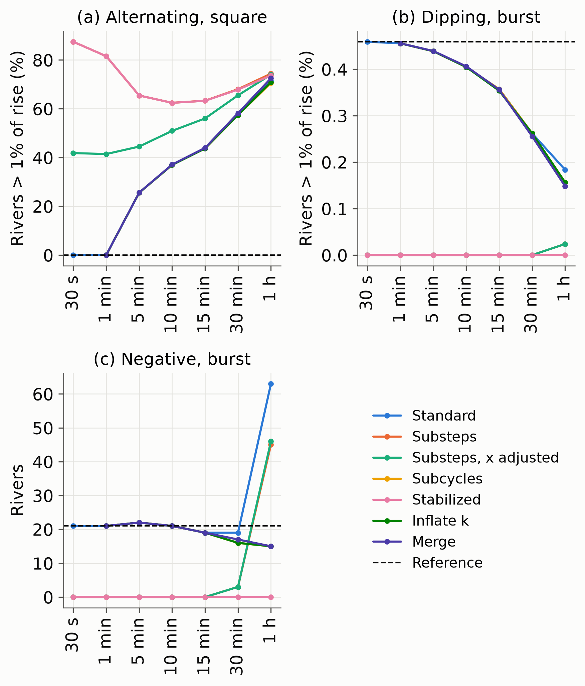

*Figure 9. (a) Reaches whose alternating error exceeds 1% of their rise under the square wave, (b) reaches dipping more than 1% of their rise below baseflow ahead of the burst, and (c) reaches with negative discharge under the burst. The dashed line is the reference.*

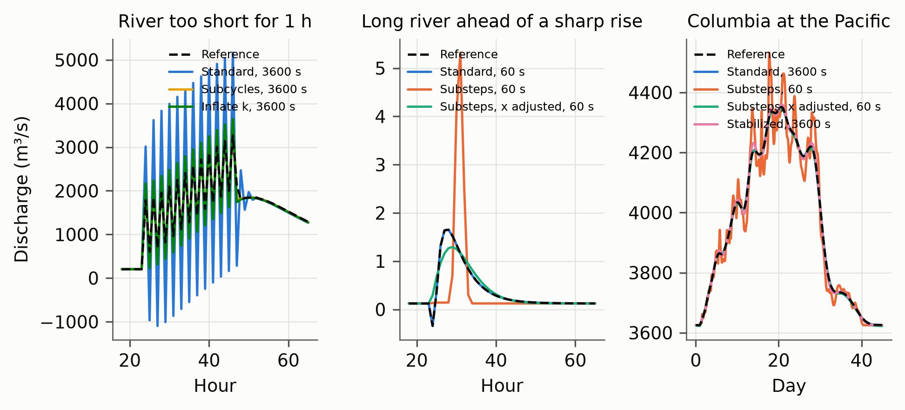

*Figure 10. Left: a lake outlet too short for 1 h under the square wave. Center: a long second-order reach ahead of the burst at 1 min, where the reference itself dips. Right: the Columbia at the Pacific under the burst.*

### 4.5 How the errors manifest under real forcing

<!-- The ERA5 numbers of this section come from the 2000–2019 runs; refresh them from the 2002–2011 matrix. -->

Under ERA5 the two sides of the window behave very differently. With the standard network at 1 h, 13 reaches carried more than 0.1% of their volume as negative discharge, 6 more than 1%, and the worst 11.6%; all are too short for 1 h, second-order reaches 277 to 1,060 m long draining 9 to 24 km². The worst, reach 720047025 (343 m, k = 686 s, c₃ = −0.53), was negative in 62,484 of 175,320 hours, alternating in sign after every sharp change of its runoff while the reference never goes negative (Fig. 11). At 30 min one reach exceeded 0.1%, and at 15 min and shorter negative discharge was no larger than in the reference, 2.8 × 10⁻¹⁰ of the basin's volume, the inherent dip of nearly dry channels. In the 45-day Columbia event, 48 short reaches went negative for 3,016 hours, as low as −48% of their range, and 34 for 1,860 hours in the Willamette event; at 30 min, 19 and 16. Under real forcing the c₃ side produces sustained oscillation at a few reaches, and the c₁ side nothing a user would notice.

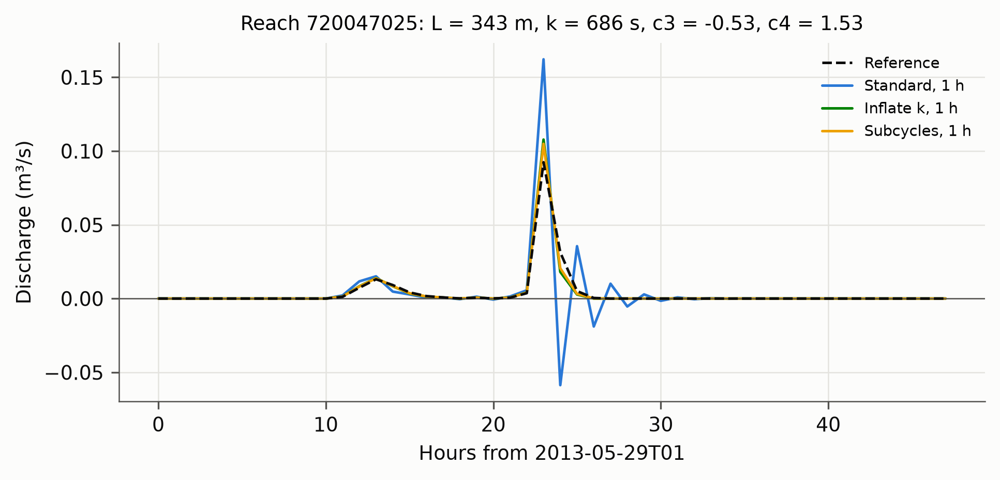

*Figure 11. Discharge of reach 720047025, the reach whose ERA5 discharge at 1 h carried the largest share of negative volume, around its lowest value, under the reference, the standard network at 1 h, and the short-reach treatments at 1 h. Merging removes the reach, so it has no discharge to show.*

### 4.6 How far errors propagate downstream

One reach too short for 1 h, left untreated, made a largest difference at itself of a median 10.4% of the hydrograph range under the burst, 2.2% under the square wave, and 2.2% to 2.9% in the ERA5 events (Fig. 12a, b). Two kilometers below, typically the next reach, it fell to 0.8% under the burst and 0.08% to 0.1% otherwise; at 20 km to 0.02% to 0.06%, and at 50 km to 0.005% to 0.015%. The alternating part fell faster, by more than x/ (1 − x) per reach because dilution compounds it, to 10⁻⁵ of the range by 100 km. Against the seed's own range, which removes dilution, the largest difference 2 km below was 1.1% under the burst and 0.1% to 0.2% otherwise (Fig. 12c, d): the next reach damps most of a short reach's error before any tributary dilutes it. At 30 min every figure was two to five times smaller.

Splitting one long reach reaches much farther. In the Columbia event at 1 h, substeps with x held changed the discharge at the reach by a median 7.3% of its range, 5.4% 2 km below, 2.8% at 20 km, and 0.6% at 200 km, because the diffusion it removes is a low-frequency change that downstream reaches pass on. With x adjusted the change was half as large at the reach and fell to 1.0% at 20 km and 0.1% at 200 km. Relative to each downstream peak, substeps with x held raised the median peak by 2.8% at the reach and 0.7% at 2 km, and moved the peak hour at 35% of seeds and 9% of reaches 20 km below.

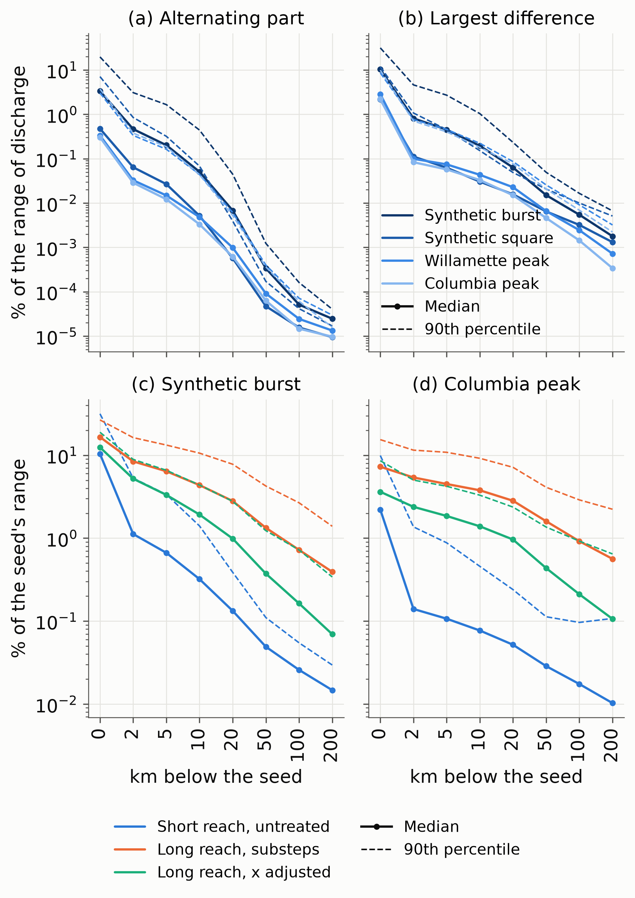

*Figure 12. Difference one defect makes at the channel distance below it at Δt = 1 h. (a, b) A reach too short left untreated, as a share of the range of discharge there: the alternating part and the largest difference, over the 1,063 seeds. (c, d) The largest difference as a share of the seed's own range for a short reach left untreated and a long reach split into substeps with x held or adjusted. Medians are solid and 90th percentiles dashed.*

### 4.7 Efficacy of the mitigation options

**Reaches too long.** Substeps with x held removed every dip and negative value but changed the solution substantially (Fig. 8). Under the burst the median peak rose by 41% of the rise at 30 s, 28% at 5 min, 18% at 15 min, 11% at 30 min, and 7% at 1 h, with a 95th percentile of 104% at 30 s and peak hours moved at two thirds of reaches. The error grows as the step shrinks, because more substeps remove more diffusion (Eq. 13): at reach 720112374 the cascade at 1 min delivered 3.1 times the reference peak three hours late, and at the outlet each tributary's pulse arrived undiffused (Fig. 10). Diffusion-preserving substeps also removed every dip and negative value but left the median peak between −4.2% and −5.0% of the rise at every step from 30 s to 30 min, moved peaks by at most 1 h at the 95th percentile, and did not depend on the step; under the square wave their median error was −0.4% and mean absolute error 0.9%, against 4.2% and 5.8% with x held.

**Reaches too short.** Network-wide the short-reach treatments are indistinguishable from the standard network (Fig. 8), because short reaches are few and their influence local (Section 4.6). On the 1,063 reaches too short for 1 h, subcycles reduced the mean absolute peak error from 9.0% to 3.1% under the burst and 1.9% under the square wave, cut the 95th percentile from 75% to 28% and 11%, and removed every negative value, and the lake outlet of Fig. 10 peaked at 3,594 m³ s⁻¹ without going negative. Inflated k reached 5.5% and 3.2% with no negative values but added travel time, moving more peak hours than the standard network under the square wave. At 30 min subcycles reduced the error of the 439 short reaches from 2.0% to 0.8% and inflated k to 1.4%. Merging reports no discharge for the reaches it removes; elsewhere its peaks matched those of subcycles at the median reach, differed by 1.4% (30 min) and 4.7% (1 h) at the 99th percentile, and by up to 52% at reaches whose joining flows it retimed. Under ERA5, subcycles cut the negative hours of short reaches from 3,016 to 108 in the Columbia event and from 1,860 to 54 in the Willamette event, and neither subcycles nor inflated k go negative at reach 720047025 (Fig. 11).

Tables 5 and 6 give, for every treatment and step, the bias and mean absolute difference from the reference of the peak, its time, and the volume, for the burst at the peak of every reach and for ERA5 at the annual peak of every reach-year.

*Table 5. Effect of each treatment and routing time step on the peak, the peak time, and the volume of every reach under the synthetic burst, against the reference. The bias of the peak is the median over reaches and the bias of the peak time the mean; peaks are a share of each reach's reference rise, and volume is the error over the 45 days. a: at 30 s no reach is too short, so the short-reach treatments are the standard network.*

<!-- begin treatment_effects_synthetic-burst -->

| Treatment            | Measure                           | 30 s  | 1 min | 5 min | 10 min | 15 min | 30 min | 60 min |
|----------------------|-----------------------------------|-------|-------|-------|--------|--------|--------|--------|
| Standard             | Peak, bias (% of rise)            | 0.0   | 0.0   | 0.0   | 0.0    | 0.0    | 0.0    | +1.2   |
|                      | Peak, mean abs. error (% of rise) | 0.0   | 0.1   | 0.6   | 1.2    | 1.8    | 3.0    | 10.2   |
|                      | Peak time, bias (h)               | 0.00  | 0.00  | −0.03 | −0.08  | −0.13  | −0.35  | −0.70  |
|                      | Peak time, mean abs. error (h)    | 0.00  | 0.00  | 0.04  | 0.08   | 0.14   | 0.37   | 0.70   |
|                      | Volume, mean abs. error (%)       | 0.000 | 0.002 | 0.002 | 0.002  | 0.002  | 0.002  | 0.002  |
| Substeps             | Peak, bias (% of rise)            | +41.1 | +38.6 | +28.1 | +21.8  | +17.7  | +10.5  | +6.6   |
|                      | Peak, mean abs. error (% of rise) | 45.4  | 42.3  | 30.3  | 23.2   | 18.8   | 12.2   | 12.1   |
|                      | Peak time, bias (h)               | +1.50 | +1.49 | +1.21 | +0.86  | +0.79  | +0.59  | −0.15  |
|                      | Peak time, mean abs. error (h)    | 3.52  | 3.39  | 2.64  | 2.10   | 1.84   | 1.34   | 1.03   |
|                      | Volume, mean abs. error (%)       | 0.003 | 0.002 | 0.002 | 0.002  | 0.002  | 0.002  | 0.002  |
| Substeps, x adjusted | Peak, bias (% of rise)            | −4.2  | −4.2  | −4.3  | −4.7   | −5.0   | −4.9   | −0.4   |
|                      | Peak, mean abs. error (% of rise) | 5.5   | 5.4   | 5.4   | 5.5    | 5.8    | 6.6    | 9.6    |
|                      | Peak time, bias (h)               | +0.17 | +0.17 | +0.15 | +0.11  | +0.08  | −0.10  | −0.60  |
|                      | Peak time, mean abs. error (h)    | 0.44  | 0.44  | 0.42  | 0.40   | 0.39   | 0.40   | 0.69   |
|                      | Volume, mean abs. error (%)       | 0.063 | 0.017 | 0.002 | 0.002  | 0.002  | 0.002  | 0.002  |
| Subcycles            | Peak, bias (% of rise)            | a     | 0.0   | 0.0   | 0.0    | 0.0    | 0.0    | +1.1   |
|                      | Peak, mean abs. error (% of rise) | a     | 0.1   | 0.6   | 1.2    | 1.8    | 3.0    | 10.0   |
|                      | Peak time, bias (h)               | a     | 0.00  | −0.03 | −0.08  | −0.13  | −0.34  | −0.69  |
|                      | Peak time, mean abs. error (h)    | a     | 0.00  | 0.04  | 0.08   | 0.14   | 0.36   | 0.69   |
|                      | Volume, mean abs. error (%)       | a     | 0.002 | 0.002 | 0.002  | 0.002  | 0.002  | 0.002  |
| Stabilized           | Peak, bias (% of rise)            | +41.1 | +38.6 | +28.1 | +21.8  | +17.7  | +10.5  | +6.5   |
|                      | Peak, mean abs. error (% of rise) | 45.4  | 42.3  | 30.3  | 23.2   | 18.8   | 12.2   | 11.8   |
|                      | Peak time, bias (h)               | +1.50 | +1.49 | +1.21 | +0.86  | +0.79  | +0.59  | −0.13  |
|                      | Peak time, mean abs. error (h)    | 3.52  | 3.39  | 2.64  | 2.10   | 1.84   | 1.34   | 1.03   |
|                      | Volume, mean abs. error (%)       | 0.003 | 0.002 | 0.002 | 0.002  | 0.002  | 0.002  | 0.002  |
| Inflate k            | Peak, bias (% of rise)            | a     | 0.0   | 0.0   | 0.0    | −0.1   | −0.1   | +1.1   |
|                      | Peak, mean abs. error (% of rise) | a     | 0.1   | 0.6   | 1.2    | 1.8    | 3.1    | 10.3   |
|                      | Peak time, bias (h)               | a     | 0.00  | −0.03 | −0.07  | −0.12  | −0.30  | −0.50  |
|                      | Peak time, mean abs. error (h)    | a     | 0.00  | 0.04  | 0.08   | 0.14   | 0.37   | 0.81   |
|                      | Volume, mean abs. error (%)       | a     | 0.002 | 0.002 | 0.002  | 0.002  | 0.002  | 0.002  |
| Merge                | Peak, bias (% of rise)            | a     | 0.0   | 0.0   | 0.0    | 0.0    | +0.1   | +2.1   |
|                      | Peak, mean abs. error (% of rise) | a     | 0.1   | 0.6   | 1.3    | 1.8    | 3.1    | 10.6   |
|                      | Peak time, bias (h)               | a     | 0.00  | −0.03 | −0.08  | −0.14  | −0.39  | −0.91  |
|                      | Peak time, mean abs. error (h)    | a     | 0.00  | 0.04  | 0.09   | 0.15   | 0.44   | 0.97   |
|                      | Volume, mean abs. error (%)       | a     | 0.002 | 0.002 | 0.002  | 0.002  | 0.002  | 0.002  |

<!-- end treatment_effects_synthetic-burst -->
*Table 6. Effect of each treatment and routing time step on the annual peak, its time, and the annual volume of every reach over the ERA5 period, 2002–2011, against the reference. The bias of the peak is the median over reach-years and the bias of the peak time the mean; peaks are a share of each reach-year's reference peak, over reach-years whose reference peak is at least 0.1 m³ s⁻¹, and peak times are over reach-years whose peak is the same event as the reference's, within 72 h. a: at 30 s no reach is too short, so the short-reach treatments are the standard network and the stabilized network is the substeps network. b: at 1 min the stabilized network differs from the substeps network only in four subcycled reaches and was not run. …: not yet routed.*

<!-- begin treatment_effects_era5-2002-2011 -->

| Treatment            | Measure                            | 30 s  | 1 min  | 5 min | 10 min | 15 min | 30 min | 60 min |
|----------------------|------------------------------------|-------|--------|-------|--------|--------|--------|--------|
| Standard             | Annual peak, bias (%)              | 0.00  | 0.00   | 0.00  | 0.00   | 0.00   | +0.04  | +0.46  |
|                      | Annual peak, mean abs. error (%)   | 0.00  | 0.02   | 0.13  | 0.26   | 0.38   | 0.75   | 2.09   |
|                      | Peak time, bias (h)                | 0.00  | 0.00   | −0.04 | −0.08  | −0.12  | −0.24  | −0.45  |
|                      | Peak time, mean abs. error (h)     | 0.00  | 0.01   | 0.07  | 0.14   | 0.22   | 0.41   | 0.75   |
|                      | Annual volume, mean abs. error (%) | 0.000 | 0.002  | 0.002 | 0.002  | 0.003  | 0.004  | 0.006  |
| Substeps             | Annual peak, bias (%)              | …     | +14.98 | …     | +11.11 | …      | +7.06  | …      |
|                      | Annual peak, mean abs. error (%)   | …     | 17.88  | …     | 12.86  | …      | 8.26   | …      |
|                      | Peak time, bias (h)                | …     | +0.38  | …     | +0.23  | …      | +0.01  | …      |
|                      | Peak time, mean abs. error (h)     | …     | 2.84   | …     | 2.22   | …      | 1.54   | …      |
|                      | Annual volume, mean abs. error (%) | …     | 0.011  | …     | 0.010  | …      | 0.010  | …      |
| Substeps, x adjusted | Annual peak, bias (%)              | …     | …      | …     | …      | …      | …      | …      |
|                      | Annual peak, mean abs. error (%)   | …     | …      | …     | …      | …      | …      | …      |
|                      | Peak time, bias (h)                | …     | …      | …     | …      | …      | …      | …      |
|                      | Peak time, mean abs. error (h)     | …     | …      | …     | …      | …      | …      | …      |
|                      | Annual volume, mean abs. error (%) | …     | …      | …     | …      | …      | …      | …      |
| Subcycles            | Annual peak, bias (%)              | a     | …      | …     | …      | …      | …      | …      |
|                      | Annual peak, mean abs. error (%)   | a     | …      | …     | …      | …      | …      | …      |
|                      | Peak time, bias (h)                | a     | …      | …     | …      | …      | …      | …      |
|                      | Peak time, mean abs. error (h)     | a     | …      | …     | …      | …      | …      | …      |
|                      | Annual volume, mean abs. error (%) | a     | …      | …     | …      | …      | …      | …      |
| Stabilized           | Annual peak, bias (%)              | a     | …      | …     | …      | …      | …      | …      |
|                      | Annual peak, mean abs. error (%)   | a     | …      | …     | …      | …      | …      | …      |
|                      | Peak time, bias (h)                | a     | …      | …     | …      | …      | …      | …      |
|                      | Peak time, mean abs. error (h)     | a     | …      | …     | …      | …      | …      | …      |
|                      | Annual volume, mean abs. error (%) | a     | …      | …     | …      | …      | …      | …      |
| Inflate k            | Annual peak, bias (%)              | a     | …      | …     | …      | …      | …      | …      |
|                      | Annual peak, mean abs. error (%)   | a     | …      | …     | …      | …      | …      | …      |
|                      | Peak time, bias (h)                | a     | …      | …     | …      | …      | …      | …      |
|                      | Peak time, mean abs. error (h)     | a     | …      | …     | …      | …      | …      | …      |
|                      | Annual volume, mean abs. error (%) | a     | …      | …     | …      | …      | …      | …      |
| Merge                | Annual peak, bias (%)              | a     | …      | …     | …      | …      | …      | …      |
|                      | Annual peak, mean abs. error (%)   | a     | …      | …     | …      | …      | …      | …      |
|                      | Peak time, bias (h)                | a     | …      | …     | …      | …      | …      | …      |
|                      | Peak time, mean abs. error (h)     | a     | …      | …     | …      | …      | …      | …      |
|                      | Annual volume, mean abs. error (%) | a     | …      | …     | …      | …      | …      | …      |

<!-- end treatment_effects_era5-2002-2011 -->
<!-- Table 6 cells marked … are ERA5 cells still routing; scripts/14_treatment_tables.py refreshes both tables. The values present come from the 2000–2019 runs. -->

**Volume.** Every treatment conserved volume: the mean absolute volume error of a reach over the burst was at most 0.003%, except diffusion-preserving substeps at 30 s and 1 min (0.06% and 0.02%), whose longer tails left water in storage, and under ERA5 the standard network's annual volume error was at most 0.006%, its largest reach-year error, 1.6% at 1 h, being water carried across a year boundary by a shifted peak. Clamping the written discharge (Section 2.8) would have grown the reported volume of the worst reach at 1 h by 12% under the burst, 81% under the square wave, and 11.6% under ERA5.

**Peak timing.** The step alone moved peaks early by almost exactly the half step Eq. 9 predicts for discharge reported as the plain mean of the computed discharges, which relative to the 30 s reference is (Δt − 30 s)/2: 0.04, 0.08, 0.12, 0.25, and 0.50 h at 5, 10, 15, 30, and 60 min. The standard network's annual peaks under ERA5 came early by 0.04, 0.08, 0.12, 0.24, and 0.45 h (Table 6), and its peaks under the burst by 0.03 to 0.70 h (Table 5), the larger shifts adding the truncation error of a one-hour burst. Because peak hours are whole hours, the lead appears as a one-hour shift at 4% of reach-years at 5 min, 13% at 15 min, and 49% at 1 h. The routing itself, which keeps every mean travel time (Eq. 13), contributes almost nothing; the step's effect on timing is a matter of what the reported number means. Treatments that change the distribution of travel time shifted peaks as Section 2 predicts. Substeps with x held concentrate each reach's response around its mean, which lies after its peak (Eq. 14), and delayed peaks by 1.5 h on average under the burst at 30 s and 1 min and by 0.4 h in the ERA5 annual peaks at 1 min. At 1 h, merging moved peaks 0.21 h earlier than the standard network by deleting travel time, and inflated k 0.20 h later by adding it. Diffusion-preserving substeps moved peaks by at most 0.17 h on average up to 15 min, and subcycles matched the standard network away from the short reaches.

**Peak flow.** Under ERA5 the step alone changed annual peaks by 0.02% on average at 1 min, 0.38% at 15 min, 0.75% at 30 min, and 2.1% at 1 h, with a median bias below 0.5%. Substeps with x held raised them by a median 15.0% at 1 min, 11.1% at 10 min, and 7.1% at 30 min, and the short-reach treatments changed network-wide peaks by no more than the step itself.

### 4.8 Performance and accuracy of river-route

river-route's guard rails are treatments of the matrix: subcycles for reaches too short, and whole reaches or diffusion-preserving substeps for reaches too long. Subcycles leave every other reach as the standard network routes it, so at the hourly forcing step river-route reproduced the time-converged reference within 2.1% in annual peak and 0.006% in volume on average, with peaks 0.45 h early from the end-of-step recording, which the trapezoidal mean of Eq. 9 removes, and within 0.4% and 0.003% at steps from 1 to 15 min. On the reaches too short for 1 h, subcycles cut the mean absolute peak error from 9.0% to 3.1% under the burst and removed their negative values. Their work is 1.11 times that of the standard network at 1 h and 1.04 times at 30 min, while substeps grow rapidly as the step shrinks (Table 7): 126-fold per step at 30 s and 13-fold at 5 min, so substeps at 30 s cost 15,000 times the standard network at 1 h per simulated hour.

*Table 7. Reaches routed and subcycles when every reach too long for Δt is divided into substeps and every reach too short is subcycled, for the Columbia; the counts are the same whether or not x is adjusted. Work is reach-steps per routing step relative to the standard network at the same Δt, and per simulated hour relative to the standard network at 1 h.*

| Δt     | Reaches routed | Max substeps | Subcycled reaches | Max subcycles | Work, same Δt | Work, vs 1 h standard |
|--------|----------------|--------------|-------------------|---------------|---------------|-----------------------|
| 30 s   | 3,716,924      | 1,161        | 0                 | 1             | 126.4         | 15,169                |
| 1 min  | 1,865,869      | 581          | 4                 | 2             | 63.5          | 3,807                 |
| 5 min  | 385,014        | 117          | 36                | 10            | 13.1          | 157                   |
| 10 min | 199,845        | 59           | 105               | 20            | 6.8           | 40.8                  |
| 15 min | 138,077        | 39           | 179               | 30            | 4.7           | 18.8                  |
| 30 min | 76,666         | 20           | 439               | 60            | 2.6           | 5.3                   |
| 60 min | 44,827         | 10           | 1,063             | 119           | 1.6           | 1.6                   |

[pending: routing seconds per simulated year of every cell at one and eight threads, from the benchmark of Section 3.10, and accuracy against cost.]

## 5 Discussion

### 5.1 Why the errors are prevalent in large-scale models

A hydrofabric is a mesh whose cell sizes were not chosen for the time step. The travel times of RFS v3 span four orders of magnitude while the window spans a factor of four at x = 0.2, so no step satisfies every reach. Short reaches come from delineation: confluences a few pixels apart, lake outlets, and, in some hydrofabrics, reaches of zero length that are artifacts of the tooling rather than features of the river. Long reaches come from the step: at the 5 min step of the NWM, 94% to 99% of the reaches of every hydrofabric examined are too long, and at 1 h 30% to 66% are too long and 3.2% to 21% too short (Section 4.1). The incidence is a structural property of continental routing, not of one dataset, and a router at this scale must handle reaches outside the window by design.

### 5.2 The time step as a Courant-like condition

In explicit advection schemes the Courant–Friedrichs–Lewy condition, C = cΔt/Δx ≤ 1, keeps the numerical domain of dependence within the physical one [@courant1928]. In the Muskingum–Cunge reading C = Δt/k is that Courant number, but the analysis of Section 2 refines the analogy in three ways. First, the scheme is unconditionally stable (Section 2.4): the window keeps the outflow non-negative, and with it the meaning of every written value. Its upper bound, C ≤ 2 (1 − x), is the Courant analog, allowing up to 1.6 travel times at x = 0.2 and reducing to C = 1 as x → 1/2; beyond it a reach stores nothing at the resolution of the step, alternates, amplifies its lateral inflow by C/ (2 (1 − x)) (Eq. 15), and goes negative under real forcing (Section 4.5). Second, the lower bound C ≥ 2x has no counterpart in advection: it is a resolution limit of the storage relation (Eq. 14), which is why the standard network at 1 min reproduced the reference while 99.9% of its reaches had c₁ < 0. Third, no global step satisfies every reach, as in the small-cell problem of cut-cell methods [@may2017], and the remedies correspond: subcycles are local time stepping, merging is cell merging, inflating k is the mass scaling of explicit structural dynamics, and splitting long reaches is mesh refinement, which changes the physics unless x is refined with Δx (Eq. 16).

The step is therefore not a resolution choice. Timing and attenuation are set by k and x, not Δt (Eq. 13): from 30 s to 15 min the standard network's annual peaks agreed with the reference within 0.4% on average and its volumes within 0.003%. A step finer than the travel times resolves only the dip, pushes more reaches across the lower bound, and costs as 1/Δt. The forcing sets the upper limit: continental runoff is hourly at best and often three-hourly, and routing steps shorter than the forcing step only refine the routing of a piecewise-constant signal. For RFS v3 the share of reaches inside the window is 55% at 1 h but 14% at 30 min, and 60% of Columbia reaches are inside it at 3 h. The forcing step, or its largest divisor that keeps most reaches inside the window, is usually the right routing step, with the remaining reaches treated as Section 5.6 describes, and the output resolution decoupled from it.

### 5.3 What Muskingum discharge represents, and how to report it

The quantity Muskingum solves for is the discharge at the next step that, averaged with the previous one, represents the mean flow over the interval, neither the instantaneous discharge at the end of the step nor the mean over the step on its own. Reading it as either misplaces the hydrograph by half a step: the standard network's peaks came early by Δt/2 at every step up to 30 min, to within 0.01 h, and by 0.45 h against 0.50 h predicted at 1 h, so almost all of the apparent timing error of the step is the reporting convention, and at three-hourly steps it would be an hour and a half. Forcing should enter as interval means held over the interval, reported discharge should be the trapezoidal mean of the computed discharges (Eq. 9), and simulations at different steps should be compared through interval means. The codes differ in opposite directions: RAPID's mean of the discharges at the start of each step lags by half a step, and the last discharge of each interval, written by the NWM and t-route, leads by half the output interval. Interval means cancel the amplified alternation of short reaches but not their negative lobes (Section 2.7), so they do not replace treating those reaches.

### 5.4 Negative discharge should not be clamped

Negative discharge is a diagnostic: it occurs only when a coefficient is negative, and under real forcing almost only when c₃ is (Section 4.5). Clamping it is a band-aid that hides an invalid result, keeps the positive half of the alternation, and adds an error of its own, gaining the clamped volume or breaking the reach's volume by up to 11.6% under ERA5 and 81% under the square wave. The causes are correctable: subcycles removed the negative values of c₃ < 0 at 11% more work, inflated k at no cost, and x from a diffusivity would leave almost no reach too short (Section 4.3). A router should write negative discharge as routed and report the reaches that produce it, as RAPID does; the limiters of WRF-Hydro and t-route are clamps in effect, acting on the series passed downstream (Table 4, W5–W7, T3).

### 5.5 Hydrofabric editing and segmentation

Editing the topology to simplify the network solves a numerical problem by changing the river. Merging removed every negative value but deleted the travel time and storage of the merged reaches, moving peaks 0.21 h earlier at 1 h, changing single peaks by up to 52% of the rise, and removing the merged reaches from the outputs (Section 4.7). Short reaches between confluences and at lake outlets exist in real rivers, and subcycles handle them while keeping the topology, the travel time, and every reach's discharge. The NextGen refactoring, which collapses inter-confluence flowpaths shorter than 1 km, is the merge treatment applied to a whole hydrofabric.

Zero-length reaches mark the boundary of this principle. They are not short rivers but artifacts of the delineation tooling: TDX-Hydro's link table can record only two upstream links, so it writes every junction of three streams as two junctions joined by a link of zero length, and MERIT-Basins contains isolated zero-length reaches that drain into themselves (Section 4.1). Such a reach has no travel time, storage, or discharge of its own, and no step or run-time treatment can route it (Section 2.7). Its topological resolution, joining its upstream reaches to its downstream reach or making them outlets, is the merge treatment at k = 0, the one case in which merging deletes neither travel time nor storage; it restores the junction the delineation could not write. It belongs to the preparation of any hydrofabric, as it is part of RFS v3, and hydrofabrics should be checked for zero-length reaches and for reaches that drain into themselves, which break the acyclic order of Section 2.3.

Segmentation still matters. With k = L/v the window is a range of reach lengths, vΔt/ (2 (1 − x)) to vΔt/ (2x), 1.1 to 4.5 km at 0.5 m s⁻¹, x = 0.2, and 1 h, but its two sides are not symmetric. A long reach can be subdivided validly at run time with x adjusted by Eq. 16, which kept the median peak within 5% of the rise and the mean peak time within 0.2 h at every step up to 30 min; a short reach cannot be coarsened without an assumption. Fewer, longer reaches that the router can subdivide are therefore better than many short ones. Consolidating unbranched chains, as RFS v3 does, is consistent with that principle; collapsing confluences is not.

### 5.6 Choosing x and the treatment of reaches outside the window

The weight x sets the width of the window, a factor of 4 at x = 0.2, 9 at 0.1, and 2.3 at 0.3; the depth of the dip, x/ (1 − x); and, with the reach length, the diffusion vL (1/2 − x) of Section 2.5. With one x for every reach the last ties attenuation to how the network was cut: across the Columbia it ranges from 261 to 1,698 m² s⁻¹ between the 5th and 95th percentiles, a factor of 6.5 with no hydraulic cause. Setting x per reach from a diffusivity, as Muskingum–Cunge does, removes that dependence and would leave 43 reaches too short for 1 h instead of 1,063, at the price of a few more reaches with the inherent dip, which under real forcing is invisible. A single diffusivity stands in here for the hydraulic diffusivity q/ (2S₀), which needs slope and a reference discharge that RFS v3 does not carry; we did not route it. For the reaches that remain outside the window (Tables 5 and 6):

- **Subcycles** are the only treatment that converges to the reference. They cut the mean peak error of the reaches too short for 1 h threefold and removed their negative values, at 1.11 times the work of the standard network at 1 h.
- **Merging** costs nothing but deletes travel time and storage, moves peaks, and removes reaches from the outputs.
- **Inflating k** costs nothing and removes negative values, but adds up to Δt/ (2 (1 − x)) of travel time per reach (0.20 h later peaks at 1 h); it is a fallback for codes that cannot subcycle.
- **Substeps with x held** should not be used: annual peaks rose by 7% to 15% under ERA5, peaks came 0.4 to 1.5 h late, the change persisted far downstream, and the work reached 126 times the standard network at 30 s.
- **Diffusion-preserving substeps** remove the dip while keeping each reach's mean and variance, with a peak error of about −5% of the rise independent of the step, at the cost of substeps; they are worth it only when the step must be short.
- **Leaving reaches too long alone** is cheapest and closest to the reference: under real forcing their dip amounts to 2.8 × 10⁻¹⁰ of the basin's volume.

### 5.7 The minimum feature set of a large-network Muskingum router

A Muskingum router needs seven features to give valid results on a continental hydrofabric: (1) a check of the coefficient signs that reports the reaches too long and too short at the routing step; (2) run-time treatment of reaches too short by subcycles, or a parameterization of x that keeps them inside the window, without editing the network; (3) long reaches left whole or divided only with x adjusted by Eq. 16; (4) negative discharge written as routed; (5) a step chosen from the forcing and the travel times, required to divide the forcing step and decoupled from the output resolution; (6) forcing entered as interval means and discharge reported as the trapezoidal mean of the computed discharges; and (7) the hydrofabric routed as delineated, the one topological edit it needs, the resolution of zero-length reaches, belonging to its preparation (Section 5.5). Table 8 compares the codes. None of RAPID, WRF-Hydro, and t-route checks the coefficient signs, treats short reaches other than by raising k, or reports interval means; WRF-Hydro and t-route alter negative discharge, and t-route relies on a refactored hydrofabric. river-route's stabilization procedure implements the set (Section 3.3).

*Table 8. The minimum feature set in RAPID, WRF-Hydro, t-route, and river-route. The entries for RAPID, WRF-Hydro, and t-route are from their source code (Table 4).*

| Feature                                               | RAPID                                                     | WRF-Hydro (NWM)                                                   | t-route                                                            | river-route                                                                                              |
|-------------------------------------------------------|-----------------------------------------------------------|-------------------------------------------------------------------|--------------------------------------------------------------------|----------------------------------------------------------------------------------------------------------|
| 1. Coefficient sign check                             | no                                                        | no                                                                | no; Courant number as an optional diagnostic                       | yes: warn, raise, or ignore                                                                              |
| 2. Short reaches treated at run time                  | no                                                        | k raised to at least Δt                                           | k raised to at least Δt                                            | subcycles                                                                                                |
| 3. Long reaches left whole or subdivided consistently | left whole                                                | left whole; the lagged upstream inflow shortens their travel time | left whole                                                         | substeps with x adjusted by Eq. 16                                                                       |
| 4. Negative discharge written as routed               | yes                                                       | no: limiters drop terms or set zero                               | no: limiters drop terms or set zero                                | yes                                                                                                      |
| 5. Step chosen from forcing and travel times          | one step, not checked to divide the forcing step          | one step, 300 s, required to divide the forcing step              | one step, 300 s by default, not checked to divide the forcing step | step required to divide the runoff step; default is the largest divisor at which every reach is positive |
| 6. Interval-mean forcing and reporting                | forcing yes; reports the mean of start-of-step discharges | forcing yes; reports the last discharge of the interval           | forcing yes; reports the last discharge of the interval            | forcing yes; reports the trapezoidal mean of the computed discharges                                     |
| 7. Hydrofabric preserved                              | yes                                                       | yes                                                               | routes the given network; NextGen hydrofabric is refactored        | yes                                                                                                      |

### 5.8 Departures from the scheme in operational codes

The codes used for continental routing meet the errors of Section 2 mostly by changing the scheme, and mostly without saying so. WRF-Hydro, and with it the NWM and t-route, raises k to at least Δt, adding travel time to short reaches; clips x at 0.25, removing the negative x that would keep the coefficients of short reaches non-negative; since version 5.1.1 halves the diffusion term of the Cunge formula; and in the NWM lags upstream inflow by one step, making every reach longer than two steps a faster linear reservoir. Each choice keeps coefficients or discharge non-negative and changes the travel time or attenuation of a flood wave, the two quantities routing exists to compute, and t-route's default drops the lag its kernel claims to follow (Table 4, T4 and T5). Calibration cannot reveal such departures, because calibrated parameters absorb them and lose the compensation whenever the numerics change; codes should be verified against analytic properties such as Eqs. 13 and 15 and a time-converged reference, with every departure removed or documented. The review also found ordinary defects that a continent-wide product passes to every user: a step that does not divide the forcing interval, silently truncated by RAPID and left fractional by t-route; a daily forcing interval misread by t-route; a value read before it is assigned; and unreported iteration failures. The coefficient sign and step checks of the feature set are the first defense.

### 5.9 Best practices for large models using Muskingum routing

- Compute the share of reaches outside the window at candidate steps and choose the step with it in mind, not the output resolution, and do not refine the step beyond the forcing step for accuracy.
- Build hydrofabrics with reaches sized for the step, by consolidating unbranched chains, preferring longer reaches the router can subdivide; keep confluences and lake outlets where they are.
- Resolve zero-length reaches before routing, joining their upstream reaches to their downstream reach, and remove reaches that drain into themselves; check every hydrofabric for both, since some delineation tools produce them by construction.
- Parameterize x per reach from a diffusivity, so that attenuation does not depend on segmentation and few reaches are too short.
- Do not clamp negative discharge; treat each reach that produces it as a reach outside the window.
- Report interval means and state the convention.
- Assess the numerical handling against a time-converged reference of the same network, separately from calibration.

### 5.10 Limitations

The study uses constant k and x, one x for every reach, and the lateral inflow convention of RAPID and river-route; variable parameters and other conventions change Eq. 15. The reference is time-converged, not physically true, and inherits the dip; no result here concerns agreement with observed discharge. Hourly outputs were recorded as the plain mean of the computed discharges, which contributes the half-step lead of Section 4.7. Results are for one basin, although the census shows the global RFS v3 network behaves the same way, and ERA5 runoff is smoother than the synthetic forcing. The NWM, t-route, and RAPID were assessed from their source code, not run, and x from a diffusivity through its coefficients only. The census gives every hydrofabric the travel times of one velocity law, extended to first-order reaches; it compares segmentations, not the travel times any model routes with.

## 6 Conclusions

This paper explored the numerical errors of Muskingum routing on continental hydrofabrics and the options for mitigating them, to determine the minimum feature set a Muskingum router needs at national and global scale. Every simulation was compared with a time-converged solution of the same network, not with gauges.

1. **Muskingum is a numerical approximation of the continuity and inventory equations.** It approximates the inventory equation over each step with the trapezoidal rule and closes it with a storage relation; k, x, and Δt are numerical choices as well as hydrological ones.
2. **Q_{t+1} is the flow that, averaged with the flow at the previous step, is the mean flow over the step.** It is not the instantaneous discharge at the end of the step, and not the mean over the step on its own. Reporting the plain mean of the computed discharges as interval values shifted hydrographs early by half a step, almost all of the timing difference between steps. Enter forcing as interval means and report the trapezoidal mean of the computed discharges.
3. **The routing step is a Courant-like condition on the signs of the coefficients, not a resolution choice.** The scheme is unconditionally stable; the window 2x ≤ C ≤ 2 (1 − x) keeps the outflow non-negative. From 30 s to 1 h the step changed annual peaks by 2.1% or less and volumes by 0.006% or less on average. Choose the largest step the forcing allows that keeps most reaches inside the window.
4. **Reaches outside the window are the norm.** Under one travel time law, 94% to 99% of the reaches of TDX-Hydro, HydroRIVERS, MERIT-Basins, and RFS v3 are too long at the 5 min step of the NWM, and at 1 h 30% to 66% are too long and 3.2% to 21% too short. A continental router must handle them by design.
5. **Operational codes avoid the errors by changing the scheme, mostly without saying so.** None of RAPID, WRF-Hydro, and t-route checks its coefficients; WRF-Hydro and t-route bound k by Δt, clip x, and alter negative discharge; the NWM lags upstream inflow, and t-route drops that lag by default. Verify routing codes against a time-converged reference.
6. **Reaches too short are where the harm is, and it stays local.** They amplify and alternate, carrying up to 11.6% of a reach's volume as negative discharge under ERA5, but their error falls about fifteenfold within one reach downstream.
7. **Do not clamp flows to zero when they go negative.** A clamp hides invalid results, keeps the alternation, and adds a mass error, while the cause is correctable by subcycles or by the parameterization of x.
8. **Do not modify the hydrography purely to simplify its topology.** Merging short reaches deleted their travel time, moved peaks, and removed their discharge; subcycles handle the same reaches without editing the river.
9. **Zero-length reaches are artifacts of delineation tooling and need a topological resolution.** They are widespread where a format cannot write a junction of three streams, as in the TauDEM link table of TDX-Hydro (5,477 in 61 of 62 regions), and MERIT-Basins carries 302 that drain into themselves. No step or run-time treatment can route them, and removing them is exact. Resolve them before routing; it corrects the data rather than simplifying the river.
10. **Fewer, longer reaches that can be validly subdivided are better than many short reaches that require assumptions to handle.** A long reach can be divided at run time with x adjusted by Eq. 16; a short reach can only be merged, slowed, or subcycled.
11. **Splitting long reaches with x held changes the answer, and the change travels.** It raised annual peaks by 7% to 15% under ERA5 and persisted 200 km downstream. Leave long reaches whole, or split them only with x adjusted.
12. **One x for every reach ties attenuation to segmentation.** x from a diffusivity removes that dependence and would reduce the Columbia's reaches too short for 1 h from 1,063 to 43.
13. **river-route implements the minimum feature set.** Routed at the hourly forcing step, the Columbia network reproduced the time-converged reference within 2.1% in annual peak and 0.006% in volume on average.

## Code and data availability statement

The `river-route` code described in this manuscript is available on GitHub <https://github.com/rileyhales/river-route>. Version 3.0 of the code was used to execute the simulations presented in the results.

The hydrography datasets analyzed are available at the following locations:

- TDX-Hydro v1 at <https://earth-info.nga.mil/>
- HydroRIVERS v10 at <https://www.hydrosheds.org/>
- MERIT Basins v1.0.1 at <https://www.reachhydro.org/home/params/merit-basins>
- NHDPlus revised 8 August 2026 <https://www.epa.gov/waterdata/get-nhdplus-national-hydrography-dataset-plus-data>

The ERA5 data used to drive the example simulations are available from the Copernicus Climate Data Store (<https://doi.org/10.24381/cds.adbb2d47>).

The other routing code evaluated as comparison were obtained and evaluated as follows:

- `RAPID` (<https://github.com/c-h-david/rapid>) was evaluated at commit 8314510.
- `WRF-Hydro` (<https://github.com/NCAR/wrf_hydro_nwm_public>) at commit 47a64b6.
- `t-route` (<https://github.com/NOAA-OWP/t-route>) at commit 12a8eae.

## References

Blodgett, D. L. hyRefactor: Tools for refactoring hydrographic networks (R package). <https://github.com/dblodgett-usgs/hyRefactor>

Carlson, K. A., Levin, H. K., Morris, A. L., et al. (2024). TDX-Hydro: Global high-resolution hydrography derived from TanDEM-X. ESS Open Archive preprint. <https://doi.org/10.22541/essoar.171629686.65893579/v1>

Chow, V. T., Maidment, D. R., and Mays, L. W. (1988). *Applied Hydrology*. McGraw-Hill, New York.

Cosgrove, B., Gochis, D., Flowers, T., Dugger, A., Ogden, F., et al. (2024). NOAA's National Water Model: Advancing operational hydrology through continental-scale modeling. *Journal of the American Water Resources Association*. <https://doi.org/10.1111/1752-1688.13184>

Courant, R., Friedrichs, K., and Lewy, H. (1928). Über die partiellen Differenzengleichungen der mathematischen Physik. *Mathematische Annalen*, 100 (1), 32–74.

Cunge, J. A. (1969). On the subject of a flood propagation computation method (Muskingum method). *Journal of Hydraulic Research*, 7 (2), 205–230. <https://doi.org/10.1080/00221686909500264>

David, C. H., Maidment, D. R., Niu, G.-Y., Yang, Z.-L., Habets, F., and Eijkhout, V. (2011). River network routing on the NHDPlus dataset. *Journal of Hydrometeorology*, 12 (5), 913–934. <https://doi.org/10.1175/2011JHM1345.1>

Garbrecht, J., and Brunner, G. W. (1991). Hydrologic channel-flow routing for compound sections. *Journal of Hydraulic Engineering*, 117 (5), 629–642. <https://doi.org/10.1061/(ASCE)0733-9429(1991)117:5(629)>

Gill, M. A. (1992). Numerical solution of Muskingum equation. *Journal of Hydraulic Engineering*, 118 (5), 804–809. <https://doi.org/10.1061/(ASCE)0733-9429(1992)118:5(804)>

Gochis, D. J., Barlage, M., Cabell, R., Casali, M., Dugger, A., FitzGerald, K., McAllister, M., McCreight, J., RafieeiNasab, A., Read, L., Sampson, K., Yates, D., and Zhang, Y. (2020). *The WRF-Hydro modeling system technical description, (Version 5.1.1)*. NCAR Technical Note.

Hales, R. C., Nelson, E. J., Souffront, M., Gutierrez, A. L., Prudhomme, C., Kopp, S., Ames, D. P., Williams, G. P., and Jones, N. L. (2025). Advancing global hydrologic modeling with the GEOGloWS ECMWF streamflow service. *Journal of Flood Risk Management*, 18 (1), e12859. <https://doi.org/10.1111/jfr3.12859>

Hersbach, H., Bell, B., Berrisford, P., et al. (2020). The ERA5 global reanalysis. *Quarterly Journal of the Royal Meteorological Society*, 146 (730), 1999–2049. <https://doi.org/10.1002/qj.3803>

Hjelmfelt, A. T., Jr. (1985). Negative outflows from Muskingum flood routing. *Journal of Hydraulic Engineering*, 111 (6), 1010–1014. <https://doi.org/10.1061/(ASCE)0733-9429(1985)111:6(1010)>

Johnson, J. M. (2022). National Hydrologic Geospatial Fabric (hydrofabric) for the Next Generation (NextGen) Hydrologic Modeling Framework. HydroShare. <https://www.hydroshare.org/resource/129787b468aa4d55ace7b124ed27dbde/>

Johnson, J. M. (n.d.). hyAggregate documentation. <https://mikejohnson51.github.io/hyAggregate/>

Lax, P. D., and Richtmyer, R. D. (1956). Survey of the stability of linear finite difference equations. *Communications on Pure and Applied Mathematics*, 9 (2), 267–293. <https://doi.org/10.1002/cpa.3160090206>

Lehner, B. (2019). HydroRIVERS: Technical documentation, version 1.0. <https://data.hydrosheds.org/file/technical-documentation/HydroRIVERS_TechDoc_v10.pdf>

Lehner, B., and Grill, G. (2013). Global river hydrography and network routing: baseline data and new approaches to study the world's large river systems. *Hydrological Processes*, 27 (15), 2171–2186.

Lehner, B., Verdin, K., and Jarvis, A. (2008). New global hydrography derived from spaceborne elevation data. *Eos, Transactions American Geophysical Union*, 89 (10), 93–94.

Lin, P., Pan, M., Beck, H. E., Yang, Y., Yamazaki, D., Frasson, R., David, C. H., Durand, M., Pavelsky, T. M., Allen, G. H., Gleason, C. J., and Wood, E. F. (2019). Global reconstruction of naturalized river flows at 2.94 million reaches. *Water Resources Research*, 55 (8), 6499–6516.

May, S., and Berger, M. (2017). An explicit implicit scheme for cut cells in embedded boundary meshes. *Journal of Scientific Computing*, 71 (3), 919–943.

McCarthy, G. T. (1938). The unit hydrograph and flood routing. Conference of the North Atlantic Division, U.S. Army Corps of Engineers, New London, Connecticut.

McKay, L., Bondelid, T., Dewald, T., Johnston, J., Moore, R., and Rea, A. (2012). NHDPlus Version 2: User Guide. U.S. Environmental Protection Agency.

Mizukami, N., et al. (2016). mizuRoute version 1: a river network routing tool for a continental domain water resources applications. *Geoscientific Model Development*, 9, 2223–2238. <https://doi.org/10.5194/gmd-9-2223-2016>

Nash, J. E. (1959). A note on the Muskingum flood-routing method. *Journal of Geophysical Research*, 64, 1053–1056.

NCAR (2026). WRF-Hydro and National Water Model source code, commit 47a64b6. <https://github.com/NCAR/wrf_hydro_nwm_public>

NOAA Office of Water Prediction (2025). t-route source code, commit 12a8eae. <https://github.com/NOAA-OWP/t-route>

Perumal, M. (1992). The cause of negative initial outflow with the Muskingum method. *Hydrological Sciences Journal*, 37 (4), 391–401. <https://doi.org/10.1080/02626669209492603>

Ponce, V. M. (1989). *Engineering Hydrology: Principles and Practices*. Prentice Hall, Englewood Cliffs, New Jersey.

Ponce, V. M., Chen, Y. H., and Simons, D. B. (1979). Unconditional stability in convection computations. *Journal of the Hydraulics Division*, 105 (HY9), 1079–1086.

Ponce, V. M., and Theurer, F. D. (1982). Accuracy criteria in diffusion routing. *Journal of the Hydraulics Division*, 108 (HY6), 747–757.

RAPID (2024). RAPID source code, commit 8314510. <https://github.com/c-h-david/rapid>

Read, L. K., Yates, D. N., McCreight, J. M., Rafieeinasab, A., Sampson, K., and Gochis, D. J. (2023). Development and evaluation of the channel routing model and parameters within the National Water Model. *Journal of the American Water Resources Association*, 59 (5), 1051–1066. <https://doi.org/10.1111/1752-1688.13134>

Salas, F. R., Somos-Valenzuela, M. A., Dugger, A., Maidment, D. R., Gochis, D. J., David, C. H., Yu, W., Ding, D., Clark, E. P., and Noman, N. (2018). Towards real-time continental scale streamflow simulation in continuous and discrete space. *Journal of the American Water Resources Association*, 54 (1), 7–27. <https://doi.org/10.1111/1752-1688.12586>

Strupczewski, W., and Kundzewicz, Z. (1980). Muskingum method revisited. *Journal of Hydrology*, 48 (3–4), 327–342.

Szél, S., and Gáspár, C. (2000). On the negative weighting factors in the Muskingum–Cunge scheme. *Journal of Hydraulic Research*, 38 (4), 299–306.

Szilagyi, J. (1992). Why can the weighting parameter of the Muskingum channel routing method be negative? *Journal of Hydrology*, 138, 145–151.

Tang, X., Knight, D. W., and Samuels, P. G. (1999). Volume conservation in variable parameter Muskingum–Cunge method. *Journal of Hydraulic Engineering*, 125 (6), 610–620.

Tarboton, D. G. (n.d.). TauDEM: Terrain Analysis Using Digital Elevation Models. <https://github.com/dtarb/TauDEM>

Todini, E. (2007). A mass conservative and water storage consistent variable parameter Muskingum–Cunge approach. *Hydrology and Earth System Sciences*, 11, 1645–1659. <https://doi.org/10.5194/hess-11-1645-2007>

U.S. Army Corps of Engineers (USACE). HEC-HMS Technical Reference Manual: Muskingum model; Muskingum–Cunge model. <https://www.hec.usace.army.mil/confluence/hmsdocs/hmstrm/channel-flow/muskingum-model>

Wang, L., Lapin, S., Wu, J. Q., Elliot, W. J., and Fiedler, F. R. (2018). Accuracy of the Muskingum–Cunge method for constant-parameter diffusion-wave channel routing with lateral inflow. arXiv:1802.04429.

Yamazaki, D., Ikeshima, D., Sosa, J., Bates, P. D., Allen, G. H., and Pavelsky, T. M. (2019). MERIT Hydro: A high-resolution global hydrography map based on latest topography dataset. *Water Resources Research*, 55 (6), 5053–5073.
