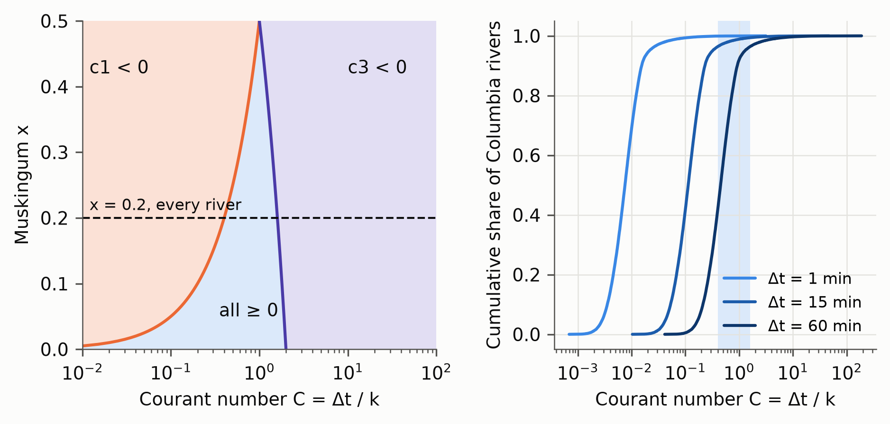
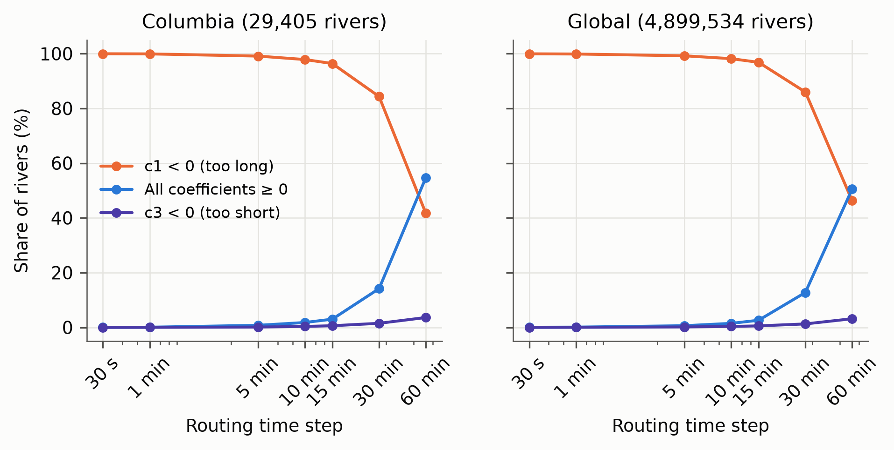
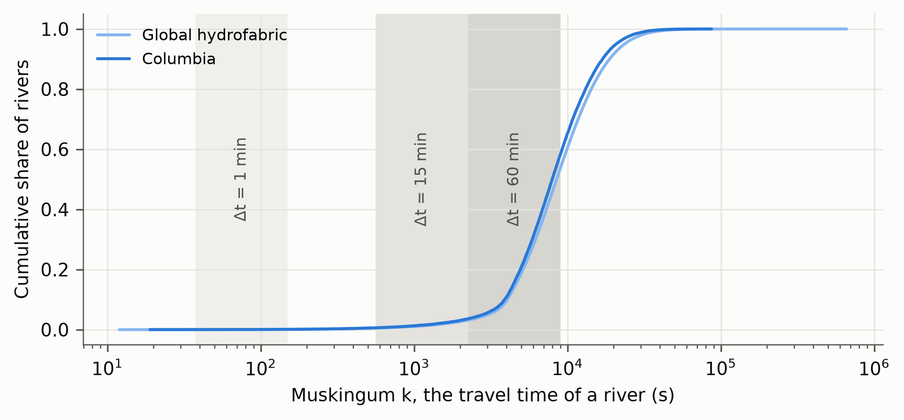
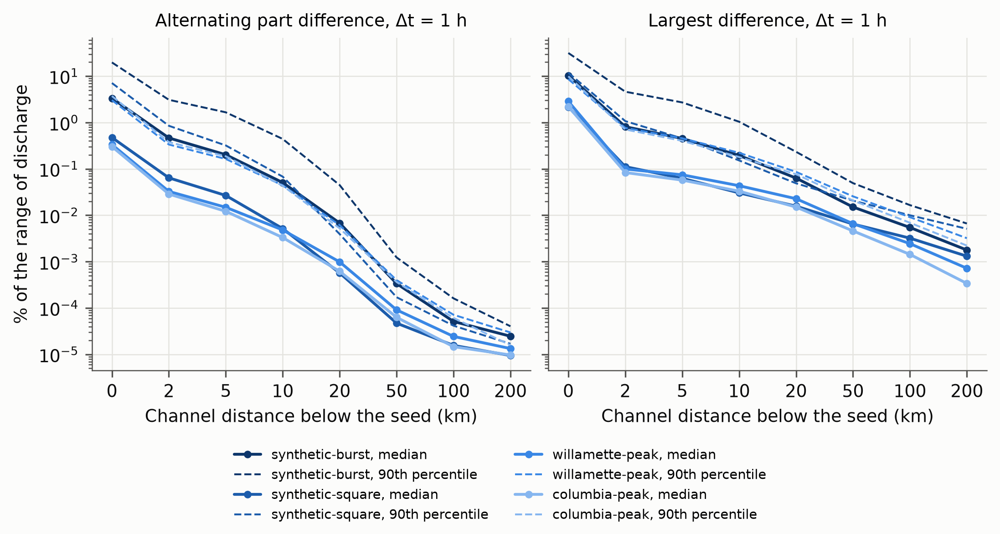
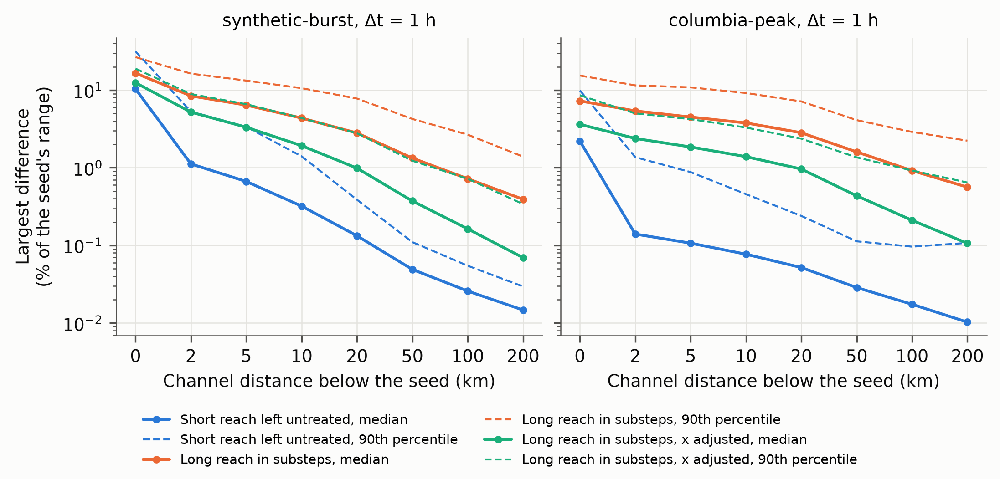

# When the time step and the reach disagree: negative Muskingum coefficients, their artifacts, and their treatment in continental hydrofabrics

*Draft manuscript. Figures are in `../figures`, tables in `../tables`, and every number below is
produced by the scripts in `../scripts` (see `../README.md`).*

---

## Abstract

Continental routing models apply one time step to millions of reaches whose lengths are set by delineation, not by
numerics, so many reaches fall outside the window 2kx ≤ Δt ≤ 2k (1 − x) in which every Muskingum coefficient is
non-negative. Using river-route v3 on the 29,405 reaches of the Columbia basin in the TDX-Hydro hydrofabric of the
GEOGLOWS River Forecast System v3, we crossed routing steps from 30 s to 1 h with six treatments of the reaches outside
the window, forced by 20 years of ERA5 runoff and by runoff designed to excite artifacts, against a time-converged
reference. At 1 h, 42% of reaches have a negative c₁ and 3.6% a negative c₃; at 15 min, 96% have a negative c₁. The
scheme keeps the mean and variance of every reach's travel time at any step, so the step alone changed annual peaks by
at most 2.1%, their timing by less than one step, and volume by at most 0.006%. Reaches too short for the step amplify
their lateral inflow at the highest frequency and carried up to 11.6% of their volume as negative discharge under ERA5,
yet their error fell fifteenfold within one reach downstream. River-route's stabilization, which splits long reaches
with x held, removed diffusion, raised annual peaks by 7% to 15%, delayed them, and changed discharge far downstream. We
recommend treating the step as a Courant-like positivity condition, subcycling short reaches, leaving long reaches whole
or splitting them with x lowered to keep their diffusion, and setting x per reach from a diffusivity, which would remove
nearly every reach too short for hourly routing.

---

## 1 Introduction

Continental and global river routing models now resolve networks of millions of reaches. The GEOGLOWS hydrological
model routes ERA5 reanalysis and ECMWF ensemble runoff through roughly seven million reaches of a hydrologically
conditioned subset of the TDX-Hydro hydrography [@geoglows; @souffront2019], and the network of
its River Forecast System v3 studied here holds 4.9 million. The U.S. National Water Model (NWM) routes runoff through
more than 2.7 million NHDPlus V2 reaches with the reach-based Muskingum–Cunge scheme of WRF-Hydro at a 5 min channel
routing step [@gochis2020; @read2023; @cosgrove2024], which NOAA's t-route re-implements for the
Next Generation Water Resources Modeling Framework. Global reconstructions such as GRADES apply the RAPID
Muskingum router to 2.94 million MERIT Hydro reaches [@lin2019]. Muskingum-family methods dominate this class of
model because the update of a reach is linear, local, and cheap, and the linear system of a whole network can be solved
by forward substitution in topological order [@david2011; @mizukami2016].

The Muskingum method [@mccarthy1938] relates the storage of a reach to a weighted average of its inflow and outflow
through two parameters: k, the travel time of the reach, and x, the weight of the inflow. @cunge1969 showed that the
resulting difference equation is a finite difference approximation of the kinematic wave equation whose numerical
diffusion, c Δx (1/2 − x), can be matched to the physical diffusion of a flood wave, which gives the Muskingum–Cunge
parameters k = Δx / c and x = (1/2)(1 − q / (S₀ c Δx)) that WRF-Hydro and the NWM compute from channel geometry
[@gochis2020]. In both forms the routing coefficients depend only on the ratio of the time step to the travel
time, Δt / k, and on x. Textbook guidance keeps every coefficient non-negative, which requires 2kx ≤ Δt ≤ 2k (1 − x)
[@chow1988; @ponce1989; @usace_hms]. Each side of that window has a long literature. @nash1959 showed that
the continuous Muskingum model predicts negative outflow at the start of a rising inflow, the "dip" that appears in the
difference equation whenever Δt < 2kx. @strupczewski1980 revisited the translation and dispersion
properties of the model, @szilagyi1992 explained why fitted values of x can be negative, and @szel2000
showed that negative weighting factors do not invalidate the Muskingum–Cunge scheme. @ponce1979 proved that
the scheme is unconditionally stable in the von Neumann sense, and @ponce1982 derived accuracy criteria
for the choice of space step. Mass conservation of the variable-parameter form has been examined by @tang1999
and @todini2007, and the treatment of lateral inflow by @wang2018.

These analyses consider one reach, or a uniformly discretized channel, whose space and time steps a modeler chooses
together. A continental hydrofabric reverses that relationship. Reach lengths are fixed by the spacing of confluences in
a digital elevation model and by the processing that cleans the delineation, not by any numerical criterion, and one
time step is applied to every reach. In the TDX-Hydro hydrofabric of the GEOGLOWS River Forecast System v3, reach travel
times span more than four orders of magnitude, from tens of seconds to days, while for x = 0.2 the window of
non-negative coefficients spans a factor of (1 − x)/x = 4 in k. No single time step can satisfy every reach. The
WRF-Hydro documentation warns that "reach-based routing is highly sensitive to time step" [@gochis2020], and
hydrofabric refactoring for the NextGen framework collapses inter-confluence flowpaths shorter than a minimum length and
splits long ones before routing [@blodgett_hyrefactor; @johnson2022]. The TDX-Hydro processing behind GEOGLOWS
consolidates reaches shorter than 2 km wherever no confluence intervenes. The reaches that remain outside the window
produce artifacts that this study reproduces: hydrographs that alternate from one step to the next, and negative
discharge that a code may silently clamp to zero. The same tension is familiar in
computational fluid dynamics as the "small cell problem" of cut-cell methods, in which a few tiny cells would force a
whole mesh to an impractically short explicit time step; its standard remedies are merging small cells into their
neighbors, stepping them locally, or treating them implicitly [@may2017].

What is missing is a quantitative account, on a real continental hydrofabric, of how common negative coefficients are,
what they do to routed discharge at the reach and downstream of it, and how the remedies built into routing codes
compare in accuracy and cost. This paper provides that account for the Muskingum formulation of the GEOGLOWS River
Forecast System v3, routed with river-route v3, on the Columbia River basin and its major tributaries. The scope is
deliberately numerical: we do not calibrate parameters or compare with gauges. Every simulation is compared with a
time-converged solution of the same network, so that every difference is attributable to how the routing handles the
time step. We ask four questions:

1. How many reaches of a modern global hydrofabric have negative Muskingum coefficients, and how does that depend on
   the routing time step?
2. What artifacts do negative coefficients produce, under realistic ERA5 forcing and under forcing designed to excite
   them, and how far downstream do the artifacts propagate?
3. How do the available treatments (splitting long reaches into substeps, routing short reaches in subcycles of their
   own, inflating the travel time of short reaches, and editing the topology to merge them away) change routed
   discharge, and at what computational cost?
4. What criterion should guide the choice of the routing time step, viewed as the analog of the Courant condition of
   explicit schemes, which limits the time step to the travel time of one cell?

Section 2 derives the Muskingum and Muskingum–Cunge equations and adds five properties of the scheme that explain the
results: positivity, not stability, is what the coefficient window protects; the time step does not change the mean or
the variance of the travel time of a reach; a reach that is too short amplifies the highest frequency of its lateral
inflow by exactly the factor by which it violates the window; an alternating error is damped by x/ (1 − x) at every reach
downstream; and splitting a reach into substeps with an unchanged x removes most of its diffusion, unless x is lowered.
Section 3 describes the hydrofabric, how travel times were assigned to it, and how many of its reaches have negative
coefficients. Section 4 describes the matrix of simulations, Section 5 its results, and Section 6 discusses them as a
Courant-like condition and gives recommendations for operational systems.

## 2 Theory and methods

### 2.1 River networks as ordered graphs

River networks are directed acyclic graphs. Ignoring braided channels and deltas, water flows only downstream, there are
no loops, and the network branches going upstream and merges going downstream. A network can therefore be
topologically sorted so that every reach appears after every reach upstream of it. river-route requires a depth-first
order, in which the reaches upstream of any reach are the rows immediately before it, so that the watershed of a reach
is one contiguous run of rows ending at it. Writing the network's connectivity as an adjacency matrix $A$, whose entry
$A_{ij}$ is 1 when reach j drains into reach i, a topological order makes $A$ strictly lower triangular, and the
inflow of every reach is $I = AQ$.

### 2.2 The Muskingum equation

Over an interval Δt, the change in storage of a reach is the difference between its mean inflow and mean outflow,

$$
\frac{I_t + I_{t+1}}{2} - \frac{Q_t + Q_{t+1}}{2} = \frac{S_{t+1} - S_t}{\Delta t}, \tag{1}
$$

where I is the inflow from the reach upstream and Q the discharge at the outlet. The trapezoidal average in Eq. 1 is the
first approximation the time step introduces. Muskingum storage is the sum of prism storage, the volume held at steady
flow, and wedge storage, the volume gained above or lost below the prism as a flood wave rises or falls:

$$
S_t = k\, Q_t + k\, x\, (I_t - Q_t) = k \left[ x\, I_t + (1 - x)\, Q_t \right], \tag{2}
$$

with k the travel time of the flood wave through the reach and x ∈ [0, 1/2] the weight of the inflow. With x = 0 the
reach is a linear reservoir whose storage depends only on its outflow and which attenuates the most; with x = 1/2
inflow and outflow weigh equally and a wave passes without attenuation, delayed by k. Substituting Eq. 2 at both ends of
the interval into Eq. 1 and solving for the unknown outflow gives the Muskingum equation

$$
Q_{t+1} = c_1\, I_{t+1} + c_2\, I_t + c_3\, Q_t, \tag{3}
$$

$$
c_1 = \frac{\Delta t / k - 2x}{\Delta t / k + 2 (1-x)}, \qquad
c_2 = \frac{\Delta t / k + 2x}{\Delta t / k + 2 (1-x)}, \qquad
c_3 = \frac{2 (1-x) - \Delta t / k}{\Delta t / k + 2 (1-x)}. \tag{4}
$$

The coefficients sum to one, so the scheme conserves mass, and every step depends on the step before, so a reach must be
solved sequentially in time. Following RAPID [@david2011], the runoff of a reach's own catchment enters as a
lateral inflow rate Q_l held constant over the runoff interval, routed as if it entered at the upstream end at both
ends of the step:

$$
Q_{t+1} = c_1\, I_{t+1} + c_2\, I_t + c_3\, Q_t + c_4\, Q_{l,t}, \qquad c_4 = c_1 + c_2. \tag{5}
$$

Substituting $I = AQ$ gives the matrix form $(\mathbf{I} - c_1 A)\, Q_{t+1} = c_2 A Q_t + c_3 Q_t + c_4 Q_{l,t}$, whose left-hand side is
unit lower triangular and is solved by forward substitution. river-route v3 does not form the matrix. Once every reach
upstream of a reach has been routed, the reach's whole inflow series is known, so it routes each reach's whole series in
turn, in topological order, and adds the result into the inflow series of the reach downstream. That is the same
forward substitution organized river by river, and it costs O (nT) for n reaches and T steps.

### 2.3 The Courant number and the window of non-negative coefficients

Writing C = Δt / k, the coefficients depend on C and x alone:

$$
c_1 = \frac{C - 2x}{C + 2 (1-x)}, \qquad c_2 = \frac{C + 2x}{C + 2 (1-x)}, \qquad c_3 = \frac{2 (1-x) - C}{C + 2 (1-x)}. \tag{6}
$$

In the Muskingum–Cunge interpretation k = Δx / c, so C = c Δt / Δx is exactly the Courant number of the reach, and
x = (1 − D)/2, where D = q / (S₀ c Δx) is the cell Reynolds number [@ponce1989]. The denominator is always positive and
c₂ is always positive. c₁ is negative when the step is short relative to the reach and c₃ when it is long:

$$
\begin{aligned}
c_1 \ge 0 &\iff \Delta t \ge 2kx \iff C \ge 2x, \\
c_3 \ge 0 &\iff \Delta t \le 2k (1-x) \iff C \le 2 (1-x).
\end{aligned} \tag{7}
$$

Every coefficient is non-negative in the window 2x ≤ C ≤ 2 (1 − x), whose width in C is 2 (1 − 2x). For x = 0 any
0 ≤ C ≤ 2 is admissible. As x approaches 1/2 the window closes on C = 1, where c₁ = c₃ = 0, c₂ = 1, and the scheme is
$Q_{t+1} = I_t$, an exact translation by one reach per step: the Muskingum analog of the first-order upwind scheme at a
Courant number of exactly one. We call a reach **too long** for Δt when C < 2x (c₁ < 0) and **too short** when
C > 2 (1 − x) (c₃ < 0). Because the window spans a factor (1 − x)/x in k, a network whose travel times span more than
that factor has no time step at which every reach is inside it (Fig. 1).

*Figure 1. Left: the plane of Courant number and x divided by the sign of c₁ and c₃; the dashed line is the x = 0.2 of
every reach of the hydrofabric. Right: the Courant numbers of the 29,405 Columbia reaches at three routing time steps;
the shaded band is the window of non-negative coefficients for x = 0.2.*

### 2.4 Positivity, not stability

A negative coefficient does not make the scheme unstable. The homogeneous solution decays as $c_3^n$, and $|c_3| < 1$ for
every C > 0 and x < 1. The gain of a reach for an inflow of angular frequency ω (radians per step) is
$H_u (\omega) = (c_1 + c_2 e^{-i\omega}) / (1 - c_3 e^{-i\omega})$, and with $a = C$, $b = 2x$, $d = 2 (1 - x)$ and the common
denominator $(a + d)^2$, a direct expansion gives

$$
|1 - c_3 e^{-i\omega}|^2 - |c_1 + c_2 e^{-i\omega}|^2 = \frac{2\, (d^2 - b^2)\, (1 - \cos\omega)}{ (a + d)^2}, \tag{8}
$$

which is non-negative whenever x ≤ 1/2, so $|H_u (\omega)| \le 1$ at every frequency and every Courant number: the scheme never amplifies upstream inflow, as @ponce1979
showed for the Muskingum–Cunge scheme. What the window protects is **positivity**: the impulse response of a reach
is non-negative, so non-negative inflow always yields non-negative discharge, only when every coefficient is
non-negative. The upstream impulse response is $h_0 = c_1$, $h_n = (c_2 + c_1 c_3)\, c_3^{n-1}$ for $n \ge 1$, and
$c_2 + c_1 c_3 = 4C/ (C + 2 (1 - x))^2 > 0$, so the response is negative at the first step exactly when c₁ < 0 and alternates in sign
exactly when c₃ < 0 (Fig. 2).

*Figure 2. Response of a reach (x = 0.2) to a unit pulse of upstream inflow (top) and of lateral inflow held over one
step (bottom), for a Courant number below, inside, and above the window. Negative ordinates are red.*

### 2.5 What the time step does not change

The moments of the upstream impulse response follow from its generating function. For every C > 0,

$$
\sum_n n\,\Delta t\; h_n = k, \qquad \sum_n (n\,\Delta t - k)^2\, h_n = k^2 (1 - 2x), \tag{9}
$$

the mean and variance of the travel time of the continuous Muskingum model, whose transfer function is
$(1 - kxs)/ (1 + k (1 - x)s)$. The trapezoidal rule of Eq. 1 is the bilinear transform
$s \to (2/\Delta t)(1 - z^{-1})/ (1 + z^{-1})$, which
departs from s only at third order in Δt, so it preserves the first two cumulants exactly; we confirmed Eq. 9
numerically for C from 0.01 to 20 (`scripts/stability/theory.py`). The time step therefore does not change how much a reach
delays or diffuses a flood wave. Only the shape beyond the variance, the skewness and the negative lobes of Fig. 2,
depends on Δt. This is the time-domain counterpart of the result of @cunge1969 that the numerical diffusion of the scheme,
c Δx (1/2 − x), contains no Δt. Attenuation in a Muskingum network is set by how the network is segmented and by x,
not by the routing time step.

### 2.6 Reaches too long for the time step: the dip

As C → 0 the coefficients tend to c₁ → −x/ (1 − x), c₂ → x/ (1 − x), and c₃ → 1, and the scheme converges to the
continuous model, whose impulse response is

$$
h (t) = -\frac{x}{1-x}\,\delta (t) + \frac{1}{k (1-x)^2}\, e^{-t / (k (1-x))}. \tag{10}
$$

The negative impulse at t = 0 is the dip @nash1959 described: a reach with x > 0 responds to a sharp rise of inflow by
first lowering its outflow. A negative c₁ is therefore not an error of the time step relative to the time-converged
model; it is that model's own behavior, exposed when the step resolves times shorter than 2kx. The c₁ condition is a
resolution threshold below which the unphysical dip of the Muskingum storage relation becomes visible. It can be
removed only by changing the model: lowering x, or splitting the reach so that each piece has a smaller k.

### 2.7 Reaches too short for the time step: alternation and amplified lateral inflow

When C > 2 (1 − x), c₃ < 0 and every disturbance decays as an alternation of period 2Δt. As C → ∞, c₃ → −1, c₁ and c₂
→ 1, and Eq. 3 becomes $Q_{t+1} + Q_t = I_{t+1} + I_t$: the reach stores nothing at the resolution of the step, and an
initial mismatch alternates almost without decay. Short reaches in hydrofabrics typically carry little upstream inflow
relative to their own lateral inflow when they are headwaters, or sit between two confluences. The lateral inflow of
Eq. 5 is held constant over each step and enters as if it were the inflow at both ends of the step. Its gain at
frequency ω is $H_l (\omega) = c_4 e^{-i\omega}/ (1 - c_3 e^{-i\omega})$, which at the Nyquist frequency ω = π is

$$
|H_l (\pi)| = \frac{c_4}{1 + c_3} = \frac{C}{2 (1-x)}, \tag{11}
$$

greater than one exactly when c₃ < 0. A reach too short for the time step amplifies the highest frequency its lateral
inflow can hold by the factor by which it violates the window: a reach with k = 19 s routed at Δt = 3600 s amplifies an
hourly alternation of its runoff 118-fold. The same condition appears in the moments of the lateral response, whose
variance about its mean, k (1 − x) after the centroid of the step, is (k (1 − x))² − Δt²/4: negative, which no
non-negative distribution can have, exactly when Δt > 2k (1 − x).

The upstream gain at the Nyquist frequency is $H_u (\pi) = -x/ (1 - x)$ at every Courant number (Fig. 3). Every reach
downstream of a defect therefore multiplies an alternating error by x/ (1 − x), a factor of 0.25 at x = 0.2, whatever
its own coefficients. Alternation produced at a short reach is a local artifact: it is reduced 16-fold within two
reaches downstream, before it is diluted by any tributary.

*Figure 3. Left: magnitude of the gain at the period of two steps for upstream inflow, x/ (1 − x), and for lateral
inflow, C/ (2 (1 − x)). Right: magnitude of the lateral inflow gain across frequencies for four Courant numbers.*

### 2.8 Mass

Because c₁ + c₂ + c₃ = 1 and c₄ = c₁ + c₂, the discharge of Eq. 5 conserves mass for any coefficients, negative ones
included. Mass is lost or gained only if negative discharge is altered. river-route v3, like other operational codes,
clamped negative discharge to zero in the discharge it wrote while passing the unclamped series downstream, which
conserved mass in the routed network but not in the reported discharge of the reach. For this study the clamp was
removed, so every reported value is the routed one and negative discharge is measured directly.

### 2.9 Treatments of reaches outside the window

**Substeps** (river-route's treatment of reaches too long for Δt). A reach is divided into N = ⌈2kx/Δt⌉ equal
sub-reaches in series, each of travel time k/N and the original x, so that each satisfies c₁ ≥ 0; each sub-reach
receives 1/N of the reach's lateral inflow. By Eq. 9 a sub-reach has variance (k/N)² (1 − 2x), so the cascade keeps the
mean travel time k but its variance falls to k² (1 − 2x)/N. Substeps change the model: as Δt → 0, N → ∞ and the cascade
converges to pure translation. Cost grows by N for every split reach.

**Diffusion-preserving substeps** (introduced here). If each sub-reach instead takes

$$
x_N = \tfrac{1}{2} - N\left (\tfrac{1}{2} - x\right), \tag{12}
$$

the cascade keeps both the mean k and the variance k² (1 − 2x) of the original reach. Eq. 12 is not an ad hoc fix: it
is the Muskingum–Cunge x of a reach N times shorter. Since x = (1 − D)/2 with a cell Reynolds number $D = q/ (S_0 c \Delta x)$
inversely proportional to Δx, a sub-reach of length Δx/N has D_N = ND and x_N = (1 − ND)/2 = 1/2 − N (1/2 − x). A
scheme that computes x from the reach length, as the NWM does, makes this adjustment by itself; a hydrofabric that
assigns one x to every reach, as RFS v3 does, does not. For N ≥ 2 and x = 0.2, x_N is negative. Negative x has a physical reading in the Muskingum–Cunge interpretation: a reach shorter than the
characteristic length $q/ (S_0 c)$ [@szilagyi1992; @szel2000]. With x_N < 0, the lower bound 2k x_N of the
window is negative, so c₁ > 0 at any step, and Eq. 10 shows a non-negative impulse response. Unlike substeps with x
held, the treatment converges to a fixed model as Δt → 0 (Fig. 4).

**Subcycles** (river-route's treatment of reaches too short for Δt). A reach is routed in m = ⌈Δt/ (2k (1 − x))⌉ steps of
its own of length Δt/m, with its upstream inflow interpolated linearly within each routing step. This is local time
stepping: it does not change the reach, and it converges to the reference as m grows. Cost grows by m for the subcycled
reaches only.

**Inflated k.** The travel time of a reach too short for Δt is raised to k' = Δt/ (2 (1 − x)), the smallest k with
c₃ ≥ 0. The reach gains travel time k' − k and variance (k'² − k²)(1 − 2x). It costs nothing.

**Merge.** A reach too short for Δt is deleted from the topology; the reaches upstream of it drain directly into the
reach downstream of it, which also receives its catchment runoff. When the short reach joins two confluences, as most
short reaches do (Section 3.4), this merges the two confluences into one. The network loses the travel time k and the
variance k² (1 − 2x) of the deleted reach and the routed discharge at its location. It costs nothing and reduces the
number of reaches.

**Stabilized** is river-route's `network_type='stabilized'`: substeps for reaches too long and subcycles for reaches too
short, which no reach needs at once for x ≤ 1/2.

*Table 1. The treatments, what they change about the model, and what they cost.*

| Treatment            | Applies to | Mean travel time | Variance             | Converges to the reference as Δt → 0      | Positive               | Cost                 |
|----------------------|------------|------------------|----------------------|-------------------------------------------|------------------------|----------------------|
| Standard             | —          | kept             | kept                 | yes                                       | only inside the window | 1                    |
| Substeps             | c₁ < 0     | kept             | divided by N         | no: tends to pure translation             | yes                    | × N on split reaches |
| Substeps, x adjusted | c₁ < 0     | kept             | kept                 | to a fixed model with the reach's moments | yes                    | × N on split reaches |
| Subcycles            | c₃ < 0     | kept             | kept                 | yes                                       | yes                    | × m on short reaches |
| Inflated k           | c₃ < 0     | + (k' − k)       | + (k'² − k²)(1 − 2x) | no (no reach is short as Δt → 0)          | yes                    | none                 |
| Merge                | c₃ < 0     | − k              | − k²(1 − 2x)         | no (no reach is short as Δt → 0)          | yes                    | fewer reaches        |

*Figure 4. Left: the travel time variance of a reach split into N substeps with x held at 0.2 and with x lowered by
Eq. 12. Center and right: a sharp and a broad pulse routed through one reach of k = 5.6 h, through eight substeps with x
held, and through eight substeps with x lowered, at Δt = 60 s.*

## 3 Hydrofabric, travel times, and forcing

### 3.1 TDX-Hydro and its processing for the River Forecast System v3

TDX-Hydro is a global hydrography derived by the U.S. National Geospatial-Intelligence Agency from the 12 m TanDEM-X
elevation model, with streams, catchments, and a hydrologically conditioned DEM [@carlson2024]. The GEOGLOWS
River Forecast System v3 (RFS v3) processes it into a routing network in a sequence of documented edits whose records
accompany each region: removal of coastal watersheds that drain less than 250 km² to the sea, lake edits that route
the inlets of large lakes to their outlets, removal of zero-length streams that bridge three-way confluences, dissolution of first-order headwaters into their second-order receivers so
that every routed reach is of Strahler order two or higher, pruning of small branches, and consolidation of reaches
shorter than 2 km into a neighbor that is not across a confluence. A short reach with a confluence at both ends has no
such neighbor and is kept. The global network holds 4,899,534 reaches.

### 3.2 Travel time

Every reach of RFS v3 is assigned x = 0.2 and a travel time from its length L and a velocity that increases with
Strahler order ω,

$$
v = 0.5 + 0.0375\, (\omega - 2)\ \text{m s}^{-1}, \qquad k = \operatorname{round} (L / v), \tag{13}
$$

from 0.5 m s⁻¹ for second-order reaches to 0.8 m s⁻¹ for tenth-order reaches (Table 2). We verified Eq. 13 against
every reach of the global network. A velocity that depends only on order makes k proportional to length within an
order, so the spread of k is the spread of reach lengths, which the delineation sets.

### 3.3 The Columbia River basin

The Columbia basin is the subset of TDX-Hydro region 7020014250 upstream of the reach at the Pacific (riverId
720207783): 29,405 reaches draining 600,843 km², of Strahler orders 2 to 9 (Table 2). The longest path from a headwater
to the Pacific has a travel time of 39.1 days and the median path 19.1 days. We analyze the basin as a whole and along
the main stems of fourteen major tributaries (Fig. 5): the Snake and its Salmon and Clearwater tributaries, the
Pend Oreille, the Upper Columbia above Castlegar, the Kootenay, the Kettle, the Spokane, the Okanogan, the Yakima, the
John Day, the Deschutes, the Willamette, and the Cowlitz. Their main stems carry 526 observation reaches, one every
20 km of channel, whose whole hourly series every ERA5 simulation keeps (Section 4.4).

*Figure 5. The Columbia basin in the TDX-Hydro hydrofabric of the River Forecast System v3. (a) The main stems of the
fourteen major tributaries and of the Columbia, and the observation reaches along them. (b) Every reach by the sign of
its Muskingum coefficients at Δt = 1 h; reaches too short for 1 h are drawn as points because most are shorter than a
kilometer.*

*Table 2. Reaches of the Columbia basin by Strahler order (`tables/census_columbia_by_order.csv`).*

| Order | Reaches | v (m s⁻¹) | Median L (m) | 1st pct. L (m) | Median k (s) | Min k (s) | Max k (s) |
|-------|---------|-----------|--------------|----------------|--------------|-----------|-----------|
| 2     | 14,932  | 0.500     | 4,779        | 1,443          | 9,558        | 263       | 87,045    |
| 3     | 6,952   | 0.538     | 3,896        | 376            | 7,249        | 56        | 61,017    |
| 4     | 3,730   | 0.575     | 3,707        | 241            | 6,447        | 19        | 53,973    |
| 5     | 1,874   | 0.613     | 3,599        | 201            | 5,876        | 27        | 39,241    |
| 6     | 1,274   | 0.650     | 3,503        | 209            | 5,389        | 35        | 43,214    |
| 7     | 314     | 0.688     | 3,449        | 394            | 5,017        | 349       | 18,134    |
| 8     | 202     | 0.725     | 3,385        | 596            | 4,669        | 712       | 19,136    |
| 9     | 127     | 0.763     | 3,129        | 499            | 4,103        | 171       | 30,202    |

### 3.4 How many reaches have negative coefficients

The median travel time of a Columbia reach is 7,956 s and 90% of reaches lie between 2,803 s and 20,808 s, so the
window of non-negative coefficients, k between Δt/ (2 (1 − x)) = 0.625 Δt and Δt/ (2x) = 2.5 Δt, holds most reaches only
when Δt is near one hour (Figs. 6 and 7, Table 3). At Δt = 1 h, 54.7% of Columbia reaches have every coefficient
non-negative, 41.7% are too long, and 3.6% are too short. At Δt = 15 min, 96.4% are too long. At Δt = 5 min, the
operational channel routing step of the NWM [@read2023], 99.1% are too long. At Δt = 30 s, every reach
but twelve is too long. The global hydrofabric behaves the same way: 46.3% too long and 3.2% too short at 1 h, 96.8%
too long at 15 min.

*Table 3. Share of reaches by the sign of their coefficients (`tables/census_coefficient_signs.csv`).*

| Δt     | Columbia: c₁ < 0 | Columbia: c₃ < 0 | Columbia: all ≥ 0 | Global: c₁ < 0 | Global: c₃ < 0 | Global: all ≥ 0 |
|--------|------------------|------------------|-------------------|----------------|----------------|-----------------|
| 30 s   | 99.96%           | 0.00%            | 0.04%             | 99.94%         | 0.002%         | 0.06%           |
| 1 min  | 99.91%           | 0.01%            | 0.07%             | 99.87%         | 0.03%          | 0.10%           |
| 5 min  | 99.11%           | 0.12%            | 0.77%             | 99.22%         | 0.16%          | 0.62%           |
| 10 min | 97.85%           | 0.36%            | 1.79%             | 98.17%         | 0.35%          | 1.48%           |
| 15 min | 96.38%           | 0.61%            | 3.01%             | 96.83%         | 0.56%          | 2.61%           |
| 30 min | 84.35%           | 1.49%            | 14.16%            | 85.98%         | 1.27%          | 12.75%          |
| 60 min | 41.68%           | 3.62%            | 54.70%            | 46.32%         | 3.17%          | 50.51%          |

*Figure 6. Share of reaches too long for the time step (c₁ < 0), too short for it (c₃ < 0), and with every coefficient
non-negative, in the Columbia basin and in the global hydrofabric.*

*Figure 7. Distribution of k in the global hydrofabric and the Columbia basin, with the window of k that keeps every
coefficient non-negative at three time steps.*

The reaches too short for one hour are short because of where they sit. Of the 1,063 Columbia reaches with c₃ < 0 at
Δt = 1 h (median length 748 m), 839 (79%) join a confluence at each end, 60 lie just below a confluence, 55 just above
one, 75 lie in an unbranched chain, and 34 are headwaters (`tables/census_short_river_topology.csv`). The 2 km
consolidation of RFS v3 could not merge the first group, because each has a confluence on both sides; this is the
topology the merge treatment edits.

Stabilizing every reach is costly at short steps (Table 4). Substeps multiply the work of a routing step 126-fold at
Δt = 30 s and 13-fold at 5 min. Measured per hour of simulated time, the stabilized network at 30 s costs 15,000 times
the standard network at 1 h. At 1 h, substeps and subcycles cost 1.6 times the standard network: 12,256 reaches are
split into 44,827 sub-reaches in total, and 1,063 reaches take up to 119 subcycles.

*Table 4. Reaches and subcycles of river-route's stabilized network for the Columbia (`tables/census_stabilization_cost.csv`). Work is reach-steps per routing step relative to the standard network at
the
same Δt, and per simulated hour relative to the standard network at 1 h.*

| Δt     | Reaches routed | Max substeps | Subcycled reaches | Max subcycles | Work, same Δt | Work, vs 1 h standard |
|--------|----------------|--------------|-------------------|---------------|---------------|-----------------------|
| 30 s   | 3,716,924      | 1,161        | 0                 | 1             | 126.4         | 15,169                |
| 1 min  | 1,865,869      | 581          | 4                 | 2             | 63.5          | 3,807                 |
| 5 min  | 385,014        | 117          | 36                | 10            | 13.1          | 157                   |
| 10 min | 199,845        | 59           | 105               | 20            | 6.8           | 40.8                  |
| 15 min | 138,077        | 39           | 179               | 30            | 4.7           | 18.8                  |
| 30 min | 76,666         | 20           | 439               | 60            | 2.6           | 5.3                   |
| 60 min | 44,827         | 10           | 1,063             | 119           | 1.6           | 1.6                   |

### 3.5 Forcing

Runoff is the hourly ERA5 total runoff [@hersbach2020] at 0.25°, aggregated to the Columbia catchments with the
area-weighted grid table of RFS v3 and stored once as hourly catchment volumes, so that every simulation reads the same
forcing. ERA5 runoff is never negative over the basin; in 6% to 21% of catchment-hours it is exactly zero.

## 4 Experimental design

### 4.1 Routing engine

Every simulation uses river-route v3 from the fork used for RFS v3, routed through its own coefficient preparation (`static_muskingum.prepare_routing`) and kernels (`route_region`). The experiment's
harness (`scripts/stability/engine.py`)
replaces only the Router's file handling: it takes forcing as arrays and hands routed discharge to recorders that keep
full float32 precision, rather than to river-route's default writer, which rounds discharge to 12 mantissa bits. We
verified that the harness reproduces `rr.Router` bit for bit for standard and stabilized networks at Δt = 300 s and
3600 s (`scripts/verify_engine.py`). Two conventions of river-route matter for interpretation. When Δt is shorter than
the hourly runoff step, the discharge written for an hour is the mean of the routed levels at the end of each step
within it; when Δt equals one hour, it is the level at the end of the hour. And, for this study, negative discharge is
written as routed (Section 2.8). Treatments that change only how a reach is routed (substeps, x-adjusted substeps,
subcycles, stabilized) are a `Network` subclass whose `conditioning` returns the treatment's substeps and subcycles,
routed with `network_type='stabilized'`; treatments that edit the network (inflate-k, merge) are an ordinary network
of the edited table routed as standard, and merge also sums the runoff of each deleted reach into its receiver.

### 4.2 Reference solution

The reference is the standard network routed at Δt = 30 s, with every reach whose k is shorter than 150 s routed in
subcycles so that its own Courant number is at most 0.2; 26 reaches are subcycled. By Eq. 9 and second-order accuracy
of the trapezoidal rule, it approximates the continuous-time solution of the delineated network, which we call
time-converged. Routing the synthetic scenarios again at Δt = 10 s, with every reach's own Courant number again at
most 0.2, changed the peak of the median reach by 0.015% of its rise and of any reach by at most 0.47%, and the largest
difference of any hydrograph by at most 0.47% of its rise. The reference is the solution of the same model the
treatments are approximating, not a physical truth, and it inherits the dip of Eq. 10.

### 4.3 The matrix

The matrix crosses seven routing time steps (30 s, 1, 5, 10, 15, 30, and 60 min) with seven treatments (standard,
substeps, x-adjusted substeps, subcycles, stabilized, inflate-k, merge). At Δt = 30 s no reach is too short, so the three
short-reach treatments are identical to the standard network and the stabilized network to the substeps network; none
of the four is run. At 1 min the stabilized network differs from the substeps network in only the four reaches too short
at that step, which it subcycles, and is not run either. That leaves 44 cells and the reference for each forcing
scenario. Each cell writes to `data/results/<scenario>/<treatment>__dt<NNNN>s`.

### 4.4 Forcing scenarios

**ERA5 2002–2011** (`era5-2002-2011`): the hourly ERA5 runoff of 10 years, routed from a dry network on 1 October 2001,
with the three months of spin-up discarded. Each cell keeps, for every reach and calendar year, the annual peak and its
hour, the volume, the hours and volume of negative discharge, the hours of oscillation (Section 4.5), and the total
variation; the whole hourly series of 526 observation reaches spaced every 20 km along the fourteen main stems and the
Columbia; and the whole hourly series of every reach in four 45-day event windows chosen from the reference: the
largest 2000–2019 peak, which falls in 2002–2011, at the Columbia outlet (June 2002), at the Snake mouth (June 2011), and at the Willamette mouth (December 2005 to January 2006), and the flashiest
peak, relative to median flow, at the mouth of a smaller tributary (the Spokane, April 2002).

**Synthetic burst and square wave** (`synthetic-burst`, `synthetic-square`): runoff designed to excite the artifacts of
negative coefficients. Every catchment produces a steady 0.02 mm h⁻¹ of runoff, and every simulation starts from the
exact steady state of that baseflow (`engine.steady_state`). From hour 24 the burst adds one hour of 2 mm h⁻¹ over the
whole basin; the square wave instead alternates 2 mm h⁻¹ and no runoff every hour for a day, the highest frequency an
hourly forcing can carry. Both run 45 days, long enough for the perturbation to drain from the longest path.

### 4.5 Measures

All measures compare a cell with the reference reach by reach. For a hydrograph event: the error of the peak relative to
the reference rise (synthetic) or peak (ERA5); the shift of the peak hour; the largest absolute difference; and the
alternating part of the difference, $\max_t |e_{t+1} - 2e_t + e_{t-1}|/4$, which equals $A$ for a difference alternating $\pm A$
and nearly vanishes for a smooth one. Oscillation hours count hours that close four hourly changes alternating in
direction; a natural peak changes direction once and even the dip ahead of a rise twice, so only an alternation at the
period of two steps is counted. Negative hours and volume measure positivity directly.

### 4.6 Single-defect experiment

Routing is linear, so the influence of one reach on discharge downstream can be isolated exactly. Every reach too short
for Δt (1,063 at 1 h, 439 at 30 min) is a seed. We route the network with every short reach subcycled, and again with
a batch of seeds left untreated; at any reach downstream of a seed whose watershed holds no other seed of the batch, the
difference between the two runs is the seed's contribution alone. Seeds are batched greedily so that no seed lies in the
watershed of another seed's point 200 km downstream. The difference is measured at the seed and at 2, 5, 10, 20, 50,
100, and 200 km of channel below it, under both synthetic forcings and the Willamette and Columbia ERA5 events. For
reaches too long, a fixed random sample of 400 seeds is split into substeps, with x held or x adjusted, while every
other reach is routed whole, and the difference from the standard network is measured the same way.

### 4.7 Computational cost

Cost is reported two ways. The work a treatment implies, reach-steps per simulated hour, follows from its substeps and
subcycles and is independent of hardware. Wall time is measured by the routing engine as it runs, separately for
preparing forcing, routing with river-route's kernels, and recording outputs, chunk by chunk, so that a short run gives
the cost per simulated year as well as a long one. Because the matrix ran two cells at a time, the reported times come
from routing two copies of one month of ERA5 catchment runoff (June 2011), held in memory, over each cell's network
alone on the machine, at one and at eight threads, keeping the fastest of three runs after a warm-up and excluding the
first month, whose time includes loading the compiled kernels (`scripts/12_benchmark_cost.py`). Times are scaled to seconds per simulated year. The machine is an Apple M3 Max with
12 performance and 4 efficiency cores and 64 GB of memory.

## 5 Results

### 5.1 The standard network across time steps

Under forcing designed to excite them, negative coefficients on their own did not bias peaks. With the burst, the
median error of the peak of the standard network stayed within 0.03% of the reference rise at every step up to 30 min
and was +1.2% at 1 h (Fig. 8; `tables/synthetic_summary.csv`). The spread grew with the step. The mean absolute peak
error was 0.07% at 1 min, 1.8% at 15 min, 3.0% at 30 min, and 10.2% at 1 h, and the peak hour moved at 0.4%, 13%, 35%,
and 62% of reaches. That growth is the ordinary truncation error of resolving a one-hour burst with a step comparable
to it, and it appears in every treatment. The square wave gave the same pattern with mean absolute errors of 0.07%,
1.9%, 3.8%, and 7.6%.

At 1 min, 99.9% of reaches have c₁ < 0, and the standard network is indistinguishable from the reference. This is the
result Section 2.6 anticipates: a negative c₁ at a short step is the time-converged model's own response. The
reference dips below its baseflow ahead of the burst at 135 reaches by more than 1% of their rise, by as much as 30%,
and 21 of them carry negative discharge for an hour (Fig. 9). The dips are deepest on long second-order reaches that
receive a fast rise from upstream. Reach 720112374 (k = 20,631 s, L = 10.3 km) falls to −0.3 m³ s⁻¹ before rising to
1.7 m³ s⁻¹ (Fig. 10, center).

*Figure 8. Error of the peak of every reach against the reference, as a share of the reference rise, for the burst and
the square wave: median (top), mean absolute (middle), and the share of reaches whose peak hour moved (bottom).
Substeps and the stabilized network nearly coincide, because at these steps almost no reach is too short.*

*Figure 9. Left: reaches whose alternating error exceeds 1% of their rise under the square wave. Center: reaches whose
discharge dips more than 1% of their rise below baseflow ahead of the burst. Right: reaches with negative discharge
under the burst. The dashed line is the reference.*

### 5.2 Treatments

**Reaches too long.** Splitting long reaches into substeps with x held removed every dip and every negative value, and
changed the solution substantially (Fig. 8). With the burst, the median peak rose by 41% of the rise at 30 s, 39% at
1 min, 28% at 5 min, 18% at 15 min, 11% at 30 min, and 7% at 1 h. Its 95th percentile reached 104% at 30 s, and the peak
hour moved at two thirds of reaches, by up to 9 h at the 95th percentile. The error grows as the step shrinks, because
a shorter step makes more substeps, and more substeps remove more diffusion (Eq. 9). At reach 720112374 the cascade of
substeps at 1 min delivered a peak 3.1 times the reference, three hours late (Fig. 10, center). At the outlet it turned
the smooth hydrograph of the reference into a jagged one, because each tributary's pulse now arrives undiffused (Fig. 10, right). Diffusion-preserving substeps also removed every dip and every
negative value, but left the median
peak between −4.2% and −5.0% of the rise at every step from 30 s to 30 min. They moved the peak hour by at most 1 h at
the 95th percentile, and their error does not depend on the step. With the square wave, whose energy sits at the
period of two hours, their median error was −0.4% at 30 s and their mean absolute error 0.9%, against 4.2% and 5.8%
for substeps with x held.

**Reaches too short.** Network-wide, the three treatments of short reaches are indistinguishable from the standard
network (Fig. 8), because short reaches are few and, as Section 5.3 shows, their influence stays local. On the short
reaches themselves the differences are large (`tables/synthetic_by_class.csv`). For the 1,063 reaches too short for
1 h, the standard network under the burst gave a mean absolute peak error of 9.0% and a 95th percentile of 75%, and 46
of them carried negative discharge. Under the square wave, 50 reaches carried negative discharge for 492 hours. At the
worst reach the negative discharge summed to 81% of its positive volume, and its deepest value was 176% of the reference
rise below zero. Subcycles reduced the mean absolute peak error to 3.1% (burst) and 1.9% (square), cut the 95th
percentile to 28% and 11%, and removed every negative value. Inflating k reached 5.5% and 3.2% with no negative
values. It costs nothing, but adds travel time: it is the only short-reach treatment that moved more peak hours than
the standard network under the square wave. At 30 min, where 439 reaches are too short, subcycles reduced the mean
absolute peak error of those reaches from 2.0% to 0.8% (burst), and inflated k to 1.4%. Merging removes the short
reaches, so it reports no discharge for them. At the reaches it keeps, its peaks matched those of subcycles at the median
reach and differed by 1.4% (30 min) and 4.7% (1 h) of the rise at the 99th percentile, but by as much as 52% at
individual reaches, where deleting a reach's travel time and storage changes the timing of the flows that join there.

Reach 720195548 (Fig. 10, left) shows what this looks like at one reach. It is a 582 m, sixth-order reach with a
drainage area of 37,142 km² and k = 896 s, the outlet of a lake into which the hydrofabric routes 17 inlets, and lake
outlets are kept out of the 2 km consolidation. Under the square wave at 1 h its discharge swung between −1,097 and
5,165 m³ s⁻¹ while the reference alternated between 203 and 3,268 m³ s⁻¹. Subcycled, it peaked at 3,594 m³ s⁻¹ and
never went negative.

*Figure 10. Left: a lake outlet too short for 1 h under the square wave. Center: a long second-order reach ahead of the
burst, at 1 min, where the reference itself dips. Right: the Columbia at the Pacific under the burst.*

### 5.3 How far downstream a short reach matters

The single-defect experiment isolates what one reach too short for the step contributes downstream (Fig. 11;
`tables/single_defect.csv`). At 1 h the largest difference at the seed itself had a median of 10.4% of the hydrograph
range under the burst, 2.2% under the square wave, and 2.2% to 2.9% in the two ERA5 events. Two kilometers of channel
below the seed, typically the next reach, the median fell to 0.8% under the burst and to 0.08% to 0.1% under the other
forcings. At 20 km it was 0.02% to 0.06%, and at 50 km 0.005% to 0.015%. The alternating part fell faster still, by
more than the factor x/ (1 − x) = 0.25 per reach of Section 2.7 because dilution compounds it, to 10⁻⁵ of the range by
100 km. Even measured against the seed's own range, which removes dilution by the growing flow downstream, the largest
difference 2 km below the seed was 1.1% under the
burst and 0.1% to 0.2% under the other forcings: the next reach damps most of a short reach's error before any
tributary dilutes it. At 30 min every figure was two to five times smaller.

Under real forcing, the short reaches themselves do swing negative. In the 45 days of the Columbia event, 48 of the
1,063 reaches too short for 1 h carried negative discharge, for 3,016 hours in total and as low as −48% of their
hydrograph range. In the Willamette event, 34 did so for 1,860 hours. With those reaches subcycled, the negative hours
fell to 108 and 54. At 30 min, 19 and 16 short reaches went negative.

Treating one long reach reaches much farther. We split 400 randomly chosen reaches too long for the step into
substeps, one batch at a time, with every other reach routed whole, and measured the difference from the standard
network below each (Fig. 12). In the Columbia ERA5 event at 1 h, splitting one reach with x held changed the
discharge at the reach by a median 7.3% of its own range, still by 5.4% 2 km below it, 2.8% at 20 km, and 0.6% at
200 km. The diffusion it removes is a low-frequency change, which downstream reaches pass on rather than damp. With x
adjusted the change was half as large at the reach and fell to 1.0% at 20 km and 0.1% at 200 km. Relative to the peak
of each downstream reach, which includes dilution, splitting one reach with x held raised the median peak by 2.8% at
the reach and 0.7% at 2 km, and moved the peak hour at 35% of seeds and still at 9% of reaches 20 km downstream. The
short-reach defect, by contrast, fell to 0.14% of its seed's range within 2 km (`tables/single_defect.csv`).

*Figure 11. Difference that one reach too short for 1 h, left untreated, makes at the channel distance below it, as a
share of the range of discharge there: the alternating part (left) and the largest difference (right). Medians (solid) and 90th percentiles (dashed) over the 1,063 seeds.*

*Figure 12. Largest difference below one seed, as a share of the seed's own range of discharge, at 1 h: a reach too
short left untreated, and a reach too long split into substeps with x held or with x adjusted.*

### 5.4 Peak flow, peak timing, and volume across treatments and time steps

Tables 5 and 6 collect, for every treatment and routing time step, the effect on the three properties of a routed
hydrograph that matter most to its users: the size of the peak, the time of the peak, and the volume. Table 5 is the
synthetic burst, measured at the peak of every reach. Table 6 is the 20 ERA5 years, measured at the annual peak of
every reach, 588,100 reach-years. Each cell gives the bias and the mean absolute value of the difference from the
reference, or the mean absolute value alone for volume.

*Table 5. Effect of each treatment and routing time step on the peak, the peak time, and the volume of every reach under
the synthetic burst, against the reference (`tables/treatment_effects_synthetic-burst.csv`). The bias of the peak is the
median over reaches and the bias of the peak time the mean; peaks are a share of each reach's reference rise, and
volume is the error over the 45 days. a: at 30 s no reach is too short, so the short-reach treatments are the standard
network.*

<!-- begin treatment_effects_synthetic-burst -->

| Treatment            | Measure                           | 30 s  | 1 min | 5 min | 10 min | 15 min | 30 min | 60 min |
|----------------------|-----------------------------------|-------|-------|-------|--------|--------|--------|--------|
| Standard             | Peak, bias (% of rise)            | 0.0   | 0.0   | 0.0   | 0.0    | 0.0    | 0.0    | +1.2   |
|                      | Peak, mean abs. error (% of rise) | 0.0   | 0.1   | 0.6   | 1.2    | 1.8    | 3.0    | 10.2   |
|                      | Peak time, bias (h)               | 0.00  | 0.00  | −0.03 | −0.08  | −0.13  | −0.35  | −0.70  |
|                      | Peak time, mean abs. error (h)    | 0.00  | 0.00  | 0.04  | 0.08   | 0.14   | 0.37   | 0.70   |
|                      | Volume, mean abs. error (%)       | 0.000 | 0.002 | 0.002 | 0.002  | 0.002  | 0.002  | 0.002  |
| Substeps             | Peak, bias (% of rise)            | +41.1 | +38.6 | +28.1 | +21.8  | +17.7  | +10.5  | +6.6   |
|                      | Peak, mean abs. error (% of rise) | 45.4  | 42.3  | 30.3  | 23.2   | 18.8   | 12.2   | 12.1   |
|                      | Peak time, bias (h)               | +1.50 | +1.49 | +1.21 | +0.86  | +0.79  | +0.59  | −0.15  |
|                      | Peak time, mean abs. error (h)    | 3.52  | 3.39  | 2.64  | 2.10   | 1.84   | 1.34   | 1.03   |
|                      | Volume, mean abs. error (%)       | 0.003 | 0.002 | 0.002 | 0.002  | 0.002  | 0.002  | 0.002  |
| Substeps, x adjusted | Peak, bias (% of rise)            | −4.2  | −4.2  | −4.3  | −4.7   | −5.0   | −4.9   | −0.4   |
|                      | Peak, mean abs. error (% of rise) | 5.5   | 5.4   | 5.4   | 5.5    | 5.8    | 6.6    | 9.6    |
|                      | Peak time, bias (h)               | +0.17 | +0.17 | +0.15 | +0.11  | +0.08  | −0.10  | −0.60  |
|                      | Peak time, mean abs. error (h)    | 0.44  | 0.44  | 0.42  | 0.40   | 0.39   | 0.40   | 0.69   |
|                      | Volume, mean abs. error (%)       | 0.063 | 0.017 | 0.002 | 0.002  | 0.002  | 0.002  | 0.002  |
| Subcycles            | Peak, bias (% of rise)            | a     | 0.0   | 0.0   | 0.0    | 0.0    | 0.0    | +1.1   |
|                      | Peak, mean abs. error (% of rise) | a     | 0.1   | 0.6   | 1.2    | 1.8    | 3.0    | 10.0   |
|                      | Peak time, bias (h)               | a     | 0.00  | −0.03 | −0.08  | −0.13  | −0.34  | −0.69  |
|                      | Peak time, mean abs. error (h)    | a     | 0.00  | 0.04  | 0.08   | 0.14   | 0.36   | 0.69   |
|                      | Volume, mean abs. error (%)       | a     | 0.002 | 0.002 | 0.002  | 0.002  | 0.002  | 0.002  |
| Stabilized           | Peak, bias (% of rise)            | +41.1 | +38.6 | +28.1 | +21.8  | +17.7  | +10.5  | +6.5   |
|                      | Peak, mean abs. error (% of rise) | 45.4  | 42.3  | 30.3  | 23.2   | 18.8   | 12.2   | 11.8   |
|                      | Peak time, bias (h)               | +1.50 | +1.49 | +1.21 | +0.86  | +0.79  | +0.59  | −0.13  |
|                      | Peak time, mean abs. error (h)    | 3.52  | 3.39  | 2.64  | 2.10   | 1.84   | 1.34   | 1.03   |
|                      | Volume, mean abs. error (%)       | 0.003 | 0.002 | 0.002 | 0.002  | 0.002  | 0.002  | 0.002  |
| Inflate k            | Peak, bias (% of rise)            | a     | 0.0   | 0.0   | 0.0    | −0.1   | −0.1   | +1.1   |
|                      | Peak, mean abs. error (% of rise) | a     | 0.1   | 0.6   | 1.2    | 1.8    | 3.1    | 10.3   |
|                      | Peak time, bias (h)               | a     | 0.00  | −0.03 | −0.07  | −0.12  | −0.30  | −0.50  |
|                      | Peak time, mean abs. error (h)    | a     | 0.00  | 0.04  | 0.08   | 0.14   | 0.37   | 0.81   |
|                      | Volume, mean abs. error (%)       | a     | 0.002 | 0.002 | 0.002  | 0.002  | 0.002  | 0.002  |
| Merge                | Peak, bias (% of rise)            | a     | 0.0   | 0.0   | 0.0    | 0.0    | +0.1   | +2.1   |
|                      | Peak, mean abs. error (% of rise) | a     | 0.1   | 0.6   | 1.3    | 1.8    | 3.1    | 10.6   |
|                      | Peak time, bias (h)               | a     | 0.00  | −0.03 | −0.08  | −0.14  | −0.39  | −0.91  |
|                      | Peak time, mean abs. error (h)    | a     | 0.00  | 0.04  | 0.09   | 0.15   | 0.44   | 0.97   |
|                      | Volume, mean abs. error (%)       | a     | 0.002 | 0.002 | 0.002  | 0.002  | 0.002  | 0.002  |

<!-- end treatment_effects_synthetic-burst -->
*Table 6. Effect of each treatment and routing time step on the annual peak, its time, and the annual volume of every
reach over the 20 ERA5 years, 2000–2019, against the reference (`tables/treatment_effects_era5-2002-2011.csv`). The bias
of the peak is the median over reach-years and the bias of the peak time the mean; peaks are a share of each
reach-year's reference peak, over reach-years whose reference peak is at least 0.1 m³ s⁻¹, and peak times are over
reach-years whose peak is the same event as the reference's, within 72 h. a: at 30 s no reach is too short, so the
short-reach treatments are the standard network and the stabilized network is the substeps network. …: not yet
routed.*

<!-- begin treatment_effects_era5-2002-2011 -->

| Treatment            | Measure                            | 30 s  | 1 min  | 5 min | 10 min | 15 min | 30 min | 60 min |
|----------------------|------------------------------------|-------|--------|-------|--------|--------|--------|--------|
| Standard             | Annual peak, bias (%)              | 0.00  | 0.00   | 0.00  | 0.00   | 0.00   | +0.04  | +0.46  |
|                      | Annual peak, mean abs. error (%)   | 0.00  | 0.02   | 0.13  | 0.26   | 0.38   | 0.75   | 2.09   |
|                      | Peak time, bias (h)                | 0.00  | 0.00   | −0.04 | −0.08  | −0.12  | −0.24  | −0.45  |
|                      | Peak time, mean abs. error (h)     | 0.00  | 0.01   | 0.07  | 0.14   | 0.22   | 0.41   | 0.75   |
|                      | Annual volume, mean abs. error (%) | 0.000 | 0.002  | 0.002 | 0.002  | 0.003  | 0.004  | 0.006  |
| Substeps             | Annual peak, bias (%)              | …     | +14.98 | …     | +11.11 | …      | +7.06  | …      |
|                      | Annual peak, mean abs. error (%)   | …     | 17.88  | …     | 12.86  | …      | 8.26   | …      |
|                      | Peak time, bias (h)                | …     | +0.38  | …     | +0.23  | …      | +0.01  | …      |
|                      | Peak time, mean abs. error (h)     | …     | 2.84   | …     | 2.22   | …      | 1.54   | …      |
|                      | Annual volume, mean abs. error (%) | …     | 0.011  | …     | 0.010  | …      | 0.010  | …      |
| Substeps, x adjusted | Annual peak, bias (%)              | …     | …      | …     | …      | …      | …      | …      |
|                      | Annual peak, mean abs. error (%)   | …     | …      | …     | …      | …      | …      | …      |
|                      | Peak time, bias (h)                | …     | …      | …     | …      | …      | …      | …      |
|                      | Peak time, mean abs. error (h)     | …     | …      | …     | …      | …      | …      | …      |
|                      | Annual volume, mean abs. error (%) | …     | …      | …     | …      | …      | …      | …      |
| Subcycles            | Annual peak, bias (%)              | a     | …      | …     | …      | …      | …      | …      |
|                      | Annual peak, mean abs. error (%)   | a     | …      | …     | …      | …      | …      | …      |
|                      | Peak time, bias (h)                | a     | …      | …     | …      | …      | …      | …      |
|                      | Peak time, mean abs. error (h)     | a     | …      | …     | …      | …      | …      | …      |
|                      | Annual volume, mean abs. error (%) | a     | …      | …     | …      | …      | …      | …      |
| Stabilized           | Annual peak, bias (%)              | a     | …      | …     | …      | …      | …      | …      |
|                      | Annual peak, mean abs. error (%)   | a     | …      | …     | …      | …      | …      | …      |
|                      | Peak time, bias (h)                | a     | …      | …     | …      | …      | …      | …      |
|                      | Peak time, mean abs. error (h)     | a     | …      | …     | …      | …      | …      | …      |
|                      | Annual volume, mean abs. error (%) | a     | …      | …     | …      | …      | …      | …      |
| Inflate k            | Annual peak, bias (%)              | a     | …      | …     | …      | …      | …      | …      |
|                      | Annual peak, mean abs. error (%)   | a     | …      | …     | …      | …      | …      | …      |
|                      | Peak time, bias (h)                | a     | …      | …     | …      | …      | …      | …      |
|                      | Peak time, mean abs. error (h)     | a     | …      | …     | …      | …      | …      | …      |
|                      | Annual volume, mean abs. error (%) | a     | …      | …     | …      | …      | …      | …      |
| Merge                | Annual peak, bias (%)              | a     | …      | …     | …      | …      | …      | …      |
|                      | Annual peak, mean abs. error (%)   | a     | …      | …     | …      | …      | …      | …      |
|                      | Peak time, bias (h)                | a     | …      | …     | …      | …      | …      | …      |
|                      | Peak time, mean abs. error (h)     | a     | …      | …     | …      | …      | …      | …      |
|                      | Annual volume, mean abs. error (%) | a     | …      | …     | …      | …      | …      | …      |

<!-- end treatment_effects_era5-2002-2011 -->
<!-- Table 6 cells marked pending are ERA5 cells still routing (shown as …); scripts/14_treatment_tables.py refreshes both tables -->

**Volume.** Every treatment conserved volume. Over the 45 days of the burst, the mean absolute volume error of a reach
was at most 0.003% for every treatment and step, except diffusion-preserving substeps at 30 s and 1 min (0.06% and
0.02%), whose longer tails left a little water in storage when the window closed. Over the ERA5 years, the mean
absolute annual volume error of the standard network was at most 0.006%; the largest single reach-year error, 1.6% at
1 h, is water carried across the turn of a year by a shifted peak. Volume is conserved because every treatment keeps
c₁ + c₂ + c₃ = 1 and writes negative discharge as routed. With the clamp of Section 2.8, the reported volume of the
worst reach at 1 h would have grown by its negative share: 12% under the burst, 81% under the square wave, and 11.6%
over the 20 ERA5 years (Section 5.5).

**Peak timing.** The time step alone moved peaks by less than one step. Under the burst, the mean absolute shift of a
reach's peak was 0.04 h at 5 min, 0.14 h at 15 min, 0.37 h at 30 min, and 0.70 h at 1 h. Over the ERA5 years, the
annual peak moved at 4% of reach-years at 5 min, 13% at 15 min, and 49% at 1 h, by 0.07, 0.22, and 0.75 h on average,
and by at most 1 h at the 95th percentile. The shifts were early on average, by 0.45 h at 1 h under ERA5. Part of that
is how outputs are labeled rather than how water is routed: at Δt equal to the hourly runoff step, river-route reports
for each hour the discharge at its end, while at shorter steps, as in the reference, it reports the hour's mean.

Treatments that change the distribution of travel time shifted peaks systematically, in the direction Section 2
predicts. Substeps with x held keep the mean travel time of a reach but remove its variance, and they delayed peaks:
by 1.5 h on average under the burst at 30 s and 1 min, with a mean absolute shift of 3.4 to 3.5 h and 9 h at the 95th
percentile, and by 0.4 h on average and 2.8 h in absolute value in the ERA5 annual peaks at 1 min. The response of a
Muskingum reach rises at once and recedes slowly (Eq. 10), so its peak comes well before its mean; concentrating the
response around the mean moves the peak later. Under the burst at 1 h, merging moved peaks earlier than the standard
network by 0.21 h on average (−0.91 h against −0.70 h), because it deletes the travel time of the merged reaches; inflating k moved them
later, by 0.20 h (−0.50 h), because it adds travel time. Diffusion-preserving substeps moved peaks by at most 0.17 h on
average at any step up to 15 min. Subcycles matched the timing of the standard network away from the short reaches
themselves.

**Peak flow.** Under ERA5, the time step alone changed annual peaks by 0.02% on average at 1 min, 0.38% at 15 min,
0.75% at 30 min, and 2.1% at 1 h, with a median bias below 0.5% at every step. Substeps with x held raised annual peaks
by a median 15.0% at 1 min, 11.1% at 10 min, and 7.1% at 30 min, the same pattern as under the burst (Section 5.2): the
shorter the step, the more substeps, the less diffusion, the higher the peaks. The short-reach treatments changed
network-wide peaks by no more than the time step itself, because short reaches are few and their influence is local (Section 5.3).

### 5.5 Negative discharge under 20 years of ERA5

Under the standard network at 1 h, 13 reaches carried more than 0.1% of their 20-year volume as negative discharge, 6
carried more than 1%, and the worst carried 11.6% (`tables/era5_negative_reaches.csv`). All 13 are too short for 1 h:
second-order reaches 277 to 1,060 m long draining 9 to 24 km². The worst, reach 720047025 (343 m, k = 686 s,
c₃ = −0.53), was negative in 62,484 of its 175,320 hours. Its discharge alternates in sign after every sharp change of
its runoff, while the reference, subcycles, and inflated k never go negative there (Fig. 13). At 30 min one reach
exceeded 0.1%. At 15 min and shorter, negative discharge was no larger than in the reference, where it amounts to
2.8 × 10⁻¹⁰ of the basin's volume: the inherent dip of nearly dry channels when flow resumes. Under real forcing, then,
the c₃ side of the window produces sustained positive–negative oscillation at a handful of reaches, and the c₁ side
produces nothing a user would notice.

*Figure 13. Discharge of reach 720047025, the reach whose 20-year ERA5 discharge at 1 h carried the largest share of
negative volume, around its lowest value, under the reference, the standard network at 1 h, and the short-reach
treatments at 1 h. Merging removes the reach, so it has no discharge to show.*

## 6 Discussion

### 6.1 A Courant-like condition for Muskingum routing

For explicit schemes of the advection equation, the Courant–Friedrichs–Lewy condition limits the time step to the time
a signal takes to cross one cell, C = cΔt/Δx ≤ 1, so that the numerical domain of dependence contains the physical one;
beyond it the solution grows without bound [@courant1928]. In the Muskingum–Cunge reading, C = Δt/k is exactly
that Courant number, so asking for Δt to be at most one reach travel time is the natural first guess. The analysis of
Section 2 refines it in three ways.

First, the Muskingum scheme is implicit within a reach and unconditionally stable (Eq. 8), so exceeding one travel time
never makes it blow up. What the coefficient window protects is positivity, and with it the physical meaning of every
written value. The upper bound C ≤ 2 (1 − x) is the Courant analog. It allows a step of up to 1.6 travel times at
x = 0.2, and it reduces to the classical C = 1 as x → 1/2, where Muskingum becomes the exact one-cell translation of
the upwind scheme. Beyond it a reach stores nothing at the resolution of the step: its discharge alternates, its lateral
inflow is amplified at the highest frequency by C/ (2 (1 − x)) (Eq. 11), and it carries negative discharge under real
forcing (Section 5.3). Mass is still conserved, since the coefficients sum to one, but only as long as negative values
are kept. A code that clamps them to zero, as river-route did, conserves mass only when the window is respected. In that
sense the upper bound is exactly the condition for mass-conserving reported discharge that a Courant-like criterion is
meant to guarantee.

Second, the lower bound C ≥ 2x has no counterpart in explicit advection. It is a resolution limit of the Muskingum
storage relation, whose continuous-time response contains a negative impulse (Eq. 10), not an error of the time step.
Refining the step below it makes the solution converge to a model that dips, which is why the standard network at 1 min
reproduced the reference almost exactly while 99.9% of its reaches had c₁ < 0 (Section 5.1).

Third, a hydrofabric is a mesh whose cell sizes are not chosen for the time step. With travel times spanning four orders
of magnitude and a window spanning a factor of four (Section 3.4), no global step satisfies every reach, exactly as in
the small-cell problem of cut-cell methods [@may2017]. The remedies map one to one. Subcycles are local time
stepping. Merging is cell merging. Inflating k slows a small cell down to the global step, the counterpart of the mass
scaling used to raise the critical step of explicit structural dynamics. Splitting long reaches is mesh refinement,
which in Muskingum changes the physics unless x is refined consistently with Δx (Eq. 12).

### 6.2 What the time step controls, and what it does not

The property of the scheme with the largest practical consequence is Eq. 9: the mean and the variance of every reach's
travel time, and so the timing and the attenuation of a flood wave through the network, are set by k and x and do not
depend on Δt. The matrix bears this out (Table 6). From 30 s to 15 min the standard network's annual peaks agreed with
the reference within 0.4% on average, their timing within 0.22 h, and their volumes within 0.003%. Even at 1 h the
errors were 2.1%, 0.75 h, less than one step, and 0.006%. What the step does change is the shape of each reach's
response at the scale of the step and, through the window of Eq. 7, whether that response stays positive.

A shorter step is therefore not a more accurate step in the usual sense. Below the travel time of a reach it resolves
nothing new except the dip of the storage relation, at a cost that grows as 1/Δt. A longer step is no less accurate in
timing, attenuation, or volume, as long as it keeps most reaches inside the window; beyond the window it produces the
alternation and negative discharge of Sections 5.2 and 5.5 at the reaches it leaves outside. For a Muskingum network the
routing step is a positivity choice, not an accuracy choice, and the treatment of the reaches outside the window
matters more than the step itself: river-route's substeps changed annual peaks by 7% to 15% (Table 6), ten to a
thousand times more than the step alone.

### 6.3 Choosing the time step

The step should be chosen to put as many reaches as possible inside the window, not as short as the budget allows. For
a hydrofabric with one x, the share of reaches inside the window is the share of k between Δt/ (2 (1 − x)) and Δt/ (2x).
For the RFS v3 hydrofabric, whose median k is 2.2 h in the Columbia and 2.4 h globally, that share peaks near Δt = 2 h (76% in the Columbia, 75% globally) and falls to 55% and 51% at 1 h and 14% and
13% at 30 min. River-route routes at
most once per runoff step, so with hourly ERA5 runoff 1 h is the best available step; aggregating runoff to two-hourly
totals would admit the better one, and the three-hourly runoff of ECMWF forecasts admits Δt = 3 h, at which 60% of
Columbia reaches are inside the window. The step that maximizes the share inside the window leaves reaches outside it
on both sides, and the two sides are not equally harmful (Section 5.5): the reaches too long carry only the inherent
dip, while the reaches too short oscillate and go negative. A practical rule is to take the largest step the runoff
allows, to treat the reaches too short for it with subcycles, and to leave the reaches too long alone.

### 6.4 Choosing k: the segmentation of the hydrofabric

Because k is the mean travel time of a reach at any step (Eq. 9), an error in k becomes, one for one, an error in the
timing of every peak downstream, and every treatment that changes k changes timing. Merging deletes the travel time of a
short reach and inflating k adds to it; at 1 h each moved peaks by about 0.2 h on average across the basin, in opposite
directions (Section 5.4). Each short reach contributes at most Δt/ (2 (1 − x)), 37.5 min at 1 h and x = 0.2, so the
shift a path accumulates grows with the number of short reaches along it. With k = L/v, the segmentation of the
hydrofabric sets the distribution of k, and the window translates directly into reach lengths: a hydrofabric meant to be
routed at Δt with velocity v and weight x should have reaches between L_min = vΔt/ (2 (1 − x)) and L_max = vΔt/ (2x)
long, 1.1 to 4.5 km at 0.5 m s⁻¹, x = 0.2, and 1 h. The 2 km consolidation of RFS v3 is consistent with that lower bound.
The reaches it could not consolidate, those joined to a confluence at both ends and lake outlets, are the reaches too
short for 1 h (Section 3.4), and they are better handled at run time by subcycles than by editing the topology, which
removes both their travel time and their discharge from the outputs.

### 6.5 Choosing x

The weight x plays three roles. It sets the width of the window, a factor of (1 − x)/x in k: 4 at x = 0.2, 9 at x = 0.1,
and 2.3 at x = 0.3. It sets the depth of the inherent dip, x/ (1 − x) of a sharp rise. And with the reach length it sets
the diffusion of the reach, D = vL (1/2 − x), the numerical diffusion of @cunge1969 in the form of Section 2.5. With
one x for every reach, the last role ties the attenuation of a flood wave to how the network was cut. Across the
Columbia reaches, D ranges from 261 to 1,698 m² s⁻¹ between the 5th and 95th percentiles, a factor of 6.5 with no
hydraulic cause: the same river delineated into shorter reaches would attenuate less, which is the effect substeps with x
held produce (Section 5.4).

Muskingum–Cunge avoids this by computing x from a diffusivity, x = 1/2 − D/ (vL), of which Eq. 12 is the special case
for split reaches. This has a consequence for the window that a hydrofabric with one x cannot reach. With x from a
diffusivity, c₃ ≥ 0 whenever Δt ≤ L/v + 2D/v², which no longer shrinks to zero with the reach: a short reach takes a
negative x and keeps a window of at least 2D/v². If RFS v3 assigned x this way with a single diffusivity equal to its
present median, 681 m² s⁻¹, the median reach would keep x = 0.2 and 17% of reaches, the shortest, would take negative x.
The reaches too short for 1 h would fall from 1,063 to 43, and at 30 min and shorter none would be too short, because
2D/v² is at least 2,343 s for every reach. Long reaches would take x closer to 1/2, so slightly more of them would be
too long at 1 h (46% against 42%); that side of the window carries only the inherent dip. Setting x from a diffusivity
therefore trades a few more reaches with an inherent dip for almost no reaches that oscillate, and it makes attenuation
independent of segmentation. A single diffusivity stands in here for the hydraulic diffusivity of each reach,
q/ (2S₀) in Muskingum–Cunge, which needs slope and a reference discharge that the RFS v3 hydrofabric does not carry; we
did not route this parameterization.

### 6.6 Choosing a treatment

Tables 5 and 6 and the single-defect experiment separate the treatments by what they do to the model, and so to peaks,
timing, and volume.

- **Subcycles** are the only treatment that converges to the reference. On the reaches too short for 1 h they cut the
  mean peak error by a factor of three and removed every negative value caused by c₃ < 0, without moving peak times or
  volumes elsewhere, for 1.11 times the work of the standard network at 1 h and 1.04 times at 30 min. They are the
  treatment of choice for reaches too short.
- **Merging** costs nothing and reduces the number of reaches, but it deletes the travel time and storage of the merged
  reach, which moves peaks earlier (0.21 h on average at 1 h) and changes the peak at single reaches by up to 52% of the rise,
  and it removes the merged reach from the outputs. It belongs in building a hydrofabric, where the
  reach's own discharge is not needed, more than in routing one.
- **Inflating k** costs nothing and removes negative values, but adds up to Δt/ (2 (1 − x)) of travel time per reach,
  which moves peaks later (0.20 h on average at 1 h). It is a reasonable fallback for codes that cannot subcycle.
- **Substeps with x held**, river-route's stabilized network, should be avoided. They remove the dip at the price of a
  different model whose answer depends on Δt: annual peaks rose by 7% to 15% under ERA5 and peaks by 7% to 41% of the
  rise under the burst, peaks came 0.4 to 1.5 h later on average, and the change persisted far downstream (2.8% of the
  seed's range at 20 km, Section 5.3). They also cost the most, up to 126 times the work of the standard network at 30 s.
- **Diffusion-preserving substeps** remove the dip while keeping the mean and the variance of every reach's travel
  time. Their peak error, about −5% of the rise under the burst, did not depend on the step, and at steps up to 30 min
  they moved peaks by less than 0.2 h on average. They cost as much as substeps with x held, which is worth paying only when the step must be
  short enough to leave many reaches too long.
- **Leaving reaches too long alone** is the cheapest choice and the one closest to the reference. Under real forcing their
  inherent dip amounts to 2.8 × 10⁻¹⁰ of the basin's volume.

### 6.7 Implications for operational systems

Two properties of the artifacts make them easy to underestimate. They are local: an untreated short reach damps to a
1% disturbance within one reach downstream (Section 5.3), so basin-scale skill metrics and hydrographs at large rivers
do not reveal them. And they are concentrated where users look less often, at short reaches between confluences and at
lake outlets. Systems that publish discharge for every reach, as GEOGLOWS does, will publish the oscillating and
negative values of these reaches unless they are treated, and a clamp would hide the negative values while leaving the
oscillation. Schemes that compute x from the reach length, as the Muskingum–Cunge routing of the NWM does, adjust x
consistently when a reach is split (Eq. 12), so splitting long reaches is safer there than in a hydrofabric with one x.
The c₃ side of the window applies to any Muskingum scheme with the lateral inflow of Eq. 5. We did not run the NWM or
t-route, and these implications follow from the analysis of the constant-parameter scheme.

### 6.8 Limitations

The study uses constant k and x, one x for every reach, and the lateral inflow convention of RAPID and river-route;
variable-parameter Muskingum–Cunge changes k and x with discharge, and other lateral inflow conventions change Eq. 11.
The reference is time-converged, not physically true: it inherits every assumption of the Muskingum model, including
its dip. Outputs follow river-route's conventions, hourly means of the routed levels below one hour and the level at the
end of the hour at one hour, which itself contributes to the differences at 1 h under sharp forcing. Results are for one
basin, although the census shows the global hydrofabric behaves the same way, and for the ERA5 runoff, whose hourly
increments are smoother than the synthetic forcing designed to excite the artifacts. The parameterization of x from a
diffusivity (Section 6.5) is analyzed through its coefficients only; we did not route it.

## 7 Conclusions

We quantified how the routing time step and the treatment of reaches outside the window of non-negative Muskingum
coefficients change routed discharge in the Columbia basin of the GEOGLOWS River Forecast System v3 hydrofabric, against
a time-converged reference. Seven conclusions follow, each with what it implies for choosing routing parameters.

1. **Negative coefficients are the norm, not the exception, in a hydrofabric with one x.** With x = 0.2 the window of
   non-negative coefficients spans a factor of four in travel time, while the travel times of RFS v3 reaches span four
   orders of magnitude. At 1 h, 42% of Columbia reaches have c₁ < 0 and 3.6% have c₃ < 0, and the global hydrofabric of
   4.9 million reaches is no different; at 15 min, 96% have c₁ < 0. *No single routing step can be valid for every reach
   of a continental hydrofabric, so a routing code must decide what to do with the rest.*

2. **The time step does not set timing, attenuation, or volume; k and x do.** The trapezoidal Muskingum scheme keeps the
   mean k and the variance k² (1 − 2x) of every reach's travel time at any step. Across steps from 30 s to 1 h, annual
   peaks under ERA5 changed by 0.02% to 2.1% on average, their timing by 0.01 to 0.75 h, less than one step, and volumes
   by at most 0.006%. *Refining the step below the travel time of the reaches buys cost, not accuracy; the step should
   be chosen for positivity.*

3. **The Courant-like condition is a positivity condition.** The scheme is unconditionally stable, and the window
   2x ≤ C ≤ 2 (1 − x) protects positivity. Its upper bound, Δt ≤ 2k (1 − x), is the Courant analog: up to 1.6 reach travel
   times at x = 0.2, and exactly one as x → 1/2. Its lower bound marks the resolution at which the dip inherent in the
   Muskingum storage relation becomes visible, not a time step error. *Choose Δt as the largest step that keeps most
   reaches inside the window, 1 to 2 h for RFS v3, rather than the smallest affordable step.*

4. **Reaches too short for the step are where the harm is, and it stays local.** A reach with c₃ < 0 amplifies the
   highest frequency of its lateral inflow by C/ (2 (1 − x)), alternates, and goes negative: under 20 years of ERA5 at 1 h,
   13 reaches carried more than 0.1% of their volume as negative discharge and one carried 11.6%. The disturbance falls
   about fifteenfold within one reach downstream and to 0.05% of the seed's range within 20 km. *Treat the reaches too
   short for the step for the sake of their own reported discharge; the network downstream is barely affected.*

5. **Splitting long reaches with x held changes the answer, and the change travels.** River-route's stabilized network
   removes the inherent dip of long reaches by splitting them, but with x unchanged each split divides the reach's
   diffusion. Annual peaks rose by 7% to 15% under ERA5 and by up to 41% of the rise under the burst, peaks came later,
   and the effect of one split reach persisted 200 km downstream. *Leave reaches too long alone, or, if they must be
   split, lower x by Eq. 12 so the reach keeps its diffusion.*

6. **Subcycles are the right treatment for short reaches; merging and inflating k trade timing for cost.** Subcycles
   converge to the reference and removed every negative value for 11% more work at 1 h. Merging and inflating k cost
   nothing and removed negative values too, but they delete or add travel time, which moved peaks by about 0.2 h in
   opposite directions. *Use subcycles at run time; consolidate reaches when the hydrofabric is built, where the lost
   travel time and outputs can be accounted for.*

7. **One x for every reach makes attenuation depend on segmentation, and that is the root of the short-reach problem.**
   The diffusion of a reach, vL (1/2 − x), varies 6.5-fold across the Columbia reaches with their length alone. Setting x
   from a diffusivity, as Muskingum–Cunge does, would make attenuation independent of how the network is cut, and at
   the hydrofabric's present median diffusivity it would reduce the reaches too short for 1 h from 1,063 to 43 and to none
   at 30 min. *Parameterize x per reach from a diffusivity rather than with one value.*

Finally, routing codes should write negative discharge as routed, or prevent it, rather than clamp it: a clamp hides
the oscillation of the reaches too short for the step and breaks the mass balance of the reported discharge, by as much
as 11.6% of a reach's volume over 20 years in this basin.

## Code and data availability

The experiment code is in `scripts` of this repository; river-route v3 is at
<https://github.com/rileyhales/river-route>. The RFS v3 hydrofabric and ERA5 runoff are publicly available.

## References

Blodgett, D. L. hyRefactor: Tools for refactoring hydrographic networks (R package).
<https://github.com/dblodgett-usgs/hyRefactor>

Carlson, K. A., Levin, H. K., Morris, A. L., et al. (2024). TDX-Hydro: Global high-resolution hydrography derived from
TanDEM-X. ESS Open Archive preprint. <https://doi.org/10.22541/essoar.171629686.65893579/v1>

Chow, V. T., Maidment, D. R., and Mays, L. W. (1988). *Applied Hydrology*. McGraw-Hill, New York.

Cosgrove, B., Gochis, D., Flowers, T., Dugger, A., Ogden, F., et al. (2024). NOAA's National Water Model: Advancing
operational hydrology through continental-scale modeling. *Journal of the American Water Resources Association*.
<https://doi.org/10.1111/1752-1688.13184>

Courant, R., Friedrichs, K., and Lewy, H. (1928). Über die partiellen Differenzengleichungen der mathematischen Physik. *Mathematische Annalen*, 100 (1), 32–74.

Cunge, J. A. (1969). On the subject of a flood propagation computation method (Muskingum method). *Journal of
Hydraulic Research*, 7 (2), 205–230. <https://doi.org/10.1080/00221686909500264>

David, C. H., Maidment, D. R., Niu, G.-Y., Yang, Z.-L., Habets, F., and Eijkhout, V. (2011). River network routing on
the NHDPlus dataset. *Journal of Hydrometeorology*, 12 (5), 913–934. <https://doi.org/10.1175/2011JHM1345.1>

GEOGLOWS (2024). GEOGLOWS ECMWF Streamflow Service documentation, Hydrological Model version 2.
<https://geoglows.ecmwf.int/documentation>

Gochis, D. J., Barlage, M., Cabell, R., Casali, M., Dugger, A., FitzGerald, K., McAllister, M., McCreight, J.,
RafieeiNasab, A., Read, L., Sampson, K., Yates, D., and Zhang, Y. (2020). *The WRF-Hydro modeling system technical
description, (Version 5.1.1)*. NCAR Technical Note.

Hersbach, H., Bell, B., Berrisford, P., et al. (2020). The ERA5 global reanalysis. *Quarterly Journal of the Royal
Meteorological Society*, 146 (730), 1999–2049. <https://doi.org/10.1002/qj.3803>

Johnson, J. M. (2022). National Hydrologic Geospatial Fabric (hydrofabric) for the Next Generation (NextGen)
Hydrologic Modeling Framework. HydroShare.
<https://www.hydroshare.org/resource/129787b468aa4d55ace7b124ed27dbde/>

Lin, P., Pan, M., Beck, H. E., Yang, Y., Yamazaki, D., Frasson, R., David, C. H., Durand, M., Pavelsky, T. M., Allen,
G. H., Gleason, C. J., and Wood, E. F. (2019). Global reconstruction of naturalized river flows at 2.94 million
reaches. *Water Resources Research*, 55 (8), 6499–6516.

May, S., and Berger, M. (2017). An explicit implicit scheme for cut cells in embedded boundary meshes. *Journal of
Scientific Computing*, 71 (3), 919–943.

McCarthy, G. T. (1938). The unit hydrograph and flood routing. Conference of the North Atlantic Division, U.S. Army
Corps of Engineers, New London, Connecticut.

Mizukami, N., et al. (2016). mizuRoute version 1: a river network routing tool for a continental
domain water resources applications. *Geoscientific Model Development*, 9, 2223–2238.
<https://doi.org/10.5194/gmd-9-2223-2016>

Nash, J. E. (1959). A note on the Muskingum flood-routing method. *Journal of Geophysical Research*, 64, 1053–1056.

Ponce, V. M. (1989). *Engineering Hydrology: Principles and Practices*. Prentice Hall, Englewood Cliffs, New Jersey.

Ponce, V. M., Chen, Y. H., and Simons, D. B. (1979). Unconditional stability in convection computations. *Journal of
the Hydraulics Division*, 105 (HY9), 1079–1086.

Read, L. K., Yates, D. N., McCreight, J. M., Rafieeinasab, A., Sampson, K., and Gochis, D. J. (2023). Development and
evaluation of the channel routing model and parameters within the National Water Model. *Journal of the American Water
Resources Association*, 59 (5), 1051–1066. <https://doi.org/10.1111/1752-1688.13134>

Ponce, V. M., and Theurer, F. D. (1982). Accuracy criteria in diffusion routing. *Journal of the Hydraulics Division*,
108 (HY6), 747–757.

Souffront Alcantara, M. A., et al. (2019). Hydrologic modeling as a service (HMaaS): A new approach to address
hydroinformatic challenges in developing countries. *Frontiers in Environmental Science*, 7, 158. <https://doi.org/10.3389/fenvs.2019.00158>

Strupczewski, W., and Kundzewicz, Z. (1980). Muskingum method revisited. *Journal of Hydrology*, 48 (3–4), 327–342.

Szél, S., and Gáspár, C. (2000). On the negative weighting factors in the Muskingum–Cunge scheme. *Journal of Hydraulic
Research*, 38 (4), 299–306.

Szilagyi, J. (1992). Why can the weighting parameter of the Muskingum channel routing method be negative? *Journal of
Hydrology*, 138, 145–151.

Tang, X., Knight, D. W., and Samuels, P. G. (1999). Volume conservation in variable parameter Muskingum–Cunge method. *Journal of Hydraulic Engineering*, 125 (6), 610–620.

Todini, E. (2007). A mass conservative and water storage consistent variable parameter Muskingum–Cunge approach. *Hydrology and Earth System Sciences*, 11,
1645–1659. <https://doi.org/10.5194/hess-11-1645-2007>

U.S. Army Corps of Engineers (USACE). HEC-HMS Technical Reference Manual: Muskingum model; Muskingum–Cunge model.
<https://www.hec.usace.army.mil/confluence/hmsdocs/hmstrm/channel-flow/muskingum-model>

Wang, L., Lapin, S., Wu, J. Q., Elliot, W. J., and Fiedler, F. R. (2018). Accuracy of the Muskingum–Cunge method for
constant-parameter diffusion-wave channel routing with lateral inflow. arXiv:1802.04429.
